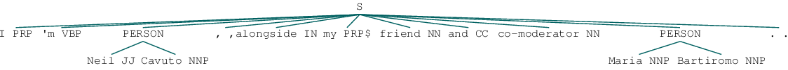
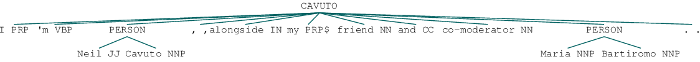
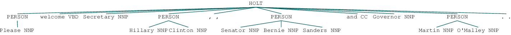
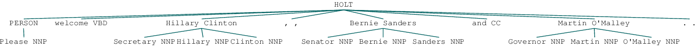
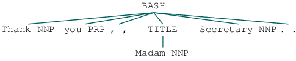

```python
%pprint
```

    Pretty printing has been turned OFF


## 2016 Election Project
### Part 2 of Processing Pipeline

This notebook is intended to document NER annotation of my data throughout this project. The data I am starting out with are transcripts of the presidential debates from the 2016 US Election- the 10 Democratic primary debates, the 12 Republican primary debates, and the debates for the general election between Hillary Clinton and Donald Trump. The transcripts were taken from UCSB's American Presidency Project. The citations for these transcripts can be found in the README.

### Table of Contents
- [Defining a Tree-Generating Function](#defining-tree-mapping-function)
- [Generating Trees](#generating-tree-for-each-sentence)
- [Mapping Speaker to Tree](#mapping-speaker-to-tree)
- [Gathering Relevant Names](#relevant-names)
- [Creating a Dictionary for NER Linking](#creating-dictionary-for-ner-linking)
- [Tagging Missed Entities- Last Names](#tagging-missed-entities-last-names)
- [NER Linking Part 1](#ner-linking-part-1)
- [Pulling in Titles](#pulling-in-titles)
- [Tagging Missed Entities- Titles and First Names](#tagging-missed-entities-titles-and-first-names)
- [NER Linking Part 2](#ner-linking-part-2)


```python
import nltk
from nltk.corpus import PlaintextCorpusReader
import pandas as pd
import glob
import os
from collections import defaultdict
import matplotlib.pyplot as plt
import re
import pickle
```

**I'm going to create a mapping function that will take the sentence in each row of each data frame and perform nltk's chunking operation on it to get a tree with annoted NEs**


```python
#Import the saved list of data frames I created in secondary_data_processing
import pickle
f = open('/Users/Paige/Documents/Data_Science/dataframes_list.p', 'rb')
dataframes = pickle.load(f)
f.close()
```

### Defining Tree Mapping Function


```python
def get_tree(sent):
    sents = nltk.sent_tokenize(sent)
    words = [nltk.word_tokenize(sent) for sent in sents]
    pos = [nltk.pos_tag(sent) for sent in words]
    chunk = nltk.ne_chunk_sents(pos)
    return list(chunk)[0]
```


```python
master_df = pd.concat(dataframes)
```


```python
master_df = master_df.reset_index(drop=True)
```


```python
master_df.head()
```


<div>
<table border="1" class="dataframe">
  <thead>
    <tr style="text-align: right;">
      <th></th>
      <th>Date</th>
      <th>Debate Type</th>
      <th>Speaker</th>
      <th>Sents</th>
    </tr>
  </thead>
  <tbody>
    <tr>
      <th>0</th>
      <td>1-14-16</td>
      <td>primary_rep</td>
      <td>CAVUTO</td>
      <td>It is 9:00 p.m. here at the North Charleston ...</td>
    </tr>
    <tr>
      <th>1</th>
      <td>1-14-16</td>
      <td>primary_rep</td>
      <td>CAVUTO</td>
      <td>Welcome to the sixth Republican presidential o...</td>
    </tr>
    <tr>
      <th>2</th>
      <td>1-14-16</td>
      <td>primary_rep</td>
      <td>CAVUTO</td>
      <td>I'm Neil Cavuto, alongside my friend and co-mo...</td>
    </tr>
    <tr>
      <th>3</th>
      <td>1-14-16</td>
      <td>primary_rep</td>
      <td>BARTIROMO</td>
      <td>Tonight we are working with Facebook to ask t...</td>
    </tr>
    <tr>
      <th>4</th>
      <td>1-14-16</td>
      <td>primary_rep</td>
      <td>BARTIROMO</td>
      <td>And according to Facebook, the U.S. election h...</td>
    </tr>
  </tbody>
</table>
</div>


```python
master_df.tail()
```


<div>
<table border="1" class="dataframe">
  <thead>
    <tr style="text-align: right;">
      <th></th>
      <th>Date</th>
      <th>Debate Type</th>
      <th>Speaker</th>
      <th>Sents</th>
    </tr>
  </thead>
  <tbody>
    <tr>
      <th>37054</th>
      <td>9-26-16</td>
      <td>general</td>
      <td>HOLT</td>
      <td>The conversation will continue.</td>
    </tr>
    <tr>
      <th>37055</th>
      <td>9-26-16</td>
      <td>general</td>
      <td>HOLT</td>
      <td>A reminder.</td>
    </tr>
    <tr>
      <th>37056</th>
      <td>9-26-16</td>
      <td>general</td>
      <td>HOLT</td>
      <td>The vice presidential debate is scheduled for ...</td>
    </tr>
    <tr>
      <th>37057</th>
      <td>9-26-16</td>
      <td>general</td>
      <td>HOLT</td>
      <td>My thanks to Hillary Clinton and to Donald Tru...</td>
    </tr>
    <tr>
      <th>37058</th>
      <td>9-26-16</td>
      <td>general</td>
      <td>HOLT</td>
      <td>Good night, everyone.</td>
    </tr>
  </tbody>
</table>
</div>


### Generating Tree for Each Sentence


```python
master_df['Tree']=master_df.Sents.map(get_tree)
```


```python
master_df.head()
```


<div>
<table border="1" class="dataframe">
  <thead>
    <tr style="text-align: right;">
      <th></th>
      <th>Date</th>
      <th>Debate Type</th>
      <th>Speaker</th>
      <th>Sents</th>
      <th>Tree</th>
    </tr>
  </thead>
  <tbody>
    <tr>
      <th>0</th>
      <td>1-14-16</td>
      <td>primary_rep</td>
      <td>CAVUTO</td>
      <td>It is 9:00 p.m. here at the North Charleston ...</td>
      <td>[(It, PRP), (is, VBZ), (9:00, CD), (p.m., NN),...</td>
    </tr>
    <tr>
      <th>1</th>
      <td>1-14-16</td>
      <td>primary_rep</td>
      <td>CAVUTO</td>
      <td>Welcome to the sixth Republican presidential o...</td>
      <td>[(Welcome, VB), (to, TO), (the, DT), (sixth, J...</td>
    </tr>
    <tr>
      <th>2</th>
      <td>1-14-16</td>
      <td>primary_rep</td>
      <td>CAVUTO</td>
      <td>I'm Neil Cavuto, alongside my friend and co-mo...</td>
      <td>[(I, PRP), ('m, VBP), [(Neil, JJ), (Cavuto, NN...</td>
    </tr>
    <tr>
      <th>3</th>
      <td>1-14-16</td>
      <td>primary_rep</td>
      <td>BARTIROMO</td>
      <td>Tonight we are working with Facebook to ask t...</td>
      <td>[(Tonight, NN), (we, PRP), (are, VBP), (workin...</td>
    </tr>
    <tr>
      <th>4</th>
      <td>1-14-16</td>
      <td>primary_rep</td>
      <td>BARTIROMO</td>
      <td>And according to Facebook, the U.S. election h...</td>
      <td>[(And, CC), (according, VBG), (to, TO), [(Face...</td>
    </tr>
  </tbody>
</table>
</div>


**I've created an NER tree! Notice that nltk's chunker pulled out Neil Cavuto and Maria Bartiromo as people. Now I want to change the S label at the top of the tree to represent who said this utterence using the information in the Speaker column.**

### Mapping Speaker to Tree


```python
master_df.iloc[2][-1]
```





```python
#Using mapping involving 2 columns. Use the Speaker column to modify the Tree column.
for row in range(0, len(master_df)):
    master_df.iloc[row][-1].set_label(master_df.iloc[row][2])
```


```python
master_df.iloc[2]['Tree']
```





```python
master_df.iloc[2]['Speaker']
```


    'CAVUTO'


```python
#Uh oh. The good news is the chunker got Trump's title- Businessman. The bad news is it's separated from the rest of his name. I'll have to fix that.
master_df.iloc[8]['Tree']
```


```python
master_df.iloc[8]['Speaker']
```


    'CAVUTO'


```python
#Again, it got Hillary Clinton and Martin O'Malley, but missed Secretary and Governor, but it DID get Senator Bernie Sanders
master_df.iloc[1603]['Tree']
```





```python
master_df.iloc[1603]['Speaker']
```


    'HOLT'


```python
#This section is with help from a datacamp tutorial
#https://campus.datacamp.com/courses/natural-language-processing-fundamentals-in-python/named-entity-recognition?ex=3

ner_categories = defaultdict(int)

# Create the nested for loop
for tree in master_df['Tree']:
    for chunk in tree:
        if hasattr(chunk, 'label'):
            ner_categories[chunk.label()] += 1

# Create a list from the dictionary keys for the chart labels: labels
labels = list(ner_categories.keys())

# Create a list of the values: values
values = [ner_categories.get(l) for l in labels]

# Create the pie chart
plt.pie(values, labels=labels, autopct='%1.1f%%', startangle=140)

# Display the chart
plt.show()
```


```python
people = []
for tree in master_df['Tree']:
    for chunk in tree:
        if hasattr(chunk, 'label'):
            if chunk.label() == 'PERSON':
                people.append(chunk)
```


```python
people[1]
```


```python
people[1].leaves()[0][0]
words = [leaf[0] for leaf in people[1].leaves()]
words
```


    ['Neil', 'Cavuto']


```python
people_names = []
name = ''
for tree in people:
    for leaf in tree.leaves():
        name+=' '+str(leaf[0])
    people_names.append(name.strip())
    name = ''

```


```python
names = set(people_names)
list(names)[100:200]
```


    ['ClINTON', 'Cardinal', 'Nebraska', 'Democrats', 'Daily News', 'Stevens', 'Mark Levin', 'Harvard', 'Collison', 'Schumer', 'Ronald Reagan', 'Saint Peter', 'Mr. Perkins', 'Did', 'Josh', 'John Kennedy', 'Maria Celesta Arrasas', 'America', 'Cuomo', 'Holder', 'Tip', 'Miriam', 'Nikki', 'Merkel', 'Ginger', 'Tamir Rice', 'Tata', 'Alexander Hamilton', 'Jeffrey Sonnenfeld', 'Drake', 'Kerry', 'Bill', 'Kentucky', 'Donald Sussman', 'Hank Paulson', 'Matter', 'Center', 'Lawrence Tribe', 'Paulson', 'Crimea', 'Kenya', 'Trayvon Martin', 'Pol Pot', 'Kasich', 'Carrier', 'Kelly Ayotte', 'Hotline Went', 'Mike Lee', 'Daniel Ortega', 'Ronald', 'Al Gore', 'Carly', 'Hugh Hewitt', 'Amazon', 'Darnell Ishmel', 'Heller', 'Nabela', 'Stephen', 'John Boehner', 'Black', 'Ashley Tofil', 'Shaheen', 'Steve King', 'William', 'Hitler', 'Haley', 'Wendy Sherman', 'Senator Clinton', 'John Pietricone', 'Panetta', 'Hill', 'Apple CEO Tim Cook', 'Mr. Cruz', 'Jane', 'Iowa Caucus', 'Hilary Clinton', 'Patti Solis Doyle', 'Brett', 'Warren Buffett', 'Nevada', 'Nancy Reagan', 'Bibi Netanyahu', 'Wired', 'Delaware', 'Putin', 'Keane', 'Ohio Governor', 'Trust', 'James Bergdahl', 'Doug', 'Jordan', 'Maria Celeste', 'Tax Reform', 'Harvard Law', 'Wolf Blitzer', 'Dan Tuohy', 'Henry Kissinger', 'Pope', 'Sinjar', 'Alzheimer']


```python
len(names)
```


    1134


**Notice we're missing a good amount of titles in this list.**


```python
'Senator' in names
```


    True


```python
'Governor' in names
```


    False


```python
'Mr.' in names
```


    True


```python
'Mrs.' in names
```


    False


```python
'Miss' in names
```


    False


```python
'Doctor' in names
```


    True


```python
'President' in names
```


    False


```python
'Secretary' in names
```


    False


```python
'Sir' in names
```


    True


### Relevant Names

**I'm going to go through all of these tags by hand, and link them to who they are referring to. I will create a dictionary of NEs. The expression that was used will be the key, and the person it refers to will be the value. I think copying and pasting this set and deleting things that obviously are not people by hand first will speed things up.**


```python
#f = open('/Users/Paige/Documents/Data_Science/names.txt', 'w')
#for name in names:
#    f.write(str(name)+'\n')
#f.close()
```

**I'm going to read in the text file I made and turn it into the dictionary described above. In this linked.txt file, I removed everyone except for the most relevant people including leaders of countries, all of the candidates, all of the moderators, and people involved in the events discussed during the debate. If the chunker only pulled out a title like 'Madame', it was tagged as TITLE to be resolved later. If the title was a part of the chunk, obviously it was included and mapped to whoever it referred to. Titles that clearly could only refer to one of the relevant people, like Secretary, were mapped to their respective entity. Other "names" like Lady Liberty and Mr. Average were mapped to NICKNAME unless I knew right away who was being referred to.**


```python
with open('/Users/Paige/Documents/Data_Science/2016-Election-Project/data/Lists/linked.txt') as f:
    name_link = f.readlines()
```


```python
#I considered 384 NEs to be relevant to the debates.
len(name_link)
```


    384


```python
name_link[:20]
```


    ['Sean Hannity;Sean Hannity\n', 'Sean;Sean Hannity\n', 'Hannity;Sean Hannity\n', 'Jake Tapper;Jake Tapper\n', 'Tapper;Jake Tapper\n', 'Jake;Jake Tapper\n', 'Florida Senator;Marco Rubio\n', 'Hill;Hillary Clinton\n', 'Bibi Netanyahu;Benjamin Netanyahu\n', 'Mr. Cruz;Ted Cruz\n', 'Ted;Ted Cruz\n', 'Cruz;Ted Cruz\n', 'Bret;Bret Baier\n', 'Baier;Bret Baier\n', 'John Quincy Adams;John Quincy Adams\n', 'Yasser Arafat;Yasser Arafat\n', 'Rubio;Marco Rubio\n', 'Marco;Marco Rubio\n', 'Bobby Jindal;Bobby Jindal\n', 'Andrea;Andrea Mitchell\n']


```python
links = [x.strip().split(';') for x in name_link]
links[30:50]
```


    [['Giuliani', 'Rudy Giuliani'], ['Rudy', 'Rudy Giuliani'], ['Miss Piggy', 'Alicia Machado'], ['Snowden', 'Edward Snowden'], ['Malley', "Martin O'Malley"], ["O'Malley", "Martin O'Malley"], ['Martin', "Martin O'Malley"], ['Martha', 'Martha Raddatz'], ['Raddatz', 'Martha Raddatz'], ['Dana', 'Dana Bash'], ['Hillary Rodham', 'Hillary Clinton'], ['John Mccain', 'John McCain'], ['McCain', 'John McCain'], ['Senator Lindsey Graham', 'Lindsey Graham'], ['Lindsey', 'Lindsey Graham'], ['Graham', 'Lindsey Graham'], ['Barbara Bush', 'Barbara Bush'], ['Lyndon Johnson', 'Lyndon Johnson'], ['Martin', "Martin O'Malley"], ['Senator Webb', 'Jim Webb']]


### Creating Dictionary for NER Linking


```python
link_dict = {x[0]:x[1] for x in links}
```


```python
f = open('/Users/Paige/Documents/Data_Science/link_dict.pkl', 'wb')
pickle.dump(link_dict, f, -1)
f.close()
```


```python
#This is the set of all of the relevant people who were referred to in the debates.
set(link_dict.values())
```


    {'Megyn Kelly', 'TITLE', 'Dana Bash', 'Pope Francis', 'Chelsea Clinton', 'Deborah Wasserman Schultz', 'Antonin Scalia', 'Hillary Clinton', 'Omran Daqneesh', 'Major Garrett', 'Yasser Arafat', 'George Washington', 'Freddie Gray', 'Nancy Pelosi', 'Paul Ryan', 'Ben Carson', 'Barbara Bush', 'Merrick Garland', 'John Podesta', 'Michael Bloomberg', 'Marco Rubio', 'Abraham Lincoln', 'Abigail Adams', 'Sandra Bland', 'Sean Hannity', 'Lyndon Johnson', 'Humayun Khan', 'Donald Trump', 'Andrea Mitchell', 'Michael Brown', 'Calvin Coolidge', 'Neil Cavuto', 'Martha Raddatz', 'Rand Paul', 'Bernie Sanders', 'Bashar al-Assad', 'John Kasich', 'Theodore Roosevelt', 'Michael Flynn', 'Ivanka Trump', 'Mitch McConnell', 'NICKNAME', 'David Muir', 'George H. W. Bush', 'Nikki Haley', 'Rosa Parks', 'Joseph Stalin', 'Rudy Giuliani', 'John Adams', 'Adolf Hitler', 'Thomas Jefferson', "Tip O'Neill", 'Jeb Bush', 'Ashraf Ghani', 'Lindsey Graham', 'Lester Holt', "Martin O'Malley", 'Andrew Cuomo', 'Kim Davis', 'Rachel Maddow', 'Mark Zuckerburg', 'Ken Bone', 'Chris Cuomo', 'Ted Cruz', 'Ronald Reagan', 'George Bush', 'Kimberley Strassel', 'John Kennedy', 'Rush Limbaugh', 'Abdullah', 'Dwight Eisenhower', 'Winston Churchill', 'Tamir Rice', 'Benjamin Netanyahu', 'Alexander Hamilton', 'Lincoln Chafee', "Rosie O'Donnell", 'Trayvon Martin', 'Kim Jong Un', 'Hugh Hewitt', "Katie O'Malley", 'Chris Christie', 'Al Gore', 'Jake Tapper', 'John Boehner', 'Angela Merkel', 'Scott Walker', 'James Comey', 'Mitt Romney', 'Maria Bartiromo', 'Senator Clinton', 'Anderson Cooper', 'Kim Jong-Un', 'Osama bin Laden', 'Woodrow Wilson', 'Benjamin Franklin', 'Nancy Reagan', 'Saddam Hussein', 'Wolf Blitzer', 'Chuck Todd', 'Carly Fiorina', 'Frederick Douglas', 'Carl Quintanilla', 'Don Lemon', 'Dylann Roof', 'Chuck Schumer', 'Chris Wallace', 'Joe Biden', 'Jorge Ramos', 'James Carter', 'Bobby Jindal', 'Elizabeth Warren', 'Mike Huckabee', 'Bret Baier', 'Jeff Sessions', 'Eric Trump', 'George W. Bush', 'John Quincy Adams', 'Eric Garner', 'John Kerry', 'Edward Snowden', 'Richard Nixon', 'Abdel Fattah el-Sisi', 'John McCain', 'Hosni Mubarak', 'Rick Santorum', 'Jim Webb', 'Harry Truman', 'Maria Celeste Arraras', 'Vladimir Putin', 'Joseph Mattis', 'Sonia Sotomayor', 'Maria Elena Salinas', 'Alicia Machado', 'Nelson Mandela', 'Muammar Gaddafi', 'Franklin D. Roosevelt', 'Joe Arpaio', 'Michelle Obama', 'David Duke', 'Barack Obama', 'Fidel Castro', 'Bill Clinton'}


```python
#Here are some of the ways those people were referred to.
list(link_dict.keys())[:40]
```


    ['Sean Hannity', 'Sean', 'Hannity', 'Jake Tapper', 'Tapper', 'Jake', 'Florida Senator', 'Hill', 'Bibi Netanyahu', 'Mr. Cruz', 'Ted', 'Cruz', 'Bret', 'Baier', 'John Quincy Adams', 'Yasser Arafat', 'Rubio', 'Marco', 'Bobby Jindal', 'Andrea', 'Ohio Governor', 'Deborah Wasserman Schultz', 'Ted Cruz', 'Barak Obama America', 'Jim', 'Webb', 'Shultz', 'Fiorina', 'Carly', 'Mayor Giuliani', 'Giuliani', 'Rudy', 'Miss Piggy', 'Snowden', 'Malley', "O'Malley", 'Martin', 'Martha', 'Raddatz', 'Dana']


```python
link_dict['Ohio Governor']
```


    'John Kasich'


```python
link_dict['Secretary']
```


    'Hillary Clinton'


```python
link_dict['Senator']
```


    'TITLE'


```python
link_dict['Andrea']
```


    'Andrea Mitchell'


```python
link_dict['Senator Webb']
```


    'Jim Webb'


```python
link_dict['Hilary Clinton']
```


    'Hillary Clinton'


```python
link_dict['Hillary Clinton']
```


    'Hillary Clinton'


```python
link_dict['Senator Bernie Sanders']
```


    'Bernie Sanders'


```python
link_dict['Christie']
```


    'Chris Christie'


```python
link_dict['Mr. Trump']
```


    'Donald Trump'


### Tagging Missed Entities (last names)

**I also want to find REs that were just completely missed by the chunker. To tag RE's that were completely missed, I am first going to go through and look for relevant last names. I will tag those as the respective person. Then, I am going to run the process that I did above, pulling in titles and first names into the new subtree I just created.**


```python
last_names = list(set(link_dict.values()))
last_names = [x.split() for x in last_names]
#Since all of the relevant people only have a two token name except for one of the moderators, Maria Celeste Arraras, and
#Debbie Wasserman Shultz, I'm just going to look for a single token, the last name.
last_names = [x[-1] for x in last_names]
last_names = set(last_names)
last_names
```


    {'Baier', 'TITLE', 'Huckabee', 'Quintanilla', 'Gore', 'Bone', 'Martin', 'Salinas', 'Jefferson', 'Schultz', 'Brown', 'Scalia', 'Netanyahu', 'Laden', 'Jong-Un', 'Bartiromo', 'Roosevelt', 'Strassel', 'Mattis', 'Pelosi', 'Hussein', 'Rice', 'Romney', 'Hannity', 'NICKNAME', 'Zuckerburg', 'Santorum', 'McCain', 'Boehner', 'Khan', 'Chafee', 'Trump', 'Arafat', 'Ryan', 'Carson', 'Biden', 'Garland', "O'Donnell", "O'Malley", 'Bash', 'Muir', 'Gray', 'Davis', 'Graham', 'Schumer', 'Cavuto', 'Ghani', 'Cuomo', 'Bush', 'Abdullah', 'Merkel', 'Clinton', 'Adams', 'Walker', 'Arpaio', 'Snowden', 'Washington', 'Kerry', 'Carter', 'Podesta', 'Holt', 'Kasich', 'al-Assad', "O'Neill", 'Ramos', 'Warren', 'Sotomayor', 'Wilson', 'Francis', 'Limbaugh', 'Truman', 'Hitler', 'Haley', 'Fiorina', 'Daqneesh', 'Wallace', 'Stalin', 'Raddatz', 'Coolidge', 'Jindal', 'Franklin', 'Rubio', 'Bland', 'Sessions', 'Blitzer', 'Cooper', 'Cruz', 'Putin', 'Un', 'Arraras', 'Garrett', 'Nixon', 'Lincoln', 'Webb', 'Comey', 'Christie', 'Flynn', 'Parks', 'Machado', 'Eisenhower', 'Churchill', 'Gaddafi', 'Mandela', 'Mubarak', 'Garner', 'Hewitt', 'Lemon', 'Kennedy', 'el-Sisi', 'Bloomberg', 'Kelly', 'Johnson', 'Mitchell', 'Sanders', 'McConnell', 'Giuliani', 'Tapper', 'Maddow', 'Duke', 'Obama', 'Reagan', 'Hamilton', 'Paul', 'Todd', 'Roof', 'Douglas', 'Castro'}


```python
#This loop looks for REs that should have been tagged as stand alone REs, but were missed
for tree in master_df['Tree']:
    for t in tree:
        if type(t) == tuple:
            if t[0] in last_names:
                tree[tree.index(t)] = nltk.tree.Tree('PERSON', [t])
```

**Now I need to use this dictionary to label all of the named entities in my NER trees with who the NE is referring to instead of just PERSON or GPE, etc.**

### NER Linking Part 1


```python
def name_linking(tree):
    name = ''
    for chunk in tree:
        #Look for relevent names with ANY label. Maybe "Hillary Clinton" was mistakenly tagged as a GPE
        if hasattr(chunk, 'label'):
            for leaf in chunk.leaves():
                name+=' '+str(leaf[0])
            if name.strip() in link_dict.keys():
                name = name.strip()
                chunk.set_label(link_dict[name])
                name = ''
            else:
                name = ''
    return tree
```


```python
master_df['Tree'] = master_df.Tree.map(name_linking)
```


```python
master_df.head()
```


<div>
<table border="1" class="dataframe">
  <thead>
    <tr style="text-align: right;">
      <th></th>
      <th>Date</th>
      <th>Debate Type</th>
      <th>Speaker</th>
      <th>Sents</th>
      <th>Tree</th>
    </tr>
  </thead>
  <tbody>
    <tr>
      <th>0</th>
      <td>1-14-16</td>
      <td>primary_rep</td>
      <td>CAVUTO</td>
      <td>It is 9:00 p.m. here at the North Charleston ...</td>
      <td>[(It, PRP), (is, VBZ), (9:00, CD), (p.m., NN),...</td>
    </tr>
    <tr>
      <th>1</th>
      <td>1-14-16</td>
      <td>primary_rep</td>
      <td>CAVUTO</td>
      <td>Welcome to the sixth Republican presidential o...</td>
      <td>[(Welcome, VB), (to, TO), (the, DT), (sixth, J...</td>
    </tr>
    <tr>
      <th>2</th>
      <td>1-14-16</td>
      <td>primary_rep</td>
      <td>CAVUTO</td>
      <td>I'm Neil Cavuto, alongside my friend and co-mo...</td>
      <td>[(I, PRP), ('m, VBP), [(Neil, JJ), (Cavuto, NN...</td>
    </tr>
    <tr>
      <th>3</th>
      <td>1-14-16</td>
      <td>primary_rep</td>
      <td>BARTIROMO</td>
      <td>Tonight we are working with Facebook to ask t...</td>
      <td>[(Tonight, NN), (we, PRP), (are, VBP), (workin...</td>
    </tr>
    <tr>
      <th>4</th>
      <td>1-14-16</td>
      <td>primary_rep</td>
      <td>BARTIROMO</td>
      <td>And according to Facebook, the U.S. election h...</td>
      <td>[(And, CC), (according, VBG), (to, TO), [(Face...</td>
    </tr>
  </tbody>
</table>
</div>


```python
master_df.iloc[8][-1]
```


```python
master_df.iloc[9][-1]
```


```python
master_df.iloc[1509][-1]
```


```python
master_df.iloc[1603][-1]
```


### Pulling in Titles

**Next, I'm going to fix up some of the tagging to include titles and any first names that might have been missed. NLTK's RE chunker is supposed to remove titles like Mr., Senator, Mrs., etc. and those are the very things I'm looking for! Luckily, it doesn't always do this well, so some of those titles are included in the tagged trees already, but I'm going to go through and try to add back the missing titles. First, I'm going to create a list of titles and first names. Then, I'm going to cycle through all of the trees that refer to people, look at the word preceeding the tagged chunk, and if that world is a title, I'm going to pull it into the tagged chunk.**


```python
#Here, I'm creating a list of first names of all of the relevant people in the corpora so I can pull these first names
#into the correct label if they were mistakenly left untagged.

first_names = list(set(link_dict.values()))
first_names = [x.split() for x in first_names]
first_names = [x[0] for x in first_names]
first_names = set(first_names)
```


```python
titles = ['Mr.', 'Mister', 'Lady', 'Speaker', 'Mrs.', 'Miss', 'Madam', 'Sir', 'President', 'Senator', 'Governor', 'Secretary', 'Congressman', 'Dr.', 'Doctor', 'Sheriff', 'Chairman']

titles.extend(first_names)
#The following is a list of ways you can refer to a person that might not be followed by a name. I'm going to look for any
#of these that were missed as well.
re = ['Secretary', 'Governer', 'Congressman', 'Senator', 'Sir', 'Madam', 'Doctor', 'Dr.']
#Need a list of last names and a list of first names
titles
```


    ['Mr.', 'Mister', 'Lady', 'Speaker', 'Mrs.', 'Miss', 'Madam', 'Sir', 'President', 'Senator', 'Governor', 'Secretary', 'Congressman', 'Dr.', 'Doctor', 'Sheriff', 'Chairman', 'Omran', 'TITLE', 'Megyn', 'Joe', 'Tamir', 'Mitch', 'Ted', 'Ken', 'Bernie', 'Jeff', 'Martin', 'Alicia', 'Wolf', 'Jeb', 'Alexander', 'Bashar', 'David', 'Trayvon', 'Fidel', 'Chuck', 'Jorge', 'Ben', 'Abigail', 'Neil', 'Rosie', 'Dwight', 'Jim', 'Angela', 'Don', 'Sonia', 'Kimberley', 'Saddam', 'Yasser', 'NICKNAME', 'Senator', 'Bret', 'Mitt', 'Andrew', 'Deborah', 'Lyndon', 'Hillary', 'Edward', 'Richard', 'Freddie', 'Benjamin', 'Donald', 'Sandra', 'Thomas', 'Rick', 'Eric', 'Dana', 'Abdullah', 'Tip', 'Nikki', 'Barack', 'Dylann', 'Michael', 'Sean', 'Anderson', 'Bill', 'Scott', 'Bobby', 'Rush', 'Abdel', 'Ronald', 'Rand', 'Joseph', 'George', 'Carly', 'Katie', 'Vladimir', 'Mark', 'Carl', 'John', 'Marco', 'Calvin', 'Chelsea', 'Rudy', 'Franklin', 'Barbara', 'Chris', 'Humayun', 'Martha', 'Muammar', 'Merrick', 'Michelle', 'Pope', 'Ivanka', 'Lincoln', 'Osama', 'Nelson', 'Mike', 'Kim', 'Woodrow', 'Nancy', 'Antonin', 'Hugh', 'Adolf', 'Elizabeth', 'Rachel', 'Maria', 'Lester', 'Harry', 'Jake', 'Theodore', 'Abraham', 'Hosni', 'Lindsey', 'James', 'Major', 'Winston', 'Frederick', 'Ashraf', 'Rosa', 'Andrea', 'Paul', 'Al']


```python
for tree in master_df['Tree']:
    for chunk in tree:
        i = tree.index(chunk)
        if type(tree[i]) == nltk.tree.Tree:
            #if we find a subtree, and it is a relevant entity, we need to look at the node preceding it
            if tree[i].label() in link_dict.values():
                #if the leaf in front of the subtree is another subtree, and it has the same label or it's labelled 'TITLE'
                #we want to pull it in.
                if type(tree[i-1]) == nltk.tree.Tree and (tree[i-1].label() == tree[i].label() or tree[i-1].label() == 'TITLE'):
                    tree[i] = nltk.tree.Tree(tree[i].label(), list(tree[i-1])+list(tree[i]))
                    tree.remove(tree[i-1])
                if tree[i-1][0] in titles:
                    if i != 0:
                        tree[i].insert(0, tree[i-1])
                        tree.remove(tree[i-1])
```


```python
master_df.iloc[1509][-1]
```


```python
master_df.iloc[1603][-1]
```





```python
master_df.iloc[8][-1]
```


### Tagging Missed Entities (titles and first names)

**Next, I'm going to make sure look for just titles or first names that were missed that stand alone and don't precede a last name using the same method as above.**


```python
master_df.iloc[30537][-1]
```





```python
#This loop looks for REs that should have been tagged as stand alone REs, but were missed
for tree in master_df['Tree']:
    for t in tree:
        if type(t) == tuple:
            if t[0] in titles:
                tree[tree.index(t)] = nltk.tree.Tree('PERSON', [t])
```


```python
master_df.iloc[30537][-1]
```


### NER Linking Part 2

**And again, I'm going to change the tag of PERSON to the appropriate entity, and pull in any tags that belong to one entity but were tagged separately**


```python
master_df['Tree'] = master_df.Tree.map(name_linking)
```


```python
for tree in master_df['Tree']:
    for chunk in tree:
        i = tree.index(chunk)
        if type(tree[i]) == nltk.tree.Tree:
            #if we find a subtree, and it is a relevant entity, we need to look at the node preceding it
            if tree[i].label() in link_dict.values():
                #if the leaf in front of the subtree is another subtree, and it has the same label or it's labelled 'TITLE'
                #we want to pull it in.
                if type(tree[i-1]) == nltk.tree.Tree and (tree[i-1].label() == tree[i].label() or tree[i-1].label() == 'TITLE'):
                    tree[i] = nltk.tree.Tree(tree[i].label(), list(tree[i-1])+list(tree[i]))
                    tree.remove(tree[i-1])
                if tree[i-1][0] in titles:
                    if i != 0:
                        tree[i].insert(0, tree[i-1])
                        tree.remove(tree[i-1])
```


```python
master_df.iloc[30537][-1]
```


**Finally, if something was tagged as a PERSON, I've decided I'm going to leave that tag the way it is instead of untagging it, even if it was mistakenly tagged as a person, because I or another researcher might want to go back in the future and look at those other entities. The process of correcting all of them would be very time consuming and not particularly relevant to this project. The entites of importance are tagged and a dictionary of important entities is saved as link_dict.**


```python
##Saving master dataframe to a CSV
master_df.to_csv('/Users/Paige/Documents/Data_Science/2016-Election-Project/data/Debates/csv/master.csv')
```


```python
f = open('/Users/Paige/Documents/Data_Science/master_df.pkl', 'wb')
pickle.dump(master_df, f, -1)
f.close()
```
