```python
%pprint
```

    Pretty printing has been turned OFF


### 2016 Election Project
### Part 3 of Processing Pipeline

This notebook is intended to document the analysis of my data throughout this project. The data I am starting out with are transcripts of the presidential debates from the 2016 US Election- the 10 Democratic primary debates, the 12 Republican primary debates, and the 3 debates for the general election between Hillary Clinton and Donald Trump. The transcripts were taken from UCSB's American Presidency Project. The citations for these transcripts can be found in the README. Using these transcripts, I'll analyze the referring expressions the candidates use for each other.


We have two factors at play: gender and experience. Hillary Clinton and Carly Fiorina are the only two female candidates. Clinton has several titles due to her experience in politics, and Fiorina has no professional titles other than Mrs. because she has no political experience. We can compare how the two are referred to by looking at whether they are called a professional title (Senator or Secretary for Clinton; Mrs. or Businesswoman for Fiorina) or by their first name only or first and last name.

There is a similar situation among the male candidates. Donald Trump is the only male candidate without a professional title other than Mr., while Ben Carson is another male candidate with no political experience, but has the professional title of Doctor. Therefore, we can try to see if there are differences in the ways the moderators and candidates refer to those with or without government experience and if there are differences in the ways the male and female candidates are referred to. Does the frequency of being called by a first name or without a title have to do with gender? Or does it have to do with experience?

### Table of Contents
- [Creating a Function to List Entities in an Utterance](#entity-listing-function)
- [Basic Analysis](#basic-analysis)
- [Building a DataFrame for Each Speaker](#building-speaker-dataframes)
- [Defining Helpful Functions](#important-functions)
- [Categorizing the Referring Expressions Used for Each Candidate](#creating-referring-expression-categories)
- [Overall Distribution of Types of Referring Expressions Used for Candidates](#overall-distribution-of-referring-expressions)
- [How Donald Trump Refers to Other Candidates](#donald-trump-as-speaker)
- [How Hillary Clinton Refers to Other Candidates](#hillary-clinton-as-speaker)
- [How Carly Fiorina Refers to Other Candidates](#carly-fiorina-as-speaker)
- [How Ted Cruz Refers to Other Candidates](#ted-cruz-as-speaker)
- [How Marco Rubio Refers to Other Candidates](#marco-rubio-as-speaker)
- [How Ben Carson Refers to Other Candidates](#ben-carson-as-speaker)
- [How Bernie Sanders Refers to Other Candidates](#bernie-sanders-as-speaker)
- [How Moderators Refer to the Candidates](#moderators)
    - [Dana Bash](#dana-bash)
    - [David Muir](#david-muir)
- [Differences Across Debates](#differences-across-debates)
    - [Debate 1](#debate-1)
    - [Debate 2](#debate-2)
    - [Debate 3](#debate-3)
- [Final Analysis](#final-analysis)


```python
import nltk
from nltk.corpus import PlaintextCorpusReader
import pandas as pd
import glob
import os
from collections import defaultdict
import matplotlib.pyplot as plt
import pickle
```


```python
f = open('/Users/Paige/Documents/Data_Science/link_dict.pkl', 'rb')
link_dict = pickle.load(f)
f.close()
```


```python
f = open('/Users/Paige/Documents/Data_Science/master_df.pkl', 'rb')
master_df = pickle.load(f)
f.close
master_df = master_df.reset_index(drop=True)
master_df.head()
```


<div>
<table border="1" class="dataframe">
  <thead>
    <tr style="text-align: right;">
      <th></th>
      <th>Date</th>
      <th>Debate Type</th>
      <th>Speaker</th>
      <th>Sents</th>
      <th>Tree</th>
    </tr>
  </thead>
  <tbody>
    <tr>
      <th>0</th>
      <td>1-14-16</td>
      <td>primary_rep</td>
      <td>CAVUTO</td>
      <td>It is 9:00 p.m. here at the North Charleston ...</td>
      <td>[(It, PRP), (is, VBZ), (9:00, CD), (p.m., NN),...</td>
    </tr>
    <tr>
      <th>1</th>
      <td>1-14-16</td>
      <td>primary_rep</td>
      <td>CAVUTO</td>
      <td>Welcome to the sixth Republican presidential o...</td>
      <td>[(Welcome, VB), (to, TO), (the, DT), (sixth, J...</td>
    </tr>
    <tr>
      <th>2</th>
      <td>1-14-16</td>
      <td>primary_rep</td>
      <td>CAVUTO</td>
      <td>I'm Neil Cavuto, alongside my friend and co-mo...</td>
      <td>[(I, PRP), ('m, VBP), [(Neil, JJ), (Cavuto, NN...</td>
    </tr>
    <tr>
      <th>3</th>
      <td>1-14-16</td>
      <td>primary_rep</td>
      <td>BARTIROMO</td>
      <td>Tonight we are working with Facebook to ask t...</td>
      <td>[(Tonight, NN), (we, PRP), (are, VBP), (workin...</td>
    </tr>
    <tr>
      <th>4</th>
      <td>1-14-16</td>
      <td>primary_rep</td>
      <td>BARTIROMO</td>
      <td>And according to Facebook, the U.S. election h...</td>
      <td>[(And, CC), (according, VBG), (to, TO), [(Face...</td>
    </tr>
  </tbody>
</table>
</div>


### Entity-Listing Function

**First, I'm going to create a mapping function that will make it easier to see if a person is being talked to or about in a particular utterance. This function is just going to create a list of all of the entity labels that appear in an utterance's tree. Then, to see if a person is being referred to in a particular utterance, we can just see if they are in that list instead of traversing the tree each time.**


```python
def entity_tracking(tree):
    name = ''
    referred_to = []
    entities = set(link_dict.values())
    for chunk in tree:
        if hasattr(chunk, 'label'):
            if chunk.label() in entities:
                referred_to.append(chunk.label())

    return list(set(referred_to))
```


```python
master_df['Entities'] = master_df.Tree.map(entity_tracking)
master_df.head()
```


<div>
<table border="1" class="dataframe">
  <thead>
    <tr style="text-align: right;">
      <th></th>
      <th>Date</th>
      <th>Debate Type</th>
      <th>Speaker</th>
      <th>Sents</th>
      <th>Tree</th>
      <th>Entities</th>
    </tr>
  </thead>
  <tbody>
    <tr>
      <th>0</th>
      <td>1-14-16</td>
      <td>primary_rep</td>
      <td>CAVUTO</td>
      <td>It is 9:00 p.m. here at the North Charleston ...</td>
      <td>[(It, PRP), (is, VBZ), (9:00, CD), (p.m., NN),...</td>
      <td>[]</td>
    </tr>
    <tr>
      <th>1</th>
      <td>1-14-16</td>
      <td>primary_rep</td>
      <td>CAVUTO</td>
      <td>Welcome to the sixth Republican presidential o...</td>
      <td>[(Welcome, VB), (to, TO), (the, DT), (sixth, J...</td>
      <td>[]</td>
    </tr>
    <tr>
      <th>2</th>
      <td>1-14-16</td>
      <td>primary_rep</td>
      <td>CAVUTO</td>
      <td>I'm Neil Cavuto, alongside my friend and co-mo...</td>
      <td>[(I, PRP), ('m, VBP), [(Neil, JJ), (Cavuto, NN...</td>
      <td>[Neil Cavuto, Maria Bartiromo]</td>
    </tr>
    <tr>
      <th>3</th>
      <td>1-14-16</td>
      <td>primary_rep</td>
      <td>BARTIROMO</td>
      <td>Tonight we are working with Facebook to ask t...</td>
      <td>[(Tonight, NN), (we, PRP), (are, VBP), (workin...</td>
      <td>[]</td>
    </tr>
    <tr>
      <th>4</th>
      <td>1-14-16</td>
      <td>primary_rep</td>
      <td>BARTIROMO</td>
      <td>And according to Facebook, the U.S. election h...</td>
      <td>[(And, CC), (according, VBG), (to, TO), [(Face...</td>
      <td>[]</td>
    </tr>
  </tbody>
</table>
</div>


### Basic Analysis

**Let's see how many times each relevant entity was referred to throughout all of the debates:**


```python
ner_categories = defaultdict(int)

# Create the nested for loop
for tree in master_df['Tree']:
    for chunk in tree:
        if hasattr(chunk, 'label') and chunk.label() not in ['GPE', 'ORGANIZATION', 'PERSON', 'LOCATION', 'GSP', 'FACILITY' ]:
            ner_categories[chunk.label()] += 1
for category in sorted(ner_categories, key=ner_categories.get, reverse=True):
    print(category, ner_categories[category])
```

    Hillary Clinton 1208
    Donald Trump 953
    TITLE 674
    Barack Obama 540
    Bernie Sanders 535
    Marco Rubio 354
    Ted Cruz 334
    John Kasich 246
    Jeb Bush 245
    Chris Christie 209
    Ben Carson 202
    Bashar al-Assad 137
    Ronald Reagan 135
    Rand Paul 114
    Martin O'Malley 110
    Vladimir Putin 105
    Carly Fiorina 88
    Jake Tapper 74
    Dana Bash 68
    Anderson Cooper 65
    Wolf Blitzer 60
    Maria Celeste Arraras 46
    John Kerry 46
    Muammar Gaddafi 46
    Martha Raddatz 45
    Bill Clinton 44
    Megyn Kelly 41
    David Muir 40
    Mike Huckabee 38
    George W. Bush 37
    Jim Webb 34
    Lester Holt 32
    Scott Walker 30
    Bret Baier 29
    Saddam Hussein 28
    Neil Cavuto 27
    Mitt Romney 26
    Andrea Mitchell 23
    Osama bin Laden 18
    Don Lemon 17
    Jeff Sessions 17
    Chuck Schumer 16
    Edward Snowden 16
    Hugh Hewitt 15
    Nancy Pelosi 14
    Antonin Scalia 14
    John McCain 13
    Carl Quintanilla 13
    Joe Biden 12
    Sean Hannity 12
    Rachel Maddow 12
    NICKNAME 11
    Nikki Haley 10
    Lindsey Graham 10
    Benjamin Netanyahu 10
    Kim Jong Un 10
    James Carter 9
    George Bush 8
    Theodore Roosevelt 8
    Abraham Lincoln 8
    Senator Clinton 7
    Fidel Castro 7
    Harry Truman 6
    James Comey 6
    Elizabeth Warren 6
    Chuck Todd 6
    Chris Cuomo 5
    Lincoln Chafee 5
    John Adams 5
    Deborah Wasserman Schultz 5
    Hosni Mubarak 5
    John Kennedy 5
    Jorge Ramos 5
    Al Gore 4
    Ivanka Trump 4
    Franklin D. Roosevelt 4
    Chris Wallace 4
    Alicia Machado 4
    Rick Santorum 4
    Michelle Obama 4
    Dwight Eisenhower 4
    Winston Churchill 4
    Joe Arpaio 4
    Nancy Reagan 4
    Chelsea Clinton 4
    Eric Trump 3
    Freddie Gray 3
    Tamir Rice 3
    Barbara Bush 3
    Kim Davis 3
    John Boehner 3
    Paul Ryan 3
    Humayun Khan 3
    Major Garrett 3
    Mitch McConnell 3
    David Duke 3
    Rosie O'Donnell 3
    Rosa Parks 3
    Maria Bartiromo 2
    Bobby Jindal 2
    Sonia Sotomayor 2
    Michael Flynn 2
    Woodrow Wilson 2
    Sandra Bland 2
    Pope Francis 2
    John Podesta 2
    Trayvon Martin 2
    Katie O'Malley 2
    George H. W. Bush 2
    Michael Bloomberg 2
    Tip O'Neill 2
    Richard Nixon 2
    Adolf Hitler 2
    Abigail Adams 2
    Dylann Roof 1
    Frederick Douglas 1
    Benjamin Franklin 1
    Rush Limbaugh 1
    John Quincy Adams 1
    Mark Zuckerburg 1
    George Washington 1
    Omran Daqneesh 1
    Ken Bone 1
    Andrew Cuomo 1
    Calvin Coolidge 1
    Eric Garner 1
    Michael Brown 1
    Joseph Mattis 1
    Kim Jong-Un 1
    Abdullah 1
    Nelson Mandela 1
    Kimberley Strassel 1
    Joseph Stalin 1
    Ashraf Ghani 1
    Angela Merkel 1
    Maria Elena Salinas 1
    Yasser Arafat 1
    Merrick Garland 1
    Abdel Fattah el-Sisi 1
    Lyndon Johnson 1
    Thomas Jefferson 1
    Alexander Hamilton 1
    Rudy Giuliani 1


**Here is a distribution across the candidates that remained in the race until the last primary debate.**


```python
#This section is with help from a datacamp tutorial
#https://campus.datacamp.com/courses/natural-language-processing-fundamentals-in-python/named-entity-recognition?ex=3

ner_categories = defaultdict(int)

# Create the nested for loop
for tree in master_df['Tree']:
    for chunk in tree:
        if hasattr(chunk, 'label'):
            if chunk.label() in ['Hillary Clinton', 'Donald Trump', 'Bernie Sanders', 'Ted Cruz', 'Marco Rubio', 'John Kasich']:
                ner_categories[chunk.label()] += 1

# Create a list from the dictionary keys for the chart labels: labels
labels = list(ner_categories.keys())

# Create a list of the values: values
values = [ner_categories.get(l) for l in labels]

# Create the pie chart
plt.pie(values, labels=labels, autopct='%1.1f%%', startangle=140)

# Display the chart
plt.show()
```


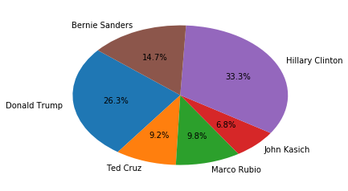


**We see that Hillary Clinton is talked about the most, followed by Trump, Sanders, Rubio, Cruz, and Kasich. It makes sense that Hillary Clinton is addressed/referred to the most often because she made it through the Democratic primary debates and then into the general election debates. The Democratic party only ever had at most 5 candidates running, while the Republican party had at most 17 candidates running. That means that each candidate who was a Democrat had more opportunities in each debate to speak than the Republican candidates simply because there were less of them.**

### Building Speaker DataFrames

**Let's build a data frame for each speaker with only their utterances in it.**


```python
#There are 89 different speakers
speaker_counts = master_df['Speaker'].value_counts()
speaker_counts.size
```


    89


```python
#These are the top 20 speakers who had the most utterances. A larger count doesn't necissarily
#mean a speaker spoke for more time than another, just that they had more utterances.
speaker_counts[:20]
```


    TRUMP        6013
    CLINTON      4890
    SANDERS      3545
    RUBIO        2617
    CRUZ         2117
    KASICH       1977
    BUSH         1461
    OMALLEY      1073
    CHRISTIE     1018
    CARSON        974
    COOPER        792
    BLITZER       756
    PAUL          752
    TAPPER        677
    WALLACE       652
    FIORINA       614
    KELLY         493
    MUIR          488
    DICKERSON     481
    HOLT          416
    Name: Speaker, dtype: int64


```python
speakers = list(speaker_counts.index)
speakers
```


    ['TRUMP', 'CLINTON', 'SANDERS', 'RUBIO', 'CRUZ', 'KASICH', 'BUSH', 'OMALLEY', 'CHRISTIE', 'CARSON', 'COOPER', 'BLITZER', 'PAUL', 'TAPPER', 'WALLACE', 'FIORINA', 'KELLY', 'MUIR', 'DICKERSON', 'HOLT', 'RADDATZ', 'BAIER', 'CUOMO', 'BASH', 'HUCKABEE', 'BARTIROMO', 'CAVUTO', 'WALKER', 'HEWITT', 'QUESTION', 'TODD', 'WEBB', 'QUINTANILLA', 'CHAFEE', 'QUICK', 'RAMOS', 'HARWOOD', 'MADDOW', 'SALINAS', 'BAKER', 'WOODRUFF', 'IFILL', 'MITCHELL', 'LEMON', 'TUMULTY', 'GARRETT', 'LOUIS', 'CORDES', 'MCELVEEN', 'DINAN', 'HAM', 'STRASSEL', 'UNKNOWN', 'UNIDENTIFIED', 'COONEY', 'LOPEZ', 'EPPERSON', 'OBRADOVICH', 'SANTELLI', 'CRAMER', 'ANNOUNCER', 'LEVESQUE', 'GOODSON', 'BROWNLEE', 'FRANCHESCA', 'FRANTA', 'JENNA', 'BISHOP', 'MODERATOR', 'PANELISTS', 'AUDIENCE', 'SMITH', 'PERRY', 'ARNOLD', 'CRAWFORD', 'LASSEN', 'ALEXIS', 'DICK', 'ROSENGREN', 'SEAN', 'WILKINS', 'PLUMMER', 'BRETT', 'HANNITY', 'MALE', 'COLLISON', 'JOY', 'UNIDENTIFIABLE', 'DEBORAH']


```python
speaker_dfs = []
for speaker in speakers:
    df = master_df.loc[master_df['Speaker']==speaker, :]
    speaker_dfs.append(df)
```

**First, let's focus on the candidates. The ultimate goal of this project is to focus on the referring expressions Hillary Clinton and Donald Trump use for each other, but analyzing how they refer to other candidates, and how other candidates refer to them can be helpful in making comparisons.**


```python
trump = speaker_dfs[0]
clinton = speaker_dfs[1]
sanders = speaker_dfs[2]
rubio = speaker_dfs[3]
cruz = speaker_dfs[4]
kasich = speaker_dfs[5]
bush = speaker_dfs[6]
omalley = speaker_dfs[7]
christie = speaker_dfs[8]
carson = speaker_dfs[9]
paul = speaker_dfs[12]
fiorina = speaker_dfs[15]
huckabee = speaker_dfs[24]
walker = speaker_dfs[27]
webb = speaker_dfs[31]
chafee = speaker_dfs[33]
```


```python
trump.head()
```


<div>
<table border="1" class="dataframe">
  <thead>
    <tr style="text-align: right;">
      <th></th>
      <th>Date</th>
      <th>Debate Type</th>
      <th>Speaker</th>
      <th>Sents</th>
      <th>Tree</th>
      <th>Entities</th>
    </tr>
  </thead>
  <tbody>
    <tr>
      <th>170</th>
      <td>1-14-16</td>
      <td>primary_rep</td>
      <td>TRUMP</td>
      <td>It's not fear and terror, it's reality.</td>
      <td>[(It, PRP), ('s, VBZ), (not, RB), (fear, JJ), ...</td>
      <td>[]</td>
    </tr>
    <tr>
      <th>171</th>
      <td>1-14-16</td>
      <td>primary_rep</td>
      <td>TRUMP</td>
      <td>You just have to look today at Indonesia, bomb...</td>
      <td>[(You, PRP), (just, RB), (have, VBP), (to, TO)...</td>
      <td>[]</td>
    </tr>
    <tr>
      <th>172</th>
      <td>1-14-16</td>
      <td>primary_rep</td>
      <td>TRUMP</td>
      <td>[applause]\n\nYou look at California, you look...</td>
      <td>[([, NN), (applause, NN), (], NNP), (You, PRP)...</td>
      <td>[]</td>
    </tr>
    <tr>
      <th>173</th>
      <td>1-14-16</td>
      <td>primary_rep</td>
      <td>TRUMP</td>
      <td>They're very, very badly wounded.</td>
      <td>[(They, PRP), ('re, VBP), (very, RB), (,, ,), ...</td>
      <td>[]</td>
    </tr>
    <tr>
      <th>174</th>
      <td>1-14-16</td>
      <td>primary_rep</td>
      <td>TRUMP</td>
      <td>They will — some will follow.</td>
      <td>[(They, PRP), (will, MD), (—, VB), (some, DT),...</td>
      <td>[]</td>
    </tr>
  </tbody>
</table>
</div>


```python
clinton.head()
```


<div>
<table border="1" class="dataframe">
  <thead>
    <tr style="text-align: right;">
      <th></th>
      <th>Date</th>
      <th>Debate Type</th>
      <th>Speaker</th>
      <th>Sents</th>
      <th>Tree</th>
      <th>Entities</th>
    </tr>
  </thead>
  <tbody>
    <tr>
      <th>1617</th>
      <td>1-17-16</td>
      <td>primary_dem</td>
      <td>CLINTON</td>
      <td>Well, good evening.</td>
      <td>[(Well, RB), (,, ,), (good, JJ), (evening, NN)...</td>
      <td>[]</td>
    </tr>
    <tr>
      <th>1618</th>
      <td>1-17-16</td>
      <td>primary_dem</td>
      <td>CLINTON</td>
      <td>And I want to thank the Congressional Black Ca...</td>
      <td>[(And, CC), (I, PRP), (want, VBP), (to, TO), (...</td>
      <td>[]</td>
    </tr>
    <tr>
      <th>1619</th>
      <td>1-17-16</td>
      <td>primary_dem</td>
      <td>CLINTON</td>
      <td>You know, I remember well when my youth minist...</td>
      <td>[(You, PRP), (know, VBP), (,, ,), (I, PRP), (r...</td>
      <td>[TITLE]</td>
    </tr>
    <tr>
      <th>1620</th>
      <td>1-17-16</td>
      <td>primary_dem</td>
      <td>CLINTON</td>
      <td>I was a teenager.</td>
      <td>[(I, PRP), (was, VBD), (a, DT), (teenager, NN)...</td>
      <td>[]</td>
    </tr>
    <tr>
      <th>1621</th>
      <td>1-17-16</td>
      <td>primary_dem</td>
      <td>CLINTON</td>
      <td>And his moral clarity, the message that he con...</td>
      <td>[(And, CC), (his, PRP$), (moral, JJ), (clarity...</td>
      <td>[]</td>
    </tr>
  </tbody>
</table>
</div>


**First, we're going to get some stats.**


```python
trump[['Date', 'Debate Type', 'Speaker', 'Sents', 'Tree']].describe()
```


<div>
<table border="1" class="dataframe">
  <thead>
    <tr style="text-align: right;">
      <th></th>
      <th>Date</th>
      <th>Debate Type</th>
      <th>Speaker</th>
      <th>Sents</th>
      <th>Tree</th>
    </tr>
  </thead>
  <tbody>
    <tr>
      <th>count</th>
      <td>6013</td>
      <td>6013</td>
      <td>6013</td>
      <td>6013</td>
      <td>6013</td>
    </tr>
    <tr>
      <th>unique</th>
      <td>14</td>
      <td>2</td>
      <td>1</td>
      <td>5606</td>
      <td>5541</td>
    </tr>
    <tr>
      <th>top</th>
      <td>9-26-16</td>
      <td>primary_rep</td>
      <td>TRUMP</td>
      <td>[applause]</td>
      <td>[([, NN), (applause, NN), (], NN)]</td>
    </tr>
    <tr>
      <th>freq</th>
      <td>751</td>
      <td>3979</td>
      <td>6013</td>
      <td>89</td>
      <td>89</td>
    </tr>
  </tbody>
</table>
</div>


```python
clinton[['Date', 'Debate Type', 'Speaker', 'Sents', 'Tree']].describe()
```


<div>
<table border="1" class="dataframe">
  <thead>
    <tr style="text-align: right;">
      <th></th>
      <th>Date</th>
      <th>Debate Type</th>
      <th>Speaker</th>
      <th>Sents</th>
      <th>Tree</th>
    </tr>
  </thead>
  <tbody>
    <tr>
      <th>count</th>
      <td>4890</td>
      <td>4890</td>
      <td>4890</td>
      <td>4890</td>
      <td>4890</td>
    </tr>
    <tr>
      <th>unique</th>
      <td>13</td>
      <td>2</td>
      <td>1</td>
      <td>4686</td>
      <td>4672</td>
    </tr>
    <tr>
      <th>top</th>
      <td>4-14-16</td>
      <td>primary_dem</td>
      <td>CLINTON</td>
      <td>[applause]</td>
      <td>[([, NN), (applause, NN), (], NN)]</td>
    </tr>
    <tr>
      <th>freq</th>
      <td>495</td>
      <td>3660</td>
      <td>4890</td>
      <td>118</td>
      <td>118</td>
    </tr>
  </tbody>
</table>
</div>


**These descriptions show that out of all of the debates, Trump had his most utterances in the 9-26-16 debate, and Clinton had her most utterances in the 4-14-16 debate. The most frequent "utterance" by both of these candidates was the transcription for applause. Based on these transcriptions, Clinton was applauded 118 times while Trump was applauded 89 times. Out of Trump's 6013 utterances, 5606 of those were unique. Somehow, there are less unique trees (5541) than there are unique utterances. I'm not quite sure how that is. Out of Clinton's 4890 utterances, 4686 of those were unique, and there are only 4672 unique trees.**

### Important Functions

**Defining some functions:**


```python
#This function returns a set of all of the relevant entities a given speaker refers to.
def get_entities(entities):
    all_ents = []
    for entity_list in entities:
        for ent in entity_list:
            all_ents.append(ent)
    return set(all_ents)
```


```python
#This function returns a list of REs a speaker used to describe a given entity.
def get_RE_for_label(trees, label):
    name = ''
    REs = []
    RE_trees = []
    ents=set(link_dict.values())
    for tree in trees:
        for chunk in tree:
            if hasattr(chunk, 'label'):
                if label == 'all':
                    if chunk.label() in ents:
                        for leaf in chunk.leaves():
                            name+=' '+str(leaf[0])
                        name = name.strip()
                        REs.append(name)
                        name = ''
                    else:
                        name = ''
                else:
                    if chunk.label()==label:
                        for leaf in chunk.leaves():
                            name+=' '+str(leaf[0])
                        name = name.strip()
                        REs.append(name)
                        name = ''
                    else:
                        name = ''
    return REs
```


```python
#This function maps a referring expression to the type of referring expression it is.
def get_re_type_freq(re_map, freq_dict):
    re_freq_dict = {}
    for key in re_map:
        if key in freq_dict.keys():
            if re_map[key] in re_freq_dict.keys():
                re_freq_dict[re_map[key]] += freq_dict[key]
            else:
                re_freq_dict[re_map[key]] = freq_dict[key]
    return re_freq_dict
```


```python
#This function takes a data frame, an entity label, and a specific RE and returns all rows with that specific RE in it
#If no RE is passed in, any rows about the entity specified will be returned
def get_trees_for(df, label, RE=''):
    name = ''
    REs = []
    RE_trees = []
    df2 = pd.DataFrame(columns=['Date', 'Debate Type', 'Speaker', 'Sents', 'Tree'])
    row=0
    if RE == '':
        for ent_list in df['Entities']:
            if label in ent_list:
                df2.loc[row]=(df.iloc[row][:])
            row+=1
    else:
        for tree in df['Tree']:
            for chunk in tree:
                if hasattr(chunk, 'label'):
                    if chunk.label()==label:
                        for leaf in chunk.leaves():
                            name+=' '+str(leaf[0])
                        name = name.strip()
                        if name == RE:
                            df2.loc[row]=(df.iloc[row][:])
                        name = ''
                    else:
                        name = ''
            row +=1
    return df2

```

### Creating Referring Expression Categories

**Let's categorize the ways a person can be referred to into different types. I will define the types as follows:**

**PROFESSIONAL- Senator, Secretary, Businessman, Dr., Governor, etc.**

**FIRST NAME- Hillary, Donald, etc.**

**FULL NAME- Hillary Clinton, Donald Trump, etc.**

**LAST NAME- Clinton, Trump, etc.**

**GENDERED- Mrs., Ms., Miss, Mr. (Only if they posess an alternate professional title)**

**NAMECALLING- any form of namecalling**

**I'm going to find all of the ways Hillary Clinton and Donald Trump are referred to by anyone who participated in the debates.**


```python
master_REclinton = get_RE_for_label(master_df['Tree'], 'Hillary Clinton')
set(master_REclinton)
```


    {'Clinton', 'Madam Secretary', 'Hillary Clinton', 'Secretary', 'Hillary', 'Hillary Rodham Clinton', 'Mrs. Clinton', 'Secretary Secretary Clinton', 'Hilary Clinton', 'Hill', 'Secretary Clinton', 'Secretary Hillary Clinton'}


```python
master_REclinton_freq = {re: master_REclinton.count(re) for re in master_REclinton}
master_REclinton_freq
```


    {'Secretary Clinton': 587, 'Hillary Clinton': 310, 'Hillary': 67, 'Hillary Rodham Clinton': 3, 'Secretary': 154, 'Clinton': 50, 'Secretary Hillary Clinton': 4, 'Secretary Secretary Clinton': 3, 'Madam Secretary': 16, 'Mrs. Clinton': 12, 'Hill': 1, 'Hilary Clinton': 1}


```python
len(master_REclinton_freq)
```


    12


**The length of this dictionary is 12, but since President Clinton is a tagging error that's difficult to fix (actually referring to President Bill Clinton).**

**In addition to Hilary Clinton being a mispelling, there are only 10 ways of referring to Hillary Clinton. That being said, I can categorize these RE's into the categories described above very easily by hand.**

**Madam Secretary could be considered professional because it has information about her previous job, but the use of "Madam" instead of just saying "Secretary" when that would suffice just as well makes this RE gendered. The use of Clinton's full name, including her maiden name (Hillary Rodham Clinton), could be an interesting case. I'm going to look at these three instances closer.**


```python
master_rodham = get_trees_for(master_df, 'Hillary Clinton', 'Hillary Rodham Clinton')
master_rodham
```


<div>
<table border="1" class="dataframe">
  <thead>
    <tr style="text-align: right;">
      <th></th>
      <th>Date</th>
      <th>Debate Type</th>
      <th>Speaker</th>
      <th>Sents</th>
      <th>Tree</th>
    </tr>
  </thead>
  <tbody>
    <tr>
      <th>435</th>
      <td>1-14-16</td>
      <td>primary_rep</td>
      <td>CHRISTIE</td>
      <td>He's a good guy, a smart guy, and he would be ...</td>
      <td>[(He, PRP), ('s, VBZ), (a, DT), (good, JJ), (g...</td>
    </tr>
    <tr>
      <th>1277</th>
      <td>1-14-16</td>
      <td>primary_rep</td>
      <td>CHRISTIE</td>
      <td>And I'm the only one up on this stage who back...</td>
      <td>[(And, CC), (I, PRP), ('m, VBP), (the, DT), (o...</td>
    </tr>
    <tr>
      <th>4340</th>
      <td>1-28-16</td>
      <td>primary_rep</td>
      <td>CHRISTIE</td>
      <td>Hillary Rodham Clinton did that to our country.</td>
      <td>[[(Hillary, NNP), (Rodham, NNP), (Clinton, NNP...</td>
    </tr>
  </tbody>
</table>
</div>


**Interesting. Chris Christie is the only one to use Hillary Clinton's maiden name.**


```python
clinton_re_maps = {'Secretary Clinton': 'PROFESSIONAL', 'Hillary Clinton': "FULL NAME", 'Hillary': "FIRST NAME", 'Hillary Rodham Clinton': "FULL NAME", 'Clinton': "LAST NAME", 'Secretary Hillary Clinton': "PROFESSIONAL", 'Mrs. Clinton': "GENDERED", 'Madam Secretary': "GENDERED", 'Hill': "FIRST NAME", 'Senator Clinton': "PROFESSIONAL", 'Hilary Clinton': "FULL NAME"}
clinton_re_maps
```


    {'Secretary Clinton': 'PROFESSIONAL', 'Hillary Clinton': 'FULL NAME', 'Hillary': 'FIRST NAME', 'Hillary Rodham Clinton': 'FULL NAME', 'Clinton': 'LAST NAME', 'Secretary Hillary Clinton': 'PROFESSIONAL', 'Mrs. Clinton': 'GENDERED', 'Madam Secretary': 'GENDERED', 'Hill': 'FIRST NAME', 'Senator Clinton': 'PROFESSIONAL', 'Hilary Clinton': 'FULL NAME'}


```python
clinton_freq = get_re_type_freq(clinton_re_maps, master_REclinton_freq)
clinton_freq
```


    {'PROFESSIONAL': 591, 'FULL NAME': 314, 'FIRST NAME': 68, 'LAST NAME': 50, 'GENDERED': 28}


**Let's do the same for Donald Trump and map his REs.**


```python
master_REtrump = get_RE_for_label(master_df['Tree'], 'Donald Trump')
set(master_REtrump)
```


    {'President Trump', 'Donald', 'Mr. Donald Trump', 'Trump', 'Senator Trump', 'Mr. Trump', 'Donald Trump', 'Mr. Trmup', 'Donald J. Trump', 'Businessman Donald Trump'}


```python
master_REtrump_freq = {re: master_REtrump.count(re) for re in master_REtrump}
master_REtrump_freq
```


    {'Businessman Donald Trump': 2, 'Mr. Trump': 458, 'Donald Trump': 176, 'Donald': 255, 'Donald J. Trump': 6, 'Trump': 47, 'President Trump': 4, 'Mr. Trmup': 1, 'Mr. Donald Trump': 3, 'Senator Trump': 1}


**That Senator Trump is weird because Donald Trump was never a senator. Let's see what's up with that.**


```python
master_sentrump = get_trees_for(master_df, 'Donald Trump', 'Senator Trump')
master_sentrump
```


<div>
<table border="1" class="dataframe">
  <thead>
    <tr style="text-align: right;">
      <th></th>
      <th>Date</th>
      <th>Debate Type</th>
      <th>Speaker</th>
      <th>Sents</th>
      <th>Tree</th>
    </tr>
  </thead>
  <tbody>
    <tr>
      <th>25524</th>
      <td>3-10-16</td>
      <td>primary_rep</td>
      <td>HEWITT</td>
      <td>Senator Trump...[crosstalk]</td>
      <td>[[(Senator, NNP), (Trump, NNP)], (..., :), ([,...</td>
    </tr>
  </tbody>
</table>
</div>


```python
master_df.loc[25520:25530][:]
```


<div>
<table border="1" class="dataframe">
  <thead>
    <tr style="text-align: right;">
      <th></th>
      <th>Date</th>
      <th>Debate Type</th>
      <th>Speaker</th>
      <th>Sents</th>
      <th>Tree</th>
      <th>Entities</th>
    </tr>
  </thead>
  <tbody>
    <tr>
      <th>25520</th>
      <td>3-10-16</td>
      <td>primary_rep</td>
      <td>TRUMP</td>
      <td>But I would like to at least have the other si...</td>
      <td>[(But, CC), (I, PRP), (would, MD), (like, VB),...</td>
      <td>[]</td>
    </tr>
    <tr>
      <th>25521</th>
      <td>3-10-16</td>
      <td>primary_rep</td>
      <td>TRUMP</td>
      <td>Maybe we can get a deal.</td>
      <td>[(Maybe, RB), (we, PRP), (can, MD), (get, VB),...</td>
      <td>[]</td>
    </tr>
    <tr>
      <th>25522</th>
      <td>3-10-16</td>
      <td>primary_rep</td>
      <td>TRUMP</td>
      <td>I think it's probably the toughest negotiation...</td>
      <td>[(I, PRP), (think, VBP), (it, PRP), ('s, VBZ),...</td>
      <td>[]</td>
    </tr>
    <tr>
      <th>25523</th>
      <td>3-10-16</td>
      <td>primary_rep</td>
      <td>TRUMP</td>
      <td>But maybe we can get a deal done.</td>
      <td>[(But, CC), (maybe, RB), (we, PRP), (can, MD),...</td>
      <td>[]</td>
    </tr>
    <tr>
      <th>25524</th>
      <td>3-10-16</td>
      <td>primary_rep</td>
      <td>HEWITT</td>
      <td>Senator Trump...[crosstalk]</td>
      <td>[[(Senator, NNP), (Trump, NNP)], (..., :), ([,...</td>
      <td>[Donald Trump]</td>
    </tr>
    <tr>
      <th>25525</th>
      <td>3-10-16</td>
      <td>primary_rep</td>
      <td>TRUMP</td>
      <td>And, by the way, just so you understand, as f...</td>
      <td>[(And, CC), (,, ,), (by, IN), (the, DT), (way,...</td>
      <td>[]</td>
    </tr>
    <tr>
      <th>25526</th>
      <td>3-10-16</td>
      <td>primary_rep</td>
      <td>TRUMP</td>
      <td>I think it's maybe the world deal I've ever seen.</td>
      <td>[(I, PRP), (think, VBP), (it, PRP), ('s, VBZ),...</td>
      <td>[]</td>
    </tr>
    <tr>
      <th>25527</th>
      <td>3-10-16</td>
      <td>primary_rep</td>
      <td>TRUMP</td>
      <td>I think it's the worst deal I've ever seen neg...</td>
      <td>[(I, PRP), (think, VBP), (it, PRP), ('s, VBZ),...</td>
      <td>[]</td>
    </tr>
    <tr>
      <th>25528</th>
      <td>3-10-16</td>
      <td>primary_rep</td>
      <td>TRUMP</td>
      <td>I will be so tough on them and ultimately that...</td>
      <td>[(I, PRP), (will, MD), (be, VB), (so, RB), (to...</td>
      <td>[]</td>
    </tr>
    <tr>
      <th>25529</th>
      <td>3-10-16</td>
      <td>primary_rep</td>
      <td>TRUMP</td>
      <td>That deal will be broken.</td>
      <td>[(That, DT), (deal, NN), (will, MD), (be, VB),...</td>
      <td>[]</td>
    </tr>
    <tr>
      <th>25530</th>
      <td>3-10-16</td>
      <td>primary_rep</td>
      <td>HEWITT</td>
      <td>Thank you Mr. Trump.</td>
      <td>[(Thank, NNP), (you, PRP), [(Mr., NNP), (Trump...</td>
      <td>[Donald Trump]</td>
    </tr>
  </tbody>
</table>
</div>


**Looks like it wasn't a tagging mistake. It was a slip of the tongue.**


```python
len(master_REtrump_freq)
```


    10


**The length of this dictionary is 10, but since one of these keys 'Mr. Trmup', is just a typo, we will say Donald Trump is only referred to in 9 different ways throughout this entire corpus. There is only one more RE for Clinton than there are for Trump. I expected there to be more variation in the ways speakers refer to Clinton because she has had many different titles over the course of her career (Senator, Secretary, First Lady), she has a maiden name, and there are two common titles to refer to married women (Ms. and Mrs.) as opposed to one title for men (Mr.). **

**The line between professional title and gendered title gets a little fuzzy with Donald Trump because of his lack of political experience. His professional title is simply Mr., which is inherently gendered. I have decided to define Mr. as professional in this case because of a lack of any other term.**


```python
trump_re_maps = {'Businessman Donald Trump': 'PROFESSIONAL', 'Mr. Trump': 'PROFESSIONAL', 'Donald Trump': 'FULL NAME', 'Donald': 'FIRST NAME', 'Donald J. Trump': 'FULL NAME', 'Trump': 'LAST NAME', 'President Trump': 'PROFESSIONAL', 'Mr. Trmup': 'PROFESSIONAL', 'Mr. Donald Trump': 'PROFESSIONAL', 'Senator Trump': 'PROFESSIONAL'}
trump_re_maps
```


    {'Businessman Donald Trump': 'PROFESSIONAL', 'Mr. Trump': 'PROFESSIONAL', 'Donald Trump': 'FULL NAME', 'Donald': 'FIRST NAME', 'Donald J. Trump': 'FULL NAME', 'Trump': 'LAST NAME', 'President Trump': 'PROFESSIONAL', 'Mr. Trmup': 'PROFESSIONAL', 'Mr. Donald Trump': 'PROFESSIONAL', 'Senator Trump': 'PROFESSIONAL'}


```python
trump_freq = get_re_type_freq(trump_re_maps, master_REtrump_freq)
trump_freq
```


    {'PROFESSIONAL': 469, 'FULL NAME': 182, 'FIRST NAME': 255, 'LAST NAME': 47}


**Let's do the same for Carly Fiorina since she is the only other female candidate and she also does not have a political title, and then for Ben Carson, another candidate lacking political experience, and for all of the candidates who made it to the last primary debate.**

##### Carly Fiorina


```python
master_REfiorina = get_RE_for_label(master_df['Tree'], 'Carly Fiorina')
set(master_REfiorina)
```


    {'Mrs. Carly Fiorina', 'Fiorina', 'Businesswoman Carly Fiorina', 'President Fiorina', 'Carly', 'Mrs. Fiorina', 'Carly Fiorina'}


```python
master_REfiorina_freq = {re: master_REfiorina.count(re) for re in master_REfiorina}
master_REfiorina_freq
```


    {'Carly Fiorina': 16, 'Mrs. Carly Fiorina': 1, 'Mrs. Fiorina': 17, 'Fiorina': 38, 'Businesswoman Carly Fiorina': 1, 'Carly': 13, 'President Fiorina': 2}


```python
fiorina_re_maps = {'Carly Fiorina': "FULL NAME", 'Mrs. Fiorina': "PROFESSIONAL", 'Fiorina': "LAST NAME", 'Businesswoman Carly Fiorina': "PROFESSIONAL", 'Carly': "FIRST NAME", 'President Fiorina': "PROFESSIONAL"}
fiorina_re_maps
```


    {'Carly Fiorina': 'FULL NAME', 'Mrs. Fiorina': 'PROFESSIONAL', 'Fiorina': 'LAST NAME', 'Businesswoman Carly Fiorina': 'PROFESSIONAL', 'Carly': 'FIRST NAME', 'President Fiorina': 'PROFESSIONAL'}


```python
fiorina_freq = get_re_type_freq(fiorina_re_maps, master_REfiorina_freq)
fiorina_freq
```


    {'FULL NAME': 16, 'PROFESSIONAL': 20, 'LAST NAME': 38, 'FIRST NAME': 13}


##### Bernie Sanders


```python
master_REsanders = get_RE_for_label(master_df['Tree'], 'Bernie Sanders')
set(master_REsanders)
```


    {'Vermont Bernie Sanders', 'Bernie', 'Governor Governor Sanders', 'Senator Sander', 'Senator Sanders', 'Sanders', 'Senator Bernie Sanders', 'Bernie Sanders', 'Secretary Sanders', 'Senator Senator Sanders', 'President Sanders'}


```python
master_REsanders_freq = {re: master_REsanders.count(re) for re in master_REsanders}
master_REsanders_freq
```


    {'Senator Bernie Sanders': 8, 'Bernie': 13, 'Bernie Sanders': 61, 'Senator Sanders': 415, 'Governor Governor Sanders': 1, 'Sanders': 21, 'President Sanders': 8, 'Secretary Sanders': 3, 'Senator Senator Sanders': 3, 'Senator Sander': 1, 'Vermont Bernie Sanders': 1}


```python
#There are some REs in here that are typos, and some where people just used incorrect titles (Secretary Sanders)
#We are still going to map those to professional
sanders_re_maps = {'Senator Bernie Sanders': "PROFESSIONAL", 'Bernie': "FIRST NAME", 'Bernie Sanders': "FULL NAME", 'Senator Sanders': "PROFESSIONAL", 'Governor Sanders': "PROFESSIONAL", 'Sanders': "LAST NAME", 'President Sanders': "PROFESSIONAL", 'Secretary Sanders': "PROFESSIONAL", 'Senator Sander': "PROFESSIONAL", 'Vermont Bernie Sanders': "PROFESSIONAL"}
sanders_re_maps
```


    {'Senator Bernie Sanders': 'PROFESSIONAL', 'Bernie': 'FIRST NAME', 'Bernie Sanders': 'FULL NAME', 'Senator Sanders': 'PROFESSIONAL', 'Governor Sanders': 'PROFESSIONAL', 'Sanders': 'LAST NAME', 'President Sanders': 'PROFESSIONAL', 'Secretary Sanders': 'PROFESSIONAL', 'Senator Sander': 'PROFESSIONAL', 'Vermont Bernie Sanders': 'PROFESSIONAL'}


```python
sanders_freq = get_re_type_freq(sanders_re_maps, master_REsanders_freq)
sanders_freq
```


    {'PROFESSIONAL': 436, 'FIRST NAME': 13, 'FULL NAME': 61, 'LAST NAME': 21}


##### Marco Rubio


```python
master_RErubio = get_RE_for_label(master_df['Tree'], 'Marco Rubio')
set(master_RErubio)
```


    {'Senator Marco Rubio', 'Senator Rubio', 'Mr. Rubio', 'President Rubio', 'Florida Senator Marco Rubio', 'Senator Senator Rubio', 'Florida Senator', 'Rubio', 'Marco Rubio', 'Marco'}


```python
master_RErubio_freq = {re: master_RErubio.count(re) for re in master_RErubio}
master_RErubio_freq
```


    {'Marco Rubio': 17, 'Senator Rubio': 223, 'Marco': 88, 'Senator Marco Rubio': 14, 'Florida Senator Marco Rubio': 2, 'Rubio': 5, 'Senator Senator Rubio': 1, 'Mr. Rubio': 2, 'Florida Senator': 1, 'President Rubio': 1}


```python
rubio_re_maps = {'Marco Rubio': "FULL NAME", 'Senator Rubio': "PROFESSIONAL", 'Marco': "FIRST NAME", 'Senator Marco Rubio': "PROFESSIONAL", 'Florida Senator Marco Rubio': "PROFESSIONAL", 'Rubio': "LAST NAME", 'Mr. Rubio': "GENDERED", 'Florida Senator': "PROFESSIONAL", 'President Rubio': "PROFESSIONAL"}
rubio_re_maps
```


    {'Marco Rubio': 'FULL NAME', 'Senator Rubio': 'PROFESSIONAL', 'Marco': 'FIRST NAME', 'Senator Marco Rubio': 'PROFESSIONAL', 'Florida Senator Marco Rubio': 'PROFESSIONAL', 'Rubio': 'LAST NAME', 'Mr. Rubio': 'GENDERED', 'Florida Senator': 'PROFESSIONAL', 'President Rubio': 'PROFESSIONAL'}


```python
rubio_freq = get_re_type_freq(rubio_re_maps, master_RErubio_freq)
rubio_freq
```


    {'FULL NAME': 17, 'PROFESSIONAL': 241, 'FIRST NAME': 88, 'LAST NAME': 5, 'GENDERED': 2}


##### Ted Cruz


```python
master_REcruz = get_RE_for_label(master_df['Tree'], 'Ted Cruz')
set(master_REcruz)
```


    {'Texas Senator', 'Cruz', 'Ted', 'President Cruz', 'Texas Senator Ted Cruz', 'Senator Cruz', 'Mr. Cruz', 'Senator Ted Cruz', 'Lyin', 'Ted Cruz'}


```python
master_REcruz_freq = {re: master_REcruz.count(re) for re in master_REcruz}
master_REcruz_freq
```


    {'Ted Cruz': 23, 'Senator Cruz': 209, 'Ted': 73, 'Cruz': 9, 'Senator Ted Cruz': 12, 'Texas Senator Ted Cruz': 2, 'Mr. Cruz': 2, 'Texas Senator': 1, 'Lyin': 2, 'President Cruz': 1}


```python
cruz_re_maps = {'Ted Cruz': 'FULL NAME', 'Senator Cruz': "PROFESSIONAL", 'Ted': "FIRST NAME", 'Cruz': "LAST NAME", 'Texas Senator Ted Cruz': "PROFESSIONAL", 'Mr. Cruz': "GENDERED", 'Texas Senator': "PROFESSIONAL", 'Lyin': "NAMECALLING", 'President Cruz': "PROFESSIONAL", 'Senator Ted Cruz': "PROFESSIONAL"}
cruz_re_maps
```


    {'Ted Cruz': 'FULL NAME', 'Senator Cruz': 'PROFESSIONAL', 'Ted': 'FIRST NAME', 'Cruz': 'LAST NAME', 'Texas Senator Ted Cruz': 'PROFESSIONAL', 'Mr. Cruz': 'GENDERED', 'Texas Senator': 'PROFESSIONAL', 'Lyin': 'NAMECALLING', 'President Cruz': 'PROFESSIONAL', 'Senator Ted Cruz': 'PROFESSIONAL'}


```python
cruz_freq = get_re_type_freq(cruz_re_maps, master_REcruz_freq)
cruz_freq
```


    {'FULL NAME': 23, 'PROFESSIONAL': 225, 'FIRST NAME': 73, 'LAST NAME': 9, 'GENDERED': 2, 'NAMECALLING': 2}


##### Ben Carson


```python
master_REcarson = get_RE_for_label(master_df['Tree'], 'Ben Carson')
set(master_REcarson)
```


    {'Neurosurgeon', 'Mr. Carson', 'Dr. Ben Carson', 'Dr. Carson', 'Ben Carson', 'President Carson', 'Dr. Dr. Carson', 'Carson', 'Ben'}


```python
master_REcarson_freq = {re: master_REcarson.count(re) for re in master_REcarson}
master_REcarson_freq
```


    {'Ben Carson': 13, 'Dr. Carson': 141, 'Dr. Ben Carson': 14, 'Neurosurgeon': 4, 'Ben': 23, 'President Carson': 1, 'Mr. Carson': 1, 'Carson': 4, 'Dr. Dr. Carson': 1}


```python
carson_re_maps = {'Ben Carson': 'FULL NAME', 'Dr. Carson': 'PROFESSIONAL', 'Neurosurgeon': 'PROFESSIONAL', 'Ben': 'FIRST NAME', 'President Carson': 'PROFESSIONAL', 'Mr. Carson': 'GENDERED', 'Dr. Ben Carson': 'PROFESSIONAL', 'Carson': 'LAST NAME'}
carson_re_maps
```


    {'Ben Carson': 'FULL NAME', 'Dr. Carson': 'PROFESSIONAL', 'Neurosurgeon': 'PROFESSIONAL', 'Ben': 'FIRST NAME', 'President Carson': 'PROFESSIONAL', 'Mr. Carson': 'GENDERED', 'Dr. Ben Carson': 'PROFESSIONAL', 'Carson': 'LAST NAME'}


```python
carson_freq = get_re_type_freq(carson_re_maps, master_REcarson_freq)
carson_freq
```


    {'FULL NAME': 13, 'PROFESSIONAL': 160, 'FIRST NAME': 23, 'GENDERED': 1, 'LAST NAME': 4}


**We are going to exclude John Kasich from this analysis because there were issues discerning whether "John" referred to John Kasich or one of the many other Johns, including moderator John Harwood, while tagging.**

### Overall Distribution of Referring Expressions


```python
distribution = pd.DataFrame([clinton_freq, trump_freq, sanders_freq, fiorina_freq, cruz_freq, rubio_freq, carson_freq], index = ['CLINTON', 'TRUMP', 'SANDERS', 'FIORINA', 'CRUZ', 'RUBIO', 'CARSON'])
distribution.fillna(0, inplace=True)
distribution.head(7)
```


<div>
<table border="1" class="dataframe">
  <thead>
    <tr style="text-align: right;">
      <th></th>
      <th>FIRST NAME</th>
      <th>FULL NAME</th>
      <th>GENDERED</th>
      <th>LAST NAME</th>
      <th>NAMECALLING</th>
      <th>PROFESSIONAL</th>
    </tr>
  </thead>
  <tbody>
    <tr>
      <th>CLINTON</th>
      <td>68</td>
      <td>314</td>
      <td>28.0</td>
      <td>50</td>
      <td>0.0</td>
      <td>591</td>
    </tr>
    <tr>
      <th>TRUMP</th>
      <td>255</td>
      <td>182</td>
      <td>0.0</td>
      <td>47</td>
      <td>0.0</td>
      <td>469</td>
    </tr>
    <tr>
      <th>SANDERS</th>
      <td>13</td>
      <td>61</td>
      <td>0.0</td>
      <td>21</td>
      <td>0.0</td>
      <td>436</td>
    </tr>
    <tr>
      <th>FIORINA</th>
      <td>13</td>
      <td>16</td>
      <td>0.0</td>
      <td>38</td>
      <td>0.0</td>
      <td>20</td>
    </tr>
    <tr>
      <th>CRUZ</th>
      <td>73</td>
      <td>23</td>
      <td>2.0</td>
      <td>9</td>
      <td>2.0</td>
      <td>225</td>
    </tr>
    <tr>
      <th>RUBIO</th>
      <td>88</td>
      <td>17</td>
      <td>2.0</td>
      <td>5</td>
      <td>0.0</td>
      <td>241</td>
    </tr>
    <tr>
      <th>CARSON</th>
      <td>23</td>
      <td>13</td>
      <td>1.0</td>
      <td>4</td>
      <td>0.0</td>
      <td>160</td>
    </tr>
  </tbody>
</table>
</div>


```python
import numpy as np
distribution['TOTAL']=distribution.sum(axis=1)
distribution.head(7)
```


<div>
<table border="1" class="dataframe">
  <thead>
    <tr style="text-align: right;">
      <th></th>
      <th>FIRST NAME</th>
      <th>FULL NAME</th>
      <th>GENDERED</th>
      <th>LAST NAME</th>
      <th>NAMECALLING</th>
      <th>PROFESSIONAL</th>
      <th>TOTAL</th>
    </tr>
  </thead>
  <tbody>
    <tr>
      <th>CLINTON</th>
      <td>68</td>
      <td>314</td>
      <td>28.0</td>
      <td>50</td>
      <td>0.0</td>
      <td>591</td>
      <td>1051.0</td>
    </tr>
    <tr>
      <th>TRUMP</th>
      <td>255</td>
      <td>182</td>
      <td>0.0</td>
      <td>47</td>
      <td>0.0</td>
      <td>469</td>
      <td>953.0</td>
    </tr>
    <tr>
      <th>SANDERS</th>
      <td>13</td>
      <td>61</td>
      <td>0.0</td>
      <td>21</td>
      <td>0.0</td>
      <td>436</td>
      <td>531.0</td>
    </tr>
    <tr>
      <th>FIORINA</th>
      <td>13</td>
      <td>16</td>
      <td>0.0</td>
      <td>38</td>
      <td>0.0</td>
      <td>20</td>
      <td>87.0</td>
    </tr>
    <tr>
      <th>CRUZ</th>
      <td>73</td>
      <td>23</td>
      <td>2.0</td>
      <td>9</td>
      <td>2.0</td>
      <td>225</td>
      <td>334.0</td>
    </tr>
    <tr>
      <th>RUBIO</th>
      <td>88</td>
      <td>17</td>
      <td>2.0</td>
      <td>5</td>
      <td>0.0</td>
      <td>241</td>
      <td>353.0</td>
    </tr>
    <tr>
      <th>CARSON</th>
      <td>23</td>
      <td>13</td>
      <td>1.0</td>
      <td>4</td>
      <td>0.0</td>
      <td>160</td>
      <td>201.0</td>
    </tr>
  </tbody>
</table>
</div>


```python
#Get the percentage of each type of RE for each candidate.
distribution['FIRST NAME'] = distribution['FIRST NAME']/distribution['TOTAL']*100
distribution['FULL NAME'] = distribution['FULL NAME']/distribution['TOTAL']*100
distribution['GENDERED'] = distribution['GENDERED']/distribution['TOTAL']*100
distribution['LAST NAME'] = distribution['LAST NAME']/distribution['TOTAL']*100
distribution['NAMECALLING'] = distribution['NAMECALLING']/distribution['TOTAL']*100
distribution['PROFESSIONAL'] = distribution['PROFESSIONAL']/distribution['TOTAL']*100
del distribution['TOTAL']
distribution.head(7)
```


<div>
<table border="1" class="dataframe">
  <thead>
    <tr style="text-align: right;">
      <th></th>
      <th>FIRST NAME</th>
      <th>FULL NAME</th>
      <th>GENDERED</th>
      <th>LAST NAME</th>
      <th>NAMECALLING</th>
      <th>PROFESSIONAL</th>
    </tr>
  </thead>
  <tbody>
    <tr>
      <th>CLINTON</th>
      <td>6.470029</td>
      <td>29.876308</td>
      <td>2.664129</td>
      <td>4.757374</td>
      <td>0.000000</td>
      <td>56.232160</td>
    </tr>
    <tr>
      <th>TRUMP</th>
      <td>26.757608</td>
      <td>19.097587</td>
      <td>0.000000</td>
      <td>4.931794</td>
      <td>0.000000</td>
      <td>49.213012</td>
    </tr>
    <tr>
      <th>SANDERS</th>
      <td>2.448211</td>
      <td>11.487759</td>
      <td>0.000000</td>
      <td>3.954802</td>
      <td>0.000000</td>
      <td>82.109228</td>
    </tr>
    <tr>
      <th>FIORINA</th>
      <td>14.942529</td>
      <td>18.390805</td>
      <td>0.000000</td>
      <td>43.678161</td>
      <td>0.000000</td>
      <td>22.988506</td>
    </tr>
    <tr>
      <th>CRUZ</th>
      <td>21.856287</td>
      <td>6.886228</td>
      <td>0.598802</td>
      <td>2.694611</td>
      <td>0.598802</td>
      <td>67.365269</td>
    </tr>
    <tr>
      <th>RUBIO</th>
      <td>24.929178</td>
      <td>4.815864</td>
      <td>0.566572</td>
      <td>1.416431</td>
      <td>0.000000</td>
      <td>68.271955</td>
    </tr>
    <tr>
      <th>CARSON</th>
      <td>11.442786</td>
      <td>6.467662</td>
      <td>0.497512</td>
      <td>1.990050</td>
      <td>0.000000</td>
      <td>79.601990</td>
    </tr>
  </tbody>
</table>
</div>


```python
plt.style.use('fivethirtyeight')
distribution.plot(kind='bar', figsize=(15,6))
plt.xlabel('CANDIDATE')
plt.ylabel('% of RE')
plt.title('OVERALL DISTRIBUTION OF RE')
plt.show()
#Why are there two?
```


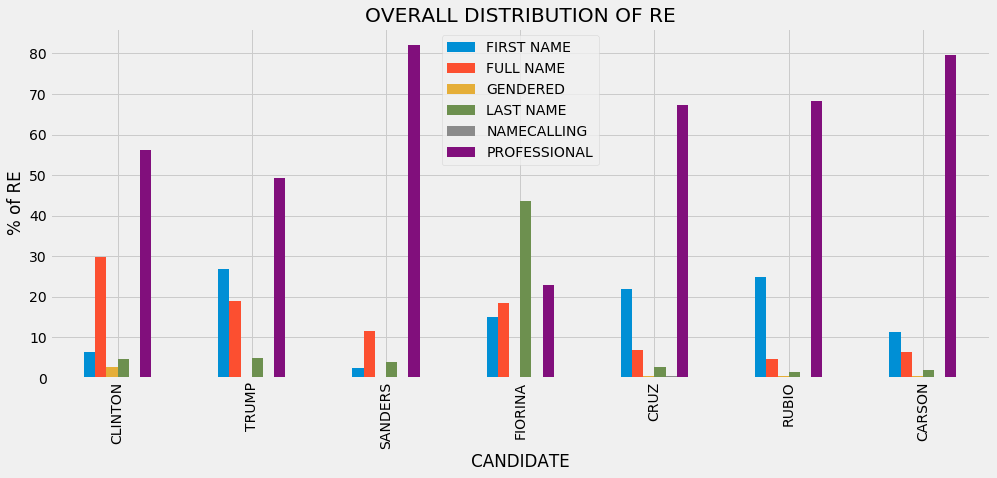


### Some Conclusions
**The person who is referred to by their full name the most often is Hillary Clinton, most likely implying that Clinton was discussed very often throughout the campaign. The person who is referred to by their first name the most often is Donald Trump. The person who is referred to by their professional title the most often is Bernie Sanders. Every candidate is referred to by a professional title more often than any other type of RE except for Carly Fiorina, who is mostly referred to by her last name. Out of all of the times she is referred to, Hillary Clinton is referred to by a professional title a higher percentage of the time than Donald Trump is out of all of the times he is referred to, but less often than Bernie Sanders, Ted Cruz, and Marco Rubio, and Ben Carson.**

### Some Questions
**What does it mean to call someone by their professional title vs their first name? What does the choice of using a first name/full name instead of a title mean? Is the distribution in type of RE for each candidate different depending on who is referring to/addressing them? Is this distribution different when a candidate is being referred to as opposed to addressed?**

**Let's look at some individual speakers now.**

### Donald Trump as Speaker


```python
trump_re = get_RE_for_label(trump['Tree'], 'all')
trump_re_freq = {re: trump_re.count(re) for re in trump_re}
trump_re_freq
```


    {'Trump': 15, 'Cruz': 1, 'Ted': 37, 'Neil': 4, 'Nikki': 4, 'Jeb': 36, 'Barack Obama': 12, 'Donald': 2, 'President Obama': 26, 'Carl': 4, 'Marco': 19, 'Maria': 3, 'Ivanka': 3, 'Eric': 2, 'Don': 2, 'Hillary': 43, 'Hillary Clinton': 33, 'Chris': 18, 'Obama': 15, 'Putin': 26, 'Podesta': 1, 'Bernie Sanders': 10, 'John Podesta': 1, 'Assad': 21, 'Ronald Reagan': 11, 'John': 3, 'Ben': 8, 'Governor': 7, 'Bill Clinton': 2, 'President Clinton': 1, 'Michelle Obama': 2, 'Deborah Wasserman Schultz': 2, 'Anderson': 3, 'President': 1, 'Captain Khan': 1, 'Abraham Lincoln': 3, 'Honest Abe': 2, 'Warren': 1, 'Donald Trump': 9, 'Clinton': 2, 'Gadhafi': 4, 'Kerry': 2, 'Scalia': 1, 'Dwight Eisenhower': 3, 'Mr. Trump': 6, 'Carly': 7, 'Wolf': 2, 'Lindsey Graham': 2, 'Jeb Bush': 4, 'Governor Bush': 1, 'Mister': 1, 'Santorum': 1, 'Governor Huckabee': 1, 'Mitch McConnell': 1, 'Bush': 3, 'George Bush': 4, 'Chris Christie': 3, 'Ben Carson': 6, 'Ted Cruz': 3, 'Sheriff Joe Arpaio': 3, 'Mitt Romney': 5, 'Robin Hood': 2, 'Anderson Cooper': 2, 'Bill': 2, 'Saddam Hussein': 1, 'John Kerry': 2, 'Dr. Ben Carson': 2, 'Senator Rubio': 1, 'Tip': 2, 'Jake': 4, 'Sheriff Joe': 1, 'Jeff Sessions': 1, 'Senator': 1, 'Senator Jeff Sessions': 1, 'Merkel': 1, 'David Duke': 1, 'Megyn': 3, 'Bret': 1, 'Lyin': 2, 'Snowden': 1, 'Sean': 2, 'Senator Marco Rubio': 1, 'Vladimir Putin': 1, "Rosie O'Donnell": 2, 'Rand Paul': 1, 'Dana': 2, 'Hugh Hewitt': 1, 'Rand': 2, 'Rosa Parks': 1, 'Lester': 9, 'Secretary': 3, 'Secretary Clinton': 21, 'Kennedy': 1, 'Mayor Giuliani': 1, 'Mayor Bloomberg': 1, 'Wolf Blitzer': 1, 'Debbie Wasserman Schultz': 1, 'Neil Cavuto': 1, 'Sean Hannity': 7, 'Secretary Kerry': 1, 'Bibi Netanyahu': 1}


**Interesting. It looks like Trump refers to himself as Mr. Trump 6 times. Let's see those instances in context.**


```python
trump_mrtrump_trees = get_trees_for(trump, 'Donald Trump', 'Mr. Trump')
```


```python
trump_mrtrump_trees
```


<div>
<table border="1" class="dataframe">
  <thead>
    <tr style="text-align: right;">
      <th></th>
      <th>Date</th>
      <th>Debate Type</th>
      <th>Speaker</th>
      <th>Sents</th>
      <th>Tree</th>
    </tr>
  </thead>
  <tbody>
    <tr>
      <th>1917</th>
      <td>11-10-15</td>
      <td>primary_rep</td>
      <td>TRUMP</td>
      <td>He said, "You know, Mr. Trump?</td>
      <td>[(He, PRP), (said, VBD), (,, ,), (``, ``), (Yo...</td>
    </tr>
    <tr>
      <th>2150</th>
      <td>12-15-15</td>
      <td>primary_rep</td>
      <td>TRUMP</td>
      <td>I think it's very sad that CNN leads Jeb Bush...</td>
      <td>[(I, PRP), (think, VBP), (it, PRP), ('s, VBZ),...</td>
    </tr>
    <tr>
      <th>2152</th>
      <td>12-15-15</td>
      <td>primary_rep</td>
      <td>TRUMP</td>
      <td>And, frankly, I watched the first debate, and ...</td>
      <td>[(And, CC), (,, ,), (frankly, RB), (,, ,), (I,...</td>
    </tr>
    <tr>
      <th>2153</th>
      <td>12-15-15</td>
      <td>primary_rep</td>
      <td>TRUMP</td>
      <td>Mr. Trump" — these poor guys — although, I mus...</td>
      <td>[[(Mr., NNP), (Trump, NNP)], ('', ''), (—, IN)...</td>
    </tr>
    <tr>
      <th>3247</th>
      <td>2-25-16</td>
      <td>primary_rep</td>
      <td>TRUMP</td>
      <td>Mr. Trump, you're doing a great job.</td>
      <td>[[(Mr., NNP), (Trump, NNP)], (,, ,), (you, PRP...</td>
    </tr>
  </tbody>
</table>
</div>


```python
trump_mrtrump_trees.loc[2152]['Sents']
```


    'And, frankly, I watched the first debate, and the first long number of questions were, "Mr. Trump said this, Mr. Trump said that.'


```python
trump_mrtrump_trees.loc[2153]['Sents']
```


    'Mr. Trump" — these poor guys — although, I must tell you, Santorum, good guy.'


**It looks like every time Donald Trump refers to himself as Mr. Trump, he is quoting someone else. This could be his way of showing the audience or making them believe that other people respect him.**


```python
trump_clinton_tree = get_trees_for(trump, 'Hillary Clinton')
trump_clinton_tree.head()
```


<div>
<table border="1" class="dataframe">
  <thead>
    <tr style="text-align: right;">
      <th></th>
      <th>Date</th>
      <th>Debate Type</th>
      <th>Speaker</th>
      <th>Sents</th>
      <th>Tree</th>
    </tr>
  </thead>
  <tbody>
    <tr>
      <th>331</th>
      <td>10-19-16</td>
      <td>general</td>
      <td>TRUMP</td>
      <td>But Hillary was extremely upset, extremely angry.</td>
      <td>[(But, CC), [(Hillary, NNP)], (was, VBD), (ext...</td>
    </tr>
    <tr>
      <th>337</th>
      <td>10-19-16</td>
      <td>general</td>
      <td>TRUMP</td>
      <td>And I am—I don't know if Hillary was saying it...</td>
      <td>[(And, CC), (I, PRP), (am—I, VBP), (do, VBP), ...</td>
    </tr>
    <tr>
      <th>349</th>
      <td>10-19-16</td>
      <td>general</td>
      <td>TRUMP</td>
      <td>If you go with what Hillary is saying, in the ...</td>
      <td>[(If, IN), (you, PRP), (go, VBP), (with, IN), ...</td>
    </tr>
    <tr>
      <th>350</th>
      <td>10-19-16</td>
      <td>general</td>
      <td>TRUMP</td>
      <td>Now, you can say that that's OK and Hillary ca...</td>
      <td>[(Now, RB), (,, ,), (you, PRP), (can, MD), (sa...</td>
    </tr>
    <tr>
      <th>362</th>
      <td>10-19-16</td>
      <td>general</td>
      <td>TRUMP</td>
      <td>Hillary wants to give amnesty.</td>
      <td>[[(Hillary, JJ)], (wants, VBZ), (to, TO), (giv...</td>
    </tr>
  </tbody>
</table>
</div>


```python
trump_REclinton = get_RE_for_label(trump['Tree'], 'Hillary Clinton')
trump_REclinton
```


    ['Hillary', 'Hillary', 'Hillary', 'Hillary', 'Hillary', 'Hillary Clinton', 'Hillary Clinton', 'Hillary Clinton', 'Hillary Clinton', 'Hillary', 'Hillary Clinton', 'Hillary', 'Hillary', 'Hillary', 'Hillary Clinton', 'Hillary', 'Hillary', 'Hillary', 'Hillary', 'Hillary', 'Hillary', 'Hillary Clinton', 'Hillary', 'Hillary', 'Hillary', 'Hillary', 'Hillary Clinton', 'Hillary', 'Hillary Clinton', 'Hillary Clinton', 'Hillary Clinton', 'Hillary Clinton', 'Hillary Clinton', 'Hillary', 'Hillary Clinton', 'Hillary', 'Hillary', 'Clinton', 'Hillary', 'Hillary', 'Hillary', 'Hillary Clinton', 'Hillary', 'Hillary', 'Hillary Clinton', 'Hillary', 'Hillary Clinton', 'Hillary', 'Hillary Clinton', 'Hillary Clinton', 'Hillary', 'Hillary Clinton', 'Hillary Clinton', 'Hillary', 'Hillary', 'Hillary', 'Hillary Clinton', 'Hillary Clinton', 'Hillary Clinton', 'Hillary Clinton', 'Hillary Clinton', 'Hillary Clinton', 'Hillary Clinton', 'Hillary Clinton', 'Hillary', 'Hillary Clinton', 'Hillary Clinton', 'Hillary Clinton', 'Hillary Clinton', 'Clinton', 'Hillary', 'Secretary', 'Secretary Clinton', 'Secretary Clinton', 'Hillary', 'Secretary Clinton', 'Secretary', 'Secretary', 'Secretary Clinton', 'Secretary Clinton', 'Secretary Clinton', 'Secretary Clinton', 'Secretary Clinton', 'Secretary Clinton', 'Secretary Clinton', 'Secretary Clinton', 'Secretary Clinton', 'Secretary Clinton', 'Secretary Clinton', 'Secretary Clinton', 'Secretary Clinton', 'Secretary Clinton', 'Secretary Clinton', 'Secretary Clinton', 'Secretary Clinton', 'Secretary Clinton', 'Hillary', 'Hillary', 'Hillary', 'Hillary', 'Hillary', 'Hillary']


```python
trump_clinton_freq = {re: trump_REclinton.count(re) for re in trump_REclinton}
trump_clinton_freq
```


    {'Hillary': 43, 'Hillary Clinton': 33, 'Clinton': 2, 'Secretary': 3, 'Secretary Clinton': 21}


```python
trump_clinton_REtype_freq = get_re_type_freq(clinton_re_maps, trump_clinton_freq)
trump_clinton_REtype_freq
```


    {'PROFESSIONAL': 21, 'FULL NAME': 33, 'FIRST NAME': 43, 'LAST NAME': 2}


##### Carly Fiorina


```python
trump_REfiorina = get_RE_for_label(trump['Tree'], 'Carly Fiorina')
trump_fiorina_freq = {re: trump_REfiorina.count(re) for re in trump_REfiorina}
trump_fiorina_freq
```


    {'Carly': 7}


```python
trump_fiorina_REtype_freq = get_re_type_freq(fiorina_re_maps, trump_fiorina_freq)
trump_fiorina_REtype_freq
```


    {'FIRST NAME': 7}


##### Ted Cruz


```python
trump_REcruz = get_RE_for_label(trump['Tree'], 'Ted Cruz')
trump_cruz_freq = {re: trump_REcruz.count(re) for re in trump_REcruz}
trump_cruz_freq
```


    {'Cruz': 1, 'Ted': 37, 'Ted Cruz': 3, 'Lyin': 2}


```python
trump_cruz_REtype_freq = get_re_type_freq(cruz_re_maps, trump_cruz_freq)
trump_cruz_REtype_freq
```


    {'FULL NAME': 3, 'FIRST NAME': 37, 'LAST NAME': 1, 'NAMECALLING': 2}


##### Marco Rubio


```python
trump_RErubio = get_RE_for_label(trump['Tree'], 'Marco Rubio')
trump_rubio_freq = {re: trump_RErubio.count(re) for re in trump_RErubio}
trump_rubio_freq
```


    {'Marco': 19, 'Senator Rubio': 1, 'Senator Marco Rubio': 1}


```python
trump_rubio_REtype_freq = get_re_type_freq(rubio_re_maps, trump_rubio_freq)
trump_rubio_REtype_freq
```


    {'PROFESSIONAL': 2, 'FIRST NAME': 19}


##### Bernie Sanders


```python
trump_REsanders = get_RE_for_label(trump['Tree'], 'Bernie Sanders')
trump_sanders_freq = {re: trump_REsanders.count(re) for re in trump_REsanders}
trump_sanders_freq
```


    {'Bernie Sanders': 10}


```python
trump_sanders_REtype_freq = get_re_type_freq(sanders_re_maps, trump_sanders_freq)
trump_sanders_REtype_freq
```


    {'FULL NAME': 10}


##### Ben Carson


```python
trump_REcarson = get_RE_for_label(trump['Tree'], 'Ben Carson')
trump_carson_freq = {re: trump_REcarson.count(re) for re in trump_REcarson}
trump_carson_freq
```


    {'Ben': 8, 'Ben Carson': 6, 'Dr. Ben Carson': 2}


```python
trump_carson_REtype_freq = get_re_type_freq(carson_re_maps, trump_carson_freq)
trump_carson_REtype_freq
```


    {'FULL NAME': 6, 'FIRST NAME': 8, 'PROFESSIONAL': 2}


```python
distribution_trump = pd.DataFrame([trump_clinton_REtype_freq, trump_sanders_REtype_freq, trump_fiorina_REtype_freq, trump_cruz_REtype_freq, trump_rubio_REtype_freq, trump_carson_REtype_freq], index = ['CLINTON', 'SANDERS', 'FIORINA', 'CRUZ', 'RUBIO', 'CARSON'])
distribution_trump.fillna(0, inplace=True)

distribution_trump['TOTAL']=distribution_trump.sum(axis=1)

#Get the percentage of each type of RE for each candidate.
distribution_trump['FIRST NAME'] = distribution_trump['FIRST NAME']/distribution_trump['TOTAL']*100
distribution_trump['FULL NAME'] = distribution_trump['FULL NAME']/distribution_trump['TOTAL']*100
distribution_trump['LAST NAME'] = distribution_trump['LAST NAME']/distribution_trump['TOTAL']*100
distribution_trump['NAMECALLING'] = distribution_trump['NAMECALLING']/distribution_trump['TOTAL']*100
distribution_trump['PROFESSIONAL'] = distribution_trump['PROFESSIONAL']/distribution_trump['TOTAL']*100
del distribution_trump['TOTAL']
distribution_trump.head(7)
```


<div>
<table border="1" class="dataframe">
  <thead>
    <tr style="text-align: right;">
      <th></th>
      <th>FIRST NAME</th>
      <th>FULL NAME</th>
      <th>LAST NAME</th>
      <th>NAMECALLING</th>
      <th>PROFESSIONAL</th>
    </tr>
  </thead>
  <tbody>
    <tr>
      <th>CLINTON</th>
      <td>43.434343</td>
      <td>33.333333</td>
      <td>2.020202</td>
      <td>0.000000</td>
      <td>21.212121</td>
    </tr>
    <tr>
      <th>SANDERS</th>
      <td>0.000000</td>
      <td>100.000000</td>
      <td>0.000000</td>
      <td>0.000000</td>
      <td>0.000000</td>
    </tr>
    <tr>
      <th>FIORINA</th>
      <td>100.000000</td>
      <td>0.000000</td>
      <td>0.000000</td>
      <td>0.000000</td>
      <td>0.000000</td>
    </tr>
    <tr>
      <th>CRUZ</th>
      <td>86.046512</td>
      <td>6.976744</td>
      <td>2.325581</td>
      <td>4.651163</td>
      <td>0.000000</td>
    </tr>
    <tr>
      <th>RUBIO</th>
      <td>90.476190</td>
      <td>0.000000</td>
      <td>0.000000</td>
      <td>0.000000</td>
      <td>9.523810</td>
    </tr>
    <tr>
      <th>CARSON</th>
      <td>50.000000</td>
      <td>37.500000</td>
      <td>0.000000</td>
      <td>0.000000</td>
      <td>12.500000</td>
    </tr>
  </tbody>
</table>
</div>


```python
plt.style.use('fivethirtyeight')
distribution_trump.plot(kind='bar', figsize=(15,6))
plt.xlabel('CANDIDATE')
plt.ylabel('% of RE')
plt.title('TRUMP DISTRIBUTION OF RE')
plt.show()
#Why are there two?
```


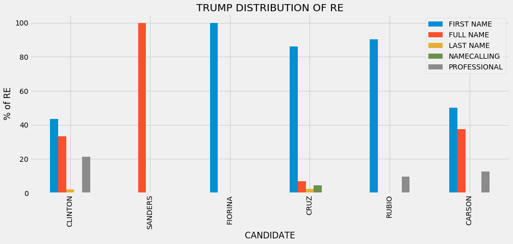


### Some Conclusions
**We can see Trump's most frequent type of RE for all of the candidates we're looking at (besides Bernie Sanders) is their first name. Trump refers to Hillary Clinton by her first name or her full name more often than by a professional title, but calls her by a professional title more often than he calls any of the other candidates by one. In fact, the only other people he uses a professional title for at all are Marco Rubio and Ben Carson. Trump refers to the only other female candidate, Carly Fiorina, exclusively by her first name. This could be a strategy to make her appear less powerful than him, or a way of making them seem like they are on the same level and good friends. In politics, the former is more likely. Every move should be strategic. He also calls Ted Cruz names more often than he refers to him as Cruz.**

**Let's check out how Hillary Clinton refers to these candidates.**

### Hillary Clinton as Speaker


```python
clinton_re = get_RE_for_label(clinton['Tree'], 'all')
clinton_re_freq = {re: clinton_re.count(re) for re in clinton_re}
clinton_re_freq
```


    {'Dr.': 3, 'Senator Sanders': 111, 'Lester': 8, 'Andrea': 1, 'Harry Truman': 2, 'President Obama': 91, "Governor O'Malley": 10, 'Lindsey Graham': 1, 'Secretary': 14, 'Governor': 5, 'Secretary Kerry': 5, 'Assad': 22, 'Putin': 15, 'Hillary Clinton': 2, 'Chris': 14, 'George W.': 1, 'President': 14, 'Bush': 12, 'Chris Cuomo': 1, 'Lady': 1, 'Chairman': 1, 'Ronald Reagan': 3, 'Bill': 5, 'Abraham Lincoln': 2, 'Abraham': 1, 'Lincoln': 2, 'Anderson': 6, 'Senator Obama': 6, 'Osama': 2, 'Laden': 8, 'Gadhafi': 10, 'Senator Webb': 1, 'Bernie': 2, 'Clinton': 2, 'Barack Obama': 7, 'Donald': 81, 'George W. Bush': 10, 'Donald Trump': 23, 'Vladimir Putin': 2, 'Bernie Sanders': 3, 'Alicia Machado': 2, 'Mr.': 2, 'Mrs.': 3, 'John McCain': 1, 'President Reagan': 3, 'Michelle Obama': 2, 'Captain Khan': 2, 'Martha': 7, 'George Washington': 1, 'President Lincoln': 2, 'Mr. Carter': 1, 'Trump': 4, 'John': 6, 'Gaddafi': 2, 'Senator': 21, 'Eric Garner': 1, 'Tamir Rice': 1, 'Michael Brown': 1, 'Trayvon Martin': 2, 'Bin Laden': 2, 'Hillary': 1, 'Martin': 2, 'Mr. Trump': 1, 'David': 3, 'Mubarak': 1, 'Mrs. Obama': 2, 'Scott Walker': 2, 'Obama': 8, 'Saddam Hussein': 1, 'Nelson Mandela': 1, 'President Biden': 1, 'Chuck': 3, 'Rachel': 3, 'Ashraf Ghani': 1, 'Secretary Carter': 3, 'President Bush': 1, 'Nikki': 1, 'Don': 2, 'Sandra Bland': 1, 'Jorge': 4, 'David Duke': 1, 'Senator Warren': 1, 'President Clinton': 1, 'Gore': 1, 'Dana': 3, 'Governor Cuomo': 2, 'Qadafi': 2, 'Wolf': 2, 'Netanyahu': 2, 'Yasser Arafat': 1, 'Lester Holt': 1, 'John Kerry': 1, 'Miss Piggy': 1, 'Miss Housekeeping': 1}


```python
clinton_ents = get_entities(clinton['Entities'])
clinton_ents
```


    {'George Washington', 'Wolf Blitzer', 'John McCain', 'Andrea Mitchell', 'Chuck Todd', 'Vladimir Putin', 'David Muir', 'Chris Christie', 'Elizabeth Warren', 'Bashar al-Assad', 'Tamir Rice', 'Rachel Maddow', 'James Carter', 'Muammar Gaddafi', 'Michael Brown', 'Dana Bash', 'Lester Holt', 'Barack Obama', 'Saddam Hussein', 'Don Lemon', 'George W. Bush', 'Martha Raddatz', 'Al Gore', 'Jorge Ramos', 'Lincoln Chafee', 'Anderson Cooper', 'Abraham Lincoln', 'Ronald Reagan', "Martin O'Malley", 'TITLE', 'Eric Garner', 'Jeb Bush', 'Harry Truman', 'Donald Trump', 'David Duke', 'Joe Biden', 'Alicia Machado', 'Lindsey Graham', 'Chris Cuomo', 'Sandra Bland', 'Humayun Khan', 'Bill Clinton', 'Nikki Haley', 'Scott Walker', 'Yasser Arafat', 'Osama bin Laden', 'Hillary Clinton', 'Ashraf Ghani', 'Jim Webb', 'John Kerry', 'Michelle Obama', 'Nelson Mandela', 'Bernie Sanders', 'Trayvon Martin', 'Hosni Mubarak', 'Benjamin Netanyahu', 'John Kasich'}


```python
'Carly Fiorina' in clinton_ents
```


    False


```python
'Ted Cruz' in clinton_ents
```


    False


```python
'Marco Rubio' in clinton_ents
```


    False


**Hillary Clinton doesn't refer to any of the Republican candidates listed above except for Donald Trump. Therefore, we're going to look at the way she refers to the other candidates she was in debates with, and we are going to examine the titles she uses.**


```python
get_trees_for(clinton, 'TITLE')
```


<div>
<table border="1" class="dataframe">
  <thead>
    <tr style="text-align: right;">
      <th></th>
      <th>Date</th>
      <th>Debate Type</th>
      <th>Speaker</th>
      <th>Sents</th>
      <th>Tree</th>
    </tr>
  </thead>
  <tbody>
    <tr>
      <th>2</th>
      <td>1-17-16</td>
      <td>primary_dem</td>
      <td>CLINTON</td>
      <td>You know, I remember well when my youth minist...</td>
      <td>[(You, PRP), (know, VBP), (,, ,), (I, PRP), (r...</td>
    </tr>
    <tr>
      <th>132</th>
      <td>1-17-16</td>
      <td>primary_dem</td>
      <td>CLINTON</td>
      <td>And, you know, Governor, you have raised money...</td>
      <td>[(And, CC), (,, ,), (you, PRP), (know, VBP), (...</td>
    </tr>
    <tr>
      <th>375</th>
      <td>1-25-16</td>
      <td>primary_dem</td>
      <td>CLINTON</td>
      <td>I flew from Cambodia, where I was with the pre...</td>
      <td>[(I, PRP), (flew, VBP), (from, IN), [(Cambodia...</td>
    </tr>
    <tr>
      <th>453</th>
      <td>1-25-16</td>
      <td>primary_dem</td>
      <td>CLINTON</td>
      <td>I did it as a First Lady when I worked, as I s...</td>
      <td>[(I, PRP), (did, VBD), (it, PRP), (as, IN), (a...</td>
    </tr>
    <tr>
      <th>491</th>
      <td>1-25-16</td>
      <td>primary_dem</td>
      <td>CLINTON</td>
      <td>And, at the end of it, the Chairman said, "No,...</td>
      <td>[(And, CC), (,, ,), (at, IN), (the, DT), (end,...</td>
    </tr>
    <tr>
      <th>669</th>
      <td>10-13-15</td>
      <td>primary_dem</td>
      <td>CLINTON</td>
      <td>There's no doubt that when Putin came back in ...</td>
      <td>[(There, EX), ('s, VBZ), (no, DT), (doubt, NN)...</td>
    </tr>
    <tr>
      <th>1178</th>
      <td>10-19-16</td>
      <td>general</td>
      <td>CLINTON</td>
      <td>He went after Mr. and Mrs. Khan, the parents ...</td>
      <td>[(He, PRP), (went, VBD), (after, IN), [(Mr., N...</td>
    </tr>
    <tr>
      <th>1400</th>
      <td>10-9-16</td>
      <td>general</td>
      <td>CLINTON</td>
      <td>He never apologized to Mr. and Mrs. Khan, the ...</td>
      <td>[(He, PRP), (never, RB), (apologized, VBD), (t...</td>
    </tr>
    <tr>
      <th>1839</th>
      <td>11-14-15</td>
      <td>primary_dem</td>
      <td>CLINTON</td>
      <td>Well, first of all, I know that the President...</td>
      <td>[(Well, RB), (,, ,), (first, RB), (of, IN), (a...</td>
    </tr>
    <tr>
      <th>1840</th>
      <td>11-14-15</td>
      <td>primary_dem</td>
      <td>CLINTON</td>
      <td>And my reading of the law and the Constitution...</td>
      <td>[(And, CC), (my, PRP$), (reading, NN), (of, IN...</td>
    </tr>
    <tr>
      <th>1926</th>
      <td>11-14-15</td>
      <td>primary_dem</td>
      <td>CLINTON</td>
      <td>But wait, I just want to say this Senator.</td>
      <td>[(But, CC), (wait, NN), (,, ,), (I, PRP), (jus...</td>
    </tr>
    <tr>
      <th>2173</th>
      <td>12-19-15</td>
      <td>primary_dem</td>
      <td>CLINTON</td>
      <td>And, you know, with all due respect, Senator, ...</td>
      <td>[(And, CC), (,, ,), (you, PRP), (know, VBP), (...</td>
    </tr>
    <tr>
      <th>2310</th>
      <td>12-19-15</td>
      <td>primary_dem</td>
      <td>CLINTON</td>
      <td>Senator, I have been -- I have been fighting ...</td>
      <td>[[(Senator, NNP)], (,, ,), (I, PRP), (have, VB...</td>
    </tr>
    <tr>
      <th>2332</th>
      <td>12-19-15</td>
      <td>primary_dem</td>
      <td>CLINTON</td>
      <td>I would like the federal government to offer $...</td>
      <td>[(I, PRP), (would, MD), (like, VB), (the, DT),...</td>
    </tr>
    <tr>
      <th>2409</th>
      <td>2-11-16</td>
      <td>primary_dem</td>
      <td>CLINTON</td>
      <td>Last week in a CNN town hall, the Senator told...</td>
      <td>[(Last, JJ), (week, NN), (in, IN), (a, DT), [(...</td>
    </tr>
    <tr>
      <th>2508</th>
      <td>2-11-16</td>
      <td>primary_dem</td>
      <td>CLINTON</td>
      <td>I think what President Obama did was to exempl...</td>
      <td>[(I, PRP), (think, VBP), (what, WP), [(Preside...</td>
    </tr>
    <tr>
      <th>2552</th>
      <td>2-11-16</td>
      <td>primary_dem</td>
      <td>CLINTON</td>
      <td>Well, that just wasn't — that just wasn't the...</td>
      <td>[(Well, RB), (,, ,), (that, DT), (just, RB), (...</td>
    </tr>
    <tr>
      <th>2559</th>
      <td>2-11-16</td>
      <td>primary_dem</td>
      <td>CLINTON</td>
      <td>I've said I'm looking at a couple of different...</td>
      <td>[(I, PRP), ('ve, VBP), (said, VBD), (I, PRP), ...</td>
    </tr>
    <tr>
      <th>2569</th>
      <td>2-11-16</td>
      <td>primary_dem</td>
      <td>CLINTON</td>
      <td>Well, Senator, look, I think we're in vigorou...</td>
      <td>[(Well, RB), (,, ,), [(Senator, NNP)], (,, ,),...</td>
    </tr>
    <tr>
      <th>2598</th>
      <td>2-11-16</td>
      <td>primary_dem</td>
      <td>CLINTON</td>
      <td>But, the real issue, I think, that the Senator...</td>
      <td>[(But, CC), (,, ,), (the, DT), (real, JJ), (is...</td>
    </tr>
    <tr>
      <th>2745</th>
      <td>2-11-16</td>
      <td>primary_dem</td>
      <td>CLINTON</td>
      <td>You know, Senator, what I am concerned about,...</td>
      <td>[(You, PRP), (know, VBP), (,, ,), [(Senator, N...</td>
    </tr>
    <tr>
      <th>2805</th>
      <td>2-4-16</td>
      <td>primary_dem</td>
      <td>CLINTON</td>
      <td>Under his definition, President Obama is not p...</td>
      <td>[(Under, IN), (his, PRP$), (definition, NN), (...</td>
    </tr>
    <tr>
      <th>2806</th>
      <td>2-4-16</td>
      <td>primary_dem</td>
      <td>CLINTON</td>
      <td>Even the late, great Senator Paul Wellstone wo...</td>
      <td>[(Even, RB), (the, DT), (late, JJ), (,, ,), (g...</td>
    </tr>
    <tr>
      <th>2824</th>
      <td>2-4-16</td>
      <td>primary_dem</td>
      <td>CLINTON</td>
      <td>It is fair to say, Senator, that in your defin...</td>
      <td>[(It, PRP), (is, VBZ), (fair, JJ), (to, TO), (...</td>
    </tr>
    <tr>
      <th>2826</th>
      <td>2-4-16</td>
      <td>primary_dem</td>
      <td>CLINTON</td>
      <td>Let's talk about what we would do as President...</td>
      <td>[(Let, VB), ('s, POS), (talk, VB), (about, IN)...</td>
    </tr>
    <tr>
      <th>2829</th>
      <td>2-4-16</td>
      <td>primary_dem</td>
      <td>CLINTON</td>
      <td>You know, the person who first put out the id...</td>
      <td>[(You, PRP), (know, VBP), (,, ,), (the, DT), (...</td>
    </tr>
    <tr>
      <th>2856</th>
      <td>2-4-16</td>
      <td>primary_dem</td>
      <td>CLINTON</td>
      <td>And I just absolutely reject that, Senator.</td>
      <td>[(And, CC), (I, PRP), (just, RB), (absolutely,...</td>
    </tr>
    <tr>
      <th>2870</th>
      <td>2-4-16</td>
      <td>primary_dem</td>
      <td>CLINTON</td>
      <td>Well, you know, Senator, I don't think—I don'...</td>
      <td>[(Well, RB), (,, ,), (you, PRP), (know, VBP), ...</td>
    </tr>
    <tr>
      <th>2937</th>
      <td>2-4-16</td>
      <td>primary_dem</td>
      <td>CLINTON</td>
      <td>I probably described more times than I can rem...</td>
      <td>[(I, PRP), (probably, RB), (described, VBD), (...</td>
    </tr>
    <tr>
      <th>2946</th>
      <td>2-4-16</td>
      <td>primary_dem</td>
      <td>CLINTON</td>
      <td>... Well, Senator, no one wants to see that h...</td>
      <td>[(..., :), (Well, RB), (,, ,), [(Senator, NNP)...</td>
    </tr>
    <tr>
      <th>3009</th>
      <td>2-4-16</td>
      <td>primary_dem</td>
      <td>CLINTON</td>
      <td>Well Senator, let me just correct the record ...</td>
      <td>[[(Well, NNP)], [(Senator, NNP)], (,, ,), (let...</td>
    </tr>
    <tr>
      <th>3021</th>
      <td>2-4-16</td>
      <td>primary_dem</td>
      <td>CLINTON</td>
      <td>That's exactly the right...[crosstalk]...and, ...</td>
      <td>[(That, DT), ('s, VBZ), (exactly, RB), (the, D...</td>
    </tr>
    <tr>
      <th>3173</th>
      <td>3-6-16</td>
      <td>primary_dem</td>
      <td>CLINTON</td>
      <td>I agree, the Governor should resign, or be rec...</td>
      <td>[(I, PRP), (agree, VBP), (,, ,), (the, DT), [(...</td>
    </tr>
    <tr>
      <th>3189</th>
      <td>3-6-16</td>
      <td>primary_dem</td>
      <td>CLINTON</td>
      <td>So I will make sure as President that I double...</td>
      <td>[(So, RB), (I, PRP), (will, MD), (make, VB), (...</td>
    </tr>
    <tr>
      <th>3404</th>
      <td>3-6-16</td>
      <td>primary_dem</td>
      <td>CLINTON</td>
      <td>It was also important for me to be a baby-sitt...</td>
      <td>[(It, PRP), (was, VBD), (also, RB), (important...</td>
    </tr>
    <tr>
      <th>3406</th>
      <td>3-6-16</td>
      <td>primary_dem</td>
      <td>CLINTON</td>
      <td>When I was in law school, I had the opportunit...</td>
      <td>[(When, WRB), (I, PRP), (was, VBD), (in, IN), ...</td>
    </tr>
    <tr>
      <th>3443</th>
      <td>3-6-16</td>
      <td>primary_dem</td>
      <td>CLINTON</td>
      <td>Mrs. Kim, here is what I would do as president.</td>
      <td>[[(Mrs., NNP)], [(Kim, NNP)], (,, ,), (here, R...</td>
    </tr>
    <tr>
      <th>3445</th>
      <td>3-6-16</td>
      <td>primary_dem</td>
      <td>CLINTON</td>
      <td>[applause]\n\nSecondly, I would use every lega...</td>
      <td>[([, NN), (applause, NN), (], NNP), (Secondly,...</td>
    </tr>
    <tr>
      <th>3634</th>
      <td>3-9-16</td>
      <td>primary_dem</td>
      <td>CLINTON</td>
      <td>So I think when you were running for the Senat...</td>
      <td>[(So, RB), (I, PRP), (think, VBP), (when, WRB)...</td>
    </tr>
    <tr>
      <th>4006</th>
      <td>4-14-16</td>
      <td>primary_dem</td>
      <td>CLINTON</td>
      <td>I spoke out against Wall Street when I was a S...</td>
      <td>[(I, PRP), (spoke, VBD), (out, RP), (against, ...</td>
    </tr>
    <tr>
      <th>4194</th>
      <td>4-14-16</td>
      <td>primary_dem</td>
      <td>CLINTON</td>
      <td>... And, our President led the effort to prot...</td>
      <td>[(..., :), (And, CC), (,, ,), (our, PRP$), [(P...</td>
    </tr>
    <tr>
      <th>4195</th>
      <td>4-14-16</td>
      <td>primary_dem</td>
      <td>CLINTON</td>
      <td>Well, I'm a little bewildered about how to re...</td>
      <td>[(Well, RB), (,, ,), (I, PRP), ('m, VBP), (a, ...</td>
    </tr>
    <tr>
      <th>4197</th>
      <td>4-14-16</td>
      <td>primary_dem</td>
      <td>CLINTON</td>
      <td>[applause]\n\nAnd, you know, I am getting a li...</td>
      <td>[([, NN), (applause, NN), (], NN), (And, CC), ...</td>
    </tr>
    <tr>
      <th>4232</th>
      <td>4-14-16</td>
      <td>primary_dem</td>
      <td>CLINTON</td>
      <td>Senator sanders voted for that, and that's exa...</td>
      <td>[[(Senator, NNP)], (sanders, NNS), (voted, VBD...</td>
    </tr>
    <tr>
      <th>4242</th>
      <td>4-14-16</td>
      <td>primary_dem</td>
      <td>CLINTON</td>
      <td>There was also in that a reference to the Sec...</td>
      <td>[(There, EX), (was, VBD), (also, RB), (in, IN)...</td>
    </tr>
    <tr>
      <th>4281</th>
      <td>4-14-16</td>
      <td>primary_dem</td>
      <td>CLINTON</td>
      <td>I did it in concert with... [applause]\n\nPres...</td>
      <td>[(I, PRP), (did, VBD), (it, PRP), (in, IN), (c...</td>
    </tr>
    <tr>
      <th>4363</th>
      <td>4-14-16</td>
      <td>primary_dem</td>
      <td>CLINTON</td>
      <td>You know, we are in vigorous agreement here, S...</td>
      <td>[(You, PRP), (know, VBP), (,, ,), (we, PRP), (...</td>
    </tr>
  </tbody>
</table>
</div>


**We see that Hillary Clinton often refers to one of the other candidates as Senator. Since all of these instances were in the primary debates, and it's clear that she is talking directly to someone instead of about them, it is clear that she much be talking about Senator Bernie Sanders or Senator Jim Webb. Based on the dates of the debates, she is always talking about Bernie Sanders, because Jim Webb withdrew from the race on October 20, 2015.**


```python
clinton_trump_tree = get_trees_for(clinton, 'Donald Trump')
clinton_trump_tree.head()
```


<div>
<table border="1" class="dataframe">
  <thead>
    <tr style="text-align: right;">
      <th></th>
      <th>Date</th>
      <th>Debate Type</th>
      <th>Speaker</th>
      <th>Sents</th>
      <th>Tree</th>
    </tr>
  </thead>
  <tbody>
    <tr>
      <th>955</th>
      <td>10-19-16</td>
      <td>general</td>
      <td>CLINTON</td>
      <td>And, you know, look, I understand that Donald'...</td>
      <td>[(And, CC), (,, ,), (you, PRP), (know, VBP), (...</td>
    </tr>
    <tr>
      <th>964</th>
      <td>10-19-16</td>
      <td>general</td>
      <td>CLINTON</td>
      <td>Donald has said he's in favor of defunding Pla...</td>
      <td>[[(Donald, NNP)], (has, VBZ), (said, VBD), (he...</td>
    </tr>
    <tr>
      <th>991</th>
      <td>10-19-16</td>
      <td>general</td>
      <td>CLINTON</td>
      <td>I don't want to see the deportation force that...</td>
      <td>[(I, PRP), (do, VBP), (n't, RB), (want, VB), (...</td>
    </tr>
    <tr>
      <th>1005</th>
      <td>10-19-16</td>
      <td>general</td>
      <td>CLINTON</td>
      <td>When it comes to the wall that Donald talks ab...</td>
      <td>[(When, WRB), (it, PRP), (comes, VBZ), (to, TO...</td>
    </tr>
    <tr>
      <th>1013</th>
      <td>10-19-16</td>
      <td>general</td>
      <td>CLINTON</td>
      <td>But it is clear, when you look at what Donald ...</td>
      <td>[(But, CC), (it, PRP), (is, VBZ), (clear, JJ),...</td>
    </tr>
  </tbody>
</table>
</div>


```python
clinton_REtrump = get_RE_for_label(clinton['Tree'], 'Donald Trump')
clinton_REtrump
```


    ['Donald', 'Donald', 'Donald', 'Donald', 'Donald', 'Donald', 'Donald', 'Donald Trump', 'Donald Trump', 'Donald', 'Donald', 'Donald', 'Donald', 'Donald', 'Donald', 'Donald', 'Donald', 'Donald', 'Donald', 'Donald', 'Donald', 'Donald', 'Donald', 'Donald', 'Donald', 'Donald', 'Donald', 'Donald', 'Donald', 'Donald', 'Donald Trump', 'Donald', 'Donald Trump', 'Donald Trump', 'Donald', 'Donald', 'Donald', 'Donald Trump', 'Donald', 'Donald', 'Donald', 'Donald', 'Donald', 'Donald', 'Donald', 'Donald', 'Donald', 'Donald Trump', 'Donald Trump', 'Donald', 'Donald', 'Donald', 'Donald', 'Donald', 'Donald', 'Donald', 'Donald', 'Donald Trump', 'Donald', 'Trump', 'Donald', 'Donald', 'Donald Trump', 'Donald', 'Donald Trump', 'Donald Trump', 'Mr. Trump', 'Trump', 'Donald Trump', 'Donald Trump', 'Donald Trump', 'Donald Trump', 'Donald Trump', 'Donald Trump', 'Donald Trump', 'Donald Trump', 'Trump', 'Donald Trump', 'Donald', 'Donald Trump', 'Donald', 'Donald', 'Donald', 'Donald', 'Donald', 'Donald', 'Donald', 'Donald', 'Trump', 'Donald', 'Donald', 'Donald', 'Donald', 'Donald', 'Donald', 'Donald Trump', 'Donald', 'Donald', 'Donald', 'Donald', 'Donald', 'Donald', 'Donald', 'Donald', 'Donald', 'Donald', 'Donald', 'Donald', 'Donald']


```python
clinton_trump_freq = {re: clinton_REtrump.count(re) for re in clinton_REtrump}
clinton_trump_freq
```


    {'Donald': 81, 'Donald Trump': 23, 'Trump': 4, 'Mr. Trump': 1}


```python
clinton_trump_REtype_freq = get_re_type_freq(trump_re_maps, clinton_trump_freq)
clinton_trump_REtype_freq
```


    {'PROFESSIONAL': 1, 'FULL NAME': 23, 'FIRST NAME': 81, 'LAST NAME': 4}


##### Bernie Sanders


```python
clinton_REsanders = get_RE_for_label(clinton['Tree'], 'Bernie Sanders')
clinton_senator = get_RE_for_label(clinton['Tree'], 'TITLE')
clinton_senator = [x for x in clinton_senator if x == 'Senator']
clinton_REsanders = clinton_REsanders + clinton_senator
set(clinton_REsanders)
```


    {'Bernie Sanders', 'Bernie', 'Senator', 'Senator Sanders'}


```python
clinton_sanders_freq = {re: clinton_REsanders.count(re) for re in clinton_REsanders}
clinton_sanders_freq
```


    {'Senator Sanders': 111, 'Bernie': 2, 'Bernie Sanders': 3, 'Senator': 21}


```python
sanders_re_maps['Senator'] = 'PROFESSIONAL'
clinton_sanders_REtype_freq = get_re_type_freq(sanders_re_maps, clinton_sanders_freq)
clinton_sanders_REtype_freq
```


    {'FIRST NAME': 2, 'FULL NAME': 3, 'PROFESSIONAL': 132}


##### Martin O'Malley


```python
clinton_REomalley = get_RE_for_label(clinton['Tree'], "Martin O'Malley")
set(clinton_REomalley)
```


    {'Martin', "Governor O'Malley"}


```python
clinton_omalley_freq = {re: clinton_REomalley.count(re) for re in clinton_REomalley}
clinton_omalley_freq
```


    {"Governor O'Malley": 10, 'Martin': 2}


```python
omalley_re_maps = {"Governor O'Malley" : "PROFESSIONAL", "Martin": "FIRST NAME"}
clinton_omalley_REtype_freq = get_re_type_freq(omalley_re_maps, clinton_omalley_freq)
clinton_omalley_REtype_freq
```


    {'PROFESSIONAL': 10, 'FIRST NAME': 2}


```python
distribution_clinton = pd.DataFrame([clinton_omalley_REtype_freq, clinton_sanders_REtype_freq, clinton_trump_REtype_freq, ], index = ["O'MALLEY", 'SANDERS', 'TRUMP'])
distribution_clinton.fillna(0, inplace=True)

distribution_clinton['TOTAL']=distribution_clinton.sum(axis=1)

#Get the percentage of each type of RE for each candidate.
distribution_clinton['FIRST NAME'] = distribution_clinton['FIRST NAME']/distribution_clinton['TOTAL']*100
distribution_clinton['FULL NAME'] = distribution_clinton['FULL NAME']/distribution_clinton['TOTAL']*100
distribution_clinton['LAST NAME'] = distribution_clinton['LAST NAME']/distribution_clinton['TOTAL']*100
distribution_clinton['PROFESSIONAL'] = distribution_clinton['PROFESSIONAL']/distribution_clinton['TOTAL']*100
del distribution_clinton['TOTAL']
distribution_clinton.head(6)
```


<div>
<table border="1" class="dataframe">
  <thead>
    <tr style="text-align: right;">
      <th></th>
      <th>FIRST NAME</th>
      <th>FULL NAME</th>
      <th>LAST NAME</th>
      <th>PROFESSIONAL</th>
    </tr>
  </thead>
  <tbody>
    <tr>
      <th>O'MALLEY</th>
      <td>16.666667</td>
      <td>0.000000</td>
      <td>0.000000</td>
      <td>83.333333</td>
    </tr>
    <tr>
      <th>SANDERS</th>
      <td>1.459854</td>
      <td>2.189781</td>
      <td>0.000000</td>
      <td>96.350365</td>
    </tr>
    <tr>
      <th>TRUMP</th>
      <td>74.311927</td>
      <td>21.100917</td>
      <td>3.669725</td>
      <td>0.917431</td>
    </tr>
  </tbody>
</table>
</div>


```python
distribution_clinton.plot(kind='bar', figsize=(15,6))
plt.xlabel('CANDIDATE')
plt.ylabel('% of RE')
plt.title('CLINTON DISTRIBUTION OF RE')
plt.show()
```


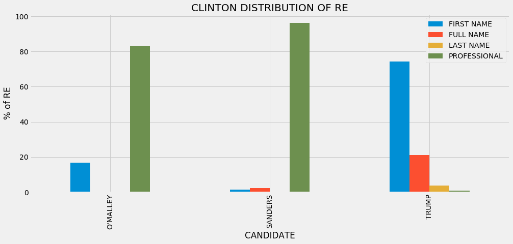


### Some Conclusions
**It's a little harder to compare this graph to Trump's since Clinton didn't refer to all of the same candidates Trump did, but we can see that she refers to O'Malley and Sanders by a professional title the majority of the time, yet she almost never calls Trump by a professional title, and mostly refers to him by his first name.**

### Carly Fiorina as Speaker

##### Donald Trump


```python
fiorina_REtrump = get_RE_for_label(fiorina['Tree'], "Donald Trump")
set(fiorina_REtrump)
```


    {'Mr. Trump'}


```python
fiorina_trump_freq = {re: fiorina_REtrump.count(re) for re in fiorina_REtrump}
fiorina_trump_freq
```


    {'Mr. Trump': 12}


```python
fiorina_trump_REtype_freq = get_re_type_freq(trump_re_maps, fiorina_trump_freq)
fiorina_trump_REtype_freq
```


    {'PROFESSIONAL': 12}


##### Hillary Clinton


```python
fiorina_REclinton = get_RE_for_label(fiorina['Tree'], "Hillary Clinton")
set(fiorina_REclinton)
```


    {'Hillary Clinton', 'Clinton', 'Mrs. Clinton'}


```python
fiorina_clinton_freq = {re: fiorina_REclinton.count(re) for re in fiorina_REclinton}
fiorina_clinton_freq
```


    {'Mrs. Clinton': 7, 'Hillary Clinton': 14, 'Clinton': 3}


```python
fiorina_clinton_REtype_freq = get_re_type_freq(clinton_re_maps, fiorina_clinton_freq)
fiorina_clinton_REtype_freq
```


    {'FULL NAME': 14, 'LAST NAME': 3, 'GENDERED': 7}


##### Ted Cruz


```python
fiorina_REcruz = get_RE_for_label(fiorina['Tree'], "Ted Cruz")
set(fiorina_REcruz)
```


    {'Senator Cruz'}


```python
fiorina_cruz_freq = {re: fiorina_REcruz.count(re) for re in fiorina_REcruz}
fiorina_cruz_freq
```


    {'Senator Cruz': 1}


```python
fiorina_cruz_REtype_freq = get_re_type_freq(cruz_re_maps, fiorina_cruz_freq)
fiorina_cruz_REtype_freq
```


    {'PROFESSIONAL': 1}


##### Marco Rubio


```python
fiorina_RErubio = get_RE_for_label(fiorina['Tree'], "Marco Rubio")
set(fiorina_RErubio)
```


    {'Senator Rubio'}


```python
fiorina_rubio_freq = {re: fiorina_RErubio.count(re) for re in fiorina_RErubio}
fiorina_rubio_freq
```


    {'Senator Rubio': 2}


```python
fiorina_rubio_REtype_freq = get_re_type_freq(rubio_re_maps, fiorina_rubio_freq)
fiorina_rubio_REtype_freq
```


    {'PROFESSIONAL': 2}


```python
distribution_fiorina = pd.DataFrame([fiorina_clinton_REtype_freq, fiorina_trump_REtype_freq, fiorina_rubio_REtype_freq, fiorina_cruz_REtype_freq], index = ["CLINTON", 'TRUMP', 'RUBIO', 'CRUZ'])
distribution_fiorina.fillna(0, inplace=True)

distribution_fiorina['TOTAL']=distribution_fiorina.sum(axis=1)

#Get the percentage of each type of RE for each candidate.
distribution_fiorina['FULL NAME'] = distribution_fiorina['FULL NAME']/distribution_fiorina['TOTAL']*100
distribution_fiorina['LAST NAME'] = distribution_fiorina['LAST NAME']/distribution_fiorina['TOTAL']*100
distribution_fiorina['GENDERED'] = distribution_fiorina['GENDERED']/distribution_fiorina['TOTAL']*100
distribution_fiorina['PROFESSIONAL'] = distribution_fiorina['PROFESSIONAL']/distribution_fiorina['TOTAL']*100
del distribution_fiorina['TOTAL']
distribution_fiorina.head(6)
```


<div>
<table border="1" class="dataframe">
  <thead>
    <tr style="text-align: right;">
      <th></th>
      <th>FULL NAME</th>
      <th>GENDERED</th>
      <th>LAST NAME</th>
      <th>PROFESSIONAL</th>
    </tr>
  </thead>
  <tbody>
    <tr>
      <th>CLINTON</th>
      <td>58.333333</td>
      <td>29.166667</td>
      <td>12.5</td>
      <td>0.0</td>
    </tr>
    <tr>
      <th>TRUMP</th>
      <td>0.000000</td>
      <td>0.000000</td>
      <td>0.0</td>
      <td>100.0</td>
    </tr>
    <tr>
      <th>RUBIO</th>
      <td>0.000000</td>
      <td>0.000000</td>
      <td>0.0</td>
      <td>100.0</td>
    </tr>
    <tr>
      <th>CRUZ</th>
      <td>0.000000</td>
      <td>0.000000</td>
      <td>0.0</td>
      <td>100.0</td>
    </tr>
  </tbody>
</table>
</div>


```python
distribution_fiorina.plot(kind='bar', figsize=(15,6))
plt.xlabel('CANDIDATE')
plt.ylabel('% of RE')
plt.title('FIORINA DISTRIBUTION OF RE')
plt.show()
```


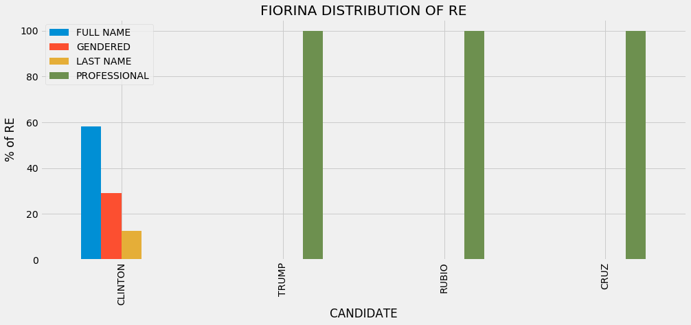


### Some Conclusions
**While Fiorina referred to Rubio and Cruz as Senator, she never referred to Clinton as Secretary, always Mrs., her full name, or her last name. This could be a way of making Hillary Clinton and herself appear more similar by taking the political references out of the way Hillary Clinton is addressed. Using Mrs. also draws attention to Clinton's husband, former President Bill Clinton. It's possible that drawing attention to their relationship using this form of address can cause audience members to associate characteristics or decisions made by President Bill Clinton with Hillary Clinton. Fiorina always referred to Trump as Mr. Trump, which is interesting because he only ever referred to her by her first name. Perhaps by showing respect by using this title when referring to Trump, Fiorina is attempting to get respect back from him. Fiorina never referred to Ben Carson. Fiorina referred to Clinton 24 times, which is interesting because Clinton did not refer to Fiorina at all. It is also important to notice that Fiorina only referred to Marco Rubio two times, and Ted Cruz one time, so seeing in the graph that she referred to them by professional titles 100% of the time doesn't mean very much.**

### Ted Cruz as Speaker

##### Donald Trump


```python
cruz_REtrump = get_RE_for_label(cruz['Tree'], "Donald Trump")
set(cruz_REtrump)
```


    {'Donald J. Trump', 'Donald', 'Donald Trump', 'Mr. Trump'}


```python
cruz_trump_freq = {re: cruz_REtrump.count(re) for re in cruz_REtrump}
cruz_trump_freq
```


    {'Donald': 116, 'Donald J. Trump': 1, 'Donald Trump': 27, 'Mr. Trump': 2}


```python
cruz_trump_REtype_freq = get_re_type_freq(trump_re_maps, cruz_trump_freq)
cruz_trump_REtype_freq
```


    {'PROFESSIONAL': 2, 'FULL NAME': 28, 'FIRST NAME': 116}


##### Hillary Clinton


```python
cruz_REclinton = get_RE_for_label(cruz['Tree'], "Hillary Clinton")
set(cruz_REclinton)
```


    {'Hillary Clinton', 'Clinton', 'Hillary', 'Madam Secretary'}


```python
cruz_clinton_freq = {re: cruz_REclinton.count(re) for re in cruz_REclinton}
cruz_clinton_freq
```


    {'Hillary Clinton': 53, 'Hillary': 11, 'Clinton': 5, 'Madam Secretary': 1}


```python
cruz_clinton_REtype_freq = get_re_type_freq(clinton_re_maps, cruz_clinton_freq)
cruz_clinton_REtype_freq
```


    {'FULL NAME': 53, 'FIRST NAME': 11, 'LAST NAME': 5, 'GENDERED': 1}


##### Carly Fiorina


```python
cruz_REfiorina = get_RE_for_label(cruz['Tree'], "Carly Fiorina")
set(cruz_REfiorina)
```


    {'Carly Fiorina'}


```python
cruz_fiorina_freq = {re: cruz_REfiorina.count(re) for re in cruz_REfiorina}
cruz_fiorina_freq
```


    {'Carly Fiorina': 1}


```python
#Let's take a peek at this one instance Ted Cruz referred to Carly Fiorina
get_trees_for(cruz, 'Carly Fiorina')
```


<div>
<table border="1" class="dataframe">
  <thead>
    <tr style="text-align: right;">
      <th></th>
      <th>Date</th>
      <th>Debate Type</th>
      <th>Speaker</th>
      <th>Sents</th>
      <th>Tree</th>
    </tr>
  </thead>
  <tbody>
    <tr>
      <th>1699</th>
      <td>3-10-16</td>
      <td>primary_rep</td>
      <td>CRUZ</td>
      <td>It's why Carly Fiorina endorsed me yesterday.</td>
      <td>[(It, PRP), ('s, VBZ), (why, WRB), [(Carly, NN...</td>
    </tr>
  </tbody>
</table>
</div>


```python
cruz_fiorina_REtype_freq = get_re_type_freq(fiorina_re_maps, cruz_fiorina_freq)
cruz_fiorina_REtype_freq
```


    {'FULL NAME': 1}


##### Marco Rubio


```python
cruz_RErubio = get_RE_for_label(cruz['Tree'], "Marco Rubio")
set(cruz_RErubio)
```


    {'Marco Rubio', 'Senator Rubio', 'Marco'}


```python
cruz_rubio_freq = {re: cruz_RErubio.count(re) for re in cruz_RErubio}
cruz_rubio_freq
```


    {'Marco Rubio': 2, 'Marco': 32, 'Senator Rubio': 6}


```python
cruz_rubio_REtype_freq = get_re_type_freq(rubio_re_maps, cruz_rubio_freq)
cruz_rubio_REtype_freq
```


    {'FULL NAME': 2, 'PROFESSIONAL': 6, 'FIRST NAME': 32}


##### Bernie Sanders


```python
cruz_REsanders = get_RE_for_label(cruz['Tree'], "Bernie Sanders")
set(cruz_REsanders)
```


    {'Bernie Sanders'}


```python
cruz_sanders_freq = {re: cruz_REsanders.count(re) for re in cruz_REsanders}
cruz_sanders_freq
```


    {'Bernie Sanders': 3}


```python
cruz_sanders_REtype_freq = get_re_type_freq(sanders_re_maps, cruz_sanders_freq)
cruz_sanders_REtype_freq
```


    {'FULL NAME': 3}


##### Ben Carson


```python
cruz_REcarson = get_RE_for_label(cruz['Tree'], "Ben Carson")
set(cruz_REcarson)
```


    {'Ben Carson', 'Ben'}


```python
cruz_carson_freq = {re: cruz_REcarson.count(re) for re in cruz_REcarson}
cruz_carson_freq
```


    {'Ben': 9, 'Ben Carson': 2}


```python
cruz_carson_REtype_freq = get_re_type_freq(carson_re_maps, cruz_carson_freq)
cruz_carson_REtype_freq
```


    {'FULL NAME': 2, 'FIRST NAME': 9}


```python
distribution_cruz = pd.DataFrame([cruz_clinton_REtype_freq, cruz_trump_REtype_freq, cruz_rubio_REtype_freq, cruz_fiorina_REtype_freq, cruz_sanders_REtype_freq, cruz_carson_REtype_freq], index = ["CLINTON", 'TRUMP', 'RUBIO', 'FIORINA', 'SANDERS', 'CARSON'])
distribution_cruz.fillna(0, inplace=True)

distribution_cruz['TOTAL']=distribution_cruz.sum(axis=1)

#Get the percentage of each type of RE for each candidate.
distribution_cruz['FIRST NAME'] = distribution_cruz['FIRST NAME']/distribution_cruz['TOTAL']*100
distribution_cruz['FULL NAME'] = distribution_cruz['FULL NAME']/distribution_cruz['TOTAL']*100
distribution_cruz['LAST NAME'] = distribution_cruz['LAST NAME']/distribution_cruz['TOTAL']*100
distribution_cruz['GENDERED'] = distribution_cruz['GENDERED']/distribution_cruz['TOTAL']*100
distribution_cruz['PROFESSIONAL'] = distribution_cruz['PROFESSIONAL']/distribution_cruz['TOTAL']*100
del distribution_cruz['TOTAL']
distribution_cruz.head(6)
```


<div>
<table border="1" class="dataframe">
  <thead>
    <tr style="text-align: right;">
      <th></th>
      <th>FIRST NAME</th>
      <th>FULL NAME</th>
      <th>GENDERED</th>
      <th>LAST NAME</th>
      <th>PROFESSIONAL</th>
    </tr>
  </thead>
  <tbody>
    <tr>
      <th>CLINTON</th>
      <td>15.714286</td>
      <td>75.714286</td>
      <td>1.428571</td>
      <td>7.142857</td>
      <td>0.000000</td>
    </tr>
    <tr>
      <th>TRUMP</th>
      <td>79.452055</td>
      <td>19.178082</td>
      <td>0.000000</td>
      <td>0.000000</td>
      <td>1.369863</td>
    </tr>
    <tr>
      <th>RUBIO</th>
      <td>80.000000</td>
      <td>5.000000</td>
      <td>0.000000</td>
      <td>0.000000</td>
      <td>15.000000</td>
    </tr>
    <tr>
      <th>FIORINA</th>
      <td>0.000000</td>
      <td>100.000000</td>
      <td>0.000000</td>
      <td>0.000000</td>
      <td>0.000000</td>
    </tr>
    <tr>
      <th>SANDERS</th>
      <td>0.000000</td>
      <td>100.000000</td>
      <td>0.000000</td>
      <td>0.000000</td>
      <td>0.000000</td>
    </tr>
    <tr>
      <th>CARSON</th>
      <td>81.818182</td>
      <td>18.181818</td>
      <td>0.000000</td>
      <td>0.000000</td>
      <td>0.000000</td>
    </tr>
  </tbody>
</table>
</div>


```python
distribution_cruz.plot(kind='bar', figsize=(15,6))
plt.xlabel('CANDIDATE')
plt.ylabel('% of RE')
plt.title('CRUZ DISTRIBUTION OF RE')
plt.show()
```


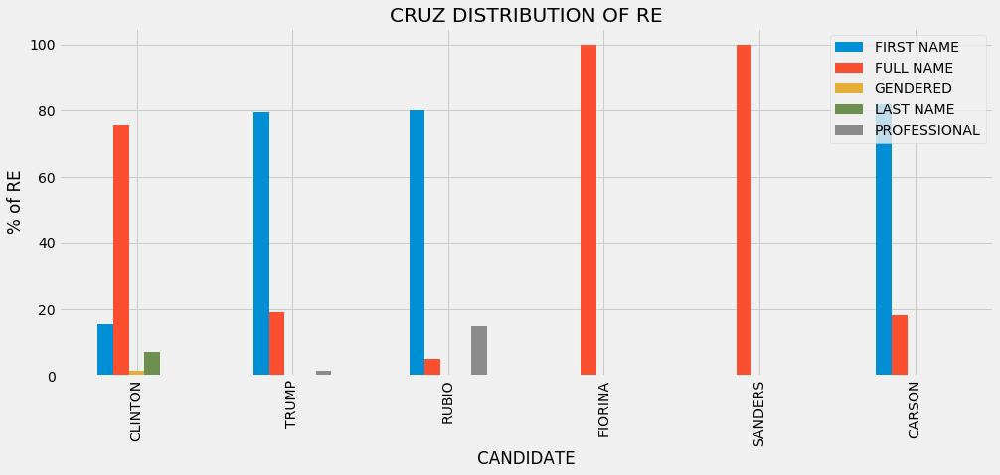


### Some Conclusions
**Ted Cruz also preferred to use the other candidates first names while addressing them, except for Hillary Clinton, Bernie Sanders, and Carly Fiorina, where he preferred their full names. This is most likely because he never spoke to those three, only about them. He refers to Marco Rubio and Donald Trump by professional titles, but no one else.**

### Marco Rubio as Speaker

##### Donald Trump


```python
rubio_REtrump = get_RE_for_label(rubio['Tree'], "Donald Trump")
set(rubio_REtrump)
```


    {'Mr. Trump', 'Donald', 'Donald Trump', 'Trump'}


```python
rubio_trump_freq = {re: rubio_REtrump.count(re) for re in rubio_REtrump}
rubio_trump_freq
```


    {'Donald': 27, 'Donald Trump': 11, 'Trump': 3, 'Mr. Trump': 4}


```python
rubio_trump_REtype_freq = get_re_type_freq(trump_re_maps, rubio_trump_freq)
rubio_trump_REtype_freq
```


    {'PROFESSIONAL': 4, 'FULL NAME': 11, 'FIRST NAME': 27, 'LAST NAME': 3}


##### Hillary Clinton


```python
rubio_REclinton = get_RE_for_label(rubio['Tree'], "Hillary Clinton")
set(rubio_REclinton)
```


    {'Hillary Clinton', 'Hillary'}


```python
rubio_clinton_freq = {re: rubio_REclinton.count(re) for re in rubio_REclinton}
rubio_clinton_freq
```


    {'Hillary Clinton': 37, 'Hillary': 2}


```python
rubio_clinton_REtype_freq = get_re_type_freq(clinton_re_maps, rubio_clinton_freq)
rubio_clinton_REtype_freq
```


    {'FULL NAME': 37, 'FIRST NAME': 2}


##### Ted Cruz


```python
rubio_REcruz = get_RE_for_label(rubio['Tree'], "Ted Cruz")
set(rubio_REcruz)
```


    {'Senator Cruz', 'Ted Cruz', 'Ted'}


```python
rubio_cruz_freq = {re: rubio_REcruz.count(re) for re in rubio_REcruz}
rubio_cruz_freq
```


    {'Ted': 14, 'Ted Cruz': 8, 'Senator Cruz': 8}


```python
rubio_cruz_REtype_freq = get_re_type_freq(cruz_re_maps, rubio_cruz_freq)
rubio_cruz_REtype_freq
```


    {'FULL NAME': 8, 'PROFESSIONAL': 8, 'FIRST NAME': 14}


##### Bernie Sanders


```python
rubio_REsanders = get_RE_for_label(rubio['Tree'], "Bernie Sanders")
set(rubio_REsanders)
```


    {'Bernie Sanders'}


```python
rubio_sanders_freq = {re: rubio_REsanders.count(re) for re in rubio_REsanders}
rubio_sanders_freq
```


    {'Bernie Sanders': 8}


```python
rubio_sanders_REtype_freq = get_re_type_freq(sanders_re_maps, rubio_sanders_freq)
rubio_sanders_REtype_freq
```


    {'FULL NAME': 8}


##### Ben Carson


```python
rubio_REcarson = get_RE_for_label(rubio['Tree'], "Ben Carson")
set(rubio_REcarson)
```


    {'Dr. Carson', 'Ben Carson'}


```python
rubio_carson_freq = {re: rubio_REcarson.count(re) for re in rubio_REcarson}
rubio_carson_freq
```


    {'Dr. Carson': 1, 'Ben Carson': 1}


```python
rubio_carson_REtype_freq = get_re_type_freq(carson_re_maps, rubio_carson_freq)
rubio_carson_REtype_freq
```


    {'FULL NAME': 1, 'PROFESSIONAL': 1}


```python
distribution_rubio = pd.DataFrame([rubio_clinton_REtype_freq, rubio_trump_REtype_freq, rubio_cruz_REtype_freq, rubio_sanders_REtype_freq, rubio_carson_REtype_freq], index = ["CLINTON", 'TRUMP', 'CRUZ', 'SANDERS', 'CARSON'])
distribution_rubio.fillna(0, inplace=True)

distribution_rubio['TOTAL']=distribution_rubio.sum(axis=1)

#Get the percentage of each type of RE for each candidate.
distribution_rubio['FIRST NAME'] = distribution_rubio['FIRST NAME']/distribution_rubio['TOTAL']*100
distribution_rubio['FULL NAME'] = distribution_rubio['FULL NAME']/distribution_rubio['TOTAL']*100
distribution_rubio['LAST NAME'] = distribution_rubio['LAST NAME']/distribution_rubio['TOTAL']*100
distribution_rubio['PROFESSIONAL'] = distribution_rubio['PROFESSIONAL']/distribution_rubio['TOTAL']*100

del distribution_rubio['TOTAL']
distribution_rubio.head(6)
```


<div>
<table border="1" class="dataframe">
  <thead>
    <tr style="text-align: right;">
      <th></th>
      <th>FIRST NAME</th>
      <th>FULL NAME</th>
      <th>LAST NAME</th>
      <th>PROFESSIONAL</th>
    </tr>
  </thead>
  <tbody>
    <tr>
      <th>CLINTON</th>
      <td>5.128205</td>
      <td>94.871795</td>
      <td>0.000000</td>
      <td>0.000000</td>
    </tr>
    <tr>
      <th>TRUMP</th>
      <td>60.000000</td>
      <td>24.444444</td>
      <td>6.666667</td>
      <td>8.888889</td>
    </tr>
    <tr>
      <th>CRUZ</th>
      <td>46.666667</td>
      <td>26.666667</td>
      <td>0.000000</td>
      <td>26.666667</td>
    </tr>
    <tr>
      <th>SANDERS</th>
      <td>0.000000</td>
      <td>100.000000</td>
      <td>0.000000</td>
      <td>0.000000</td>
    </tr>
    <tr>
      <th>CARSON</th>
      <td>0.000000</td>
      <td>50.000000</td>
      <td>0.000000</td>
      <td>50.000000</td>
    </tr>
  </tbody>
</table>
</div>


```python
distribution_rubio.plot(kind='bar', figsize=(15,6))
plt.xlabel('CANDIDATE')
plt.ylabel('% of RE')
plt.title('RUBIO DISTRIBUTION OF RE')
plt.show()
```


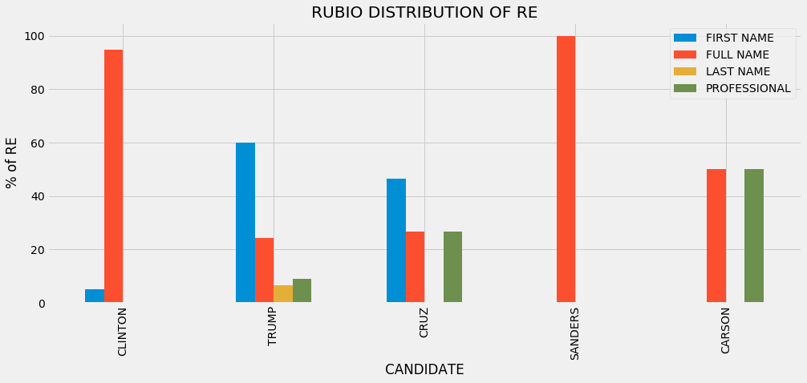


### Some Conclusions
**Marco Rubio was also a fan of using first names except in the case of Bernie Sanders, Hillary Clinton, and Ben Carson. Like Cruz, this is perhaps because Rubio only ever spoke about Sanders and Clinton and not to them. Rubio never referred to Carly Fiorina. Rubio also never used professional titles for the Democratic candidates, but did for the three Republican candidates. It is interesting that the three male, Republican candidates we have looked at so far mostly use first names. This is most likely a power move. If another candidate is trying to strip you of a title that provides insight into your experience and professionalism, you have to match them and refer to them the same way to avoid looking like they are more competent than you are.**

### Ben Carson as Speaker

##### Donald Trump


```python
carson_REtrump = get_RE_for_label(carson['Tree'], "Donald Trump")
set(carson_REtrump)
```


    {'Mr. Trump', 'Donald'}


```python
carson_trump_freq = {re: carson_REtrump.count(re) for re in carson_REtrump}
carson_trump_freq
```


    {'Donald': 1, 'Mr. Trump': 1}


```python
carson_trump_REtype_freq = get_re_type_freq(trump_re_maps, carson_trump_freq)
carson_trump_REtype_freq
```


    {'PROFESSIONAL': 1, 'FIRST NAME': 1}


##### Hillary Clinton


```python
carson_REclinton = get_RE_for_label(carson['Tree'], "Hillary Clinton")
set(carson_REclinton)
```


    {'Hillary Clinton', 'Hillary'}


```python
carson_clinton_freq = {re: carson_REclinton.count(re) for re in carson_REclinton}
carson_clinton_freq
```


    {'Hillary Clinton': 5, 'Hillary': 1}


```python
carson_clinton_REtype_freq = get_re_type_freq(clinton_re_maps, carson_clinton_freq)
carson_clinton_REtype_freq
```


    {'FULL NAME': 5, 'FIRST NAME': 1}


##### Ted Cruz


```python
carson_REcruz = get_RE_for_label(carson['Tree'], "Ted Cruz")
set(carson_REcruz)
```


    {'Senator Cruz', 'Ted'}


```python
carson_cruz_freq = {re: carson_REcruz.count(re) for re in carson_REcruz}
carson_cruz_freq
```


    {'Ted': 1, 'Senator Cruz': 1}


```python
carson_cruz_REtype_freq = get_re_type_freq(cruz_re_maps, carson_cruz_freq)
carson_cruz_REtype_freq
```


    {'PROFESSIONAL': 1, 'FIRST NAME': 1}


##### Marco Rubio


```python
carson_RErubio = get_RE_for_label(carson['Tree'], "Marco Rubio")
set(carson_RErubio)
```


    {'Marco'}


```python
carson_rubio_freq = {re: carson_RErubio.count(re) for re in carson_RErubio}
carson_rubio_freq
```


    {'Marco': 1}


```python
carson_rubio_REtype_freq = get_re_type_freq(rubio_re_maps, carson_rubio_freq)
carson_rubio_REtype_freq
```


    {'FIRST NAME': 1}


##### Bernie Sanders


```python
carson_REsanders = get_RE_for_label(carson['Tree'], "Bernie Sanders")
set(carson_REsanders)
```


    {'Bernie Sanders'}


```python
carson_sanders_freq = {re: carson_REsanders.count(re) for re in carson_REsanders}
carson_sanders_freq
```


    {'Bernie Sanders': 4}


```python
carson_sanders_REtype_freq = get_re_type_freq(sanders_re_maps, carson_sanders_freq)
carson_sanders_REtype_freq
```


    {'FULL NAME': 4}


```python
distribution_carson = pd.DataFrame([carson_clinton_REtype_freq, carson_trump_REtype_freq, carson_cruz_REtype_freq, carson_rubio_REtype_freq, carson_sanders_REtype_freq], index = ["CLINTON", 'TRUMP', 'CRUZ', 'RUBIO', 'SANDERS'])
distribution_carson.fillna(0, inplace=True)

distribution_carson['TOTAL']=distribution_carson.sum(axis=1)

#Get the percentage of each type of RE for each candidate.
distribution_carson['FIRST NAME'] = distribution_carson['FIRST NAME']/distribution_carson['TOTAL']*100
distribution_carson['FULL NAME'] = distribution_carson['FULL NAME']/distribution_carson['TOTAL']*100
distribution_carson['PROFESSIONAL'] = distribution_carson['PROFESSIONAL']/distribution_carson['TOTAL']*100

del distribution_carson['TOTAL']
distribution_carson.head(6)
```


<div>
<table border="1" class="dataframe">
  <thead>
    <tr style="text-align: right;">
      <th></th>
      <th>FIRST NAME</th>
      <th>FULL NAME</th>
      <th>PROFESSIONAL</th>
    </tr>
  </thead>
  <tbody>
    <tr>
      <th>CLINTON</th>
      <td>16.666667</td>
      <td>83.333333</td>
      <td>0.0</td>
    </tr>
    <tr>
      <th>TRUMP</th>
      <td>50.000000</td>
      <td>0.000000</td>
      <td>50.0</td>
    </tr>
    <tr>
      <th>CRUZ</th>
      <td>50.000000</td>
      <td>0.000000</td>
      <td>50.0</td>
    </tr>
    <tr>
      <th>RUBIO</th>
      <td>100.000000</td>
      <td>0.000000</td>
      <td>0.0</td>
    </tr>
    <tr>
      <th>SANDERS</th>
      <td>0.000000</td>
      <td>100.000000</td>
      <td>0.0</td>
    </tr>
  </tbody>
</table>
</div>


```python
distribution_carson.plot(kind='bar', figsize=(15,6))
plt.xlabel('CANDIDATE')
plt.ylabel('% of RE')
plt.title('CARSON DISTRIBUTION OF RE')
plt.show()
```


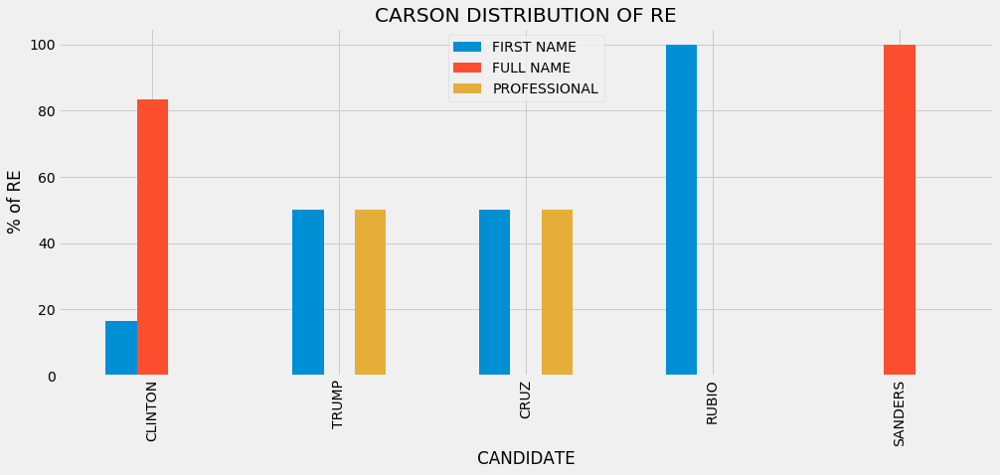


### Some Conclusions

**Ben Carson follows a similar pattern as the other male, Republican candidates. The data for Carson isn't too telling, becuase he only referred to Trump and Cruz twice, and Rubio once. He didn't refer to Carly Fiorina at all. In fact, he referred to Clinton and Sanders more than any of those Republican candidates. It seems he spent more time talking about Clinton and Sanders and their respective policies or ideas than addressing the candidates in the debate with him. We might interpret this as confidence; Carson is more focused on the Democratic candidates (the general election) than the Republican candidates (the primary election he has to win first). It could also be that the moderators just asked him many questions about the Democrats. With this little information, it is hard to draw many conclusions.**

### Bernie Sanders as Speaker

##### Donald Trump


```python
sanders_REtrump = get_RE_for_label(sanders['Tree'], "Donald Trump")
set(sanders_REtrump)
```


    {'Donald Trump', 'Trump'}


```python
sanders_trump_freq = {re: sanders_REtrump.count(re) for re in sanders_REtrump}
sanders_trump_freq
```


    {'Donald Trump': 13, 'Trump': 13}


```python
sanders_trump_REtype_freq = get_re_type_freq(trump_re_maps, sanders_trump_freq)
sanders_trump_REtype_freq
```


    {'FULL NAME': 13, 'LAST NAME': 13}


##### Hillary Clinton


```python
sanders_REclinton = get_RE_for_label(sanders['Tree'], "Hillary Clinton")
sanders_REclinton.remove('Secretary Secretary Clinton')
sanders_REclinton.append('Secretary Clinton')
set(sanders_REclinton)
```


    {'Clinton', 'Madam Secretary', 'Hillary Clinton', 'Secretary', 'Hillary', 'Secretary Clinton'}


```python
sanders_clinton_freq = {re: sanders_REclinton.count(re) for re in sanders_REclinton}
sanders_clinton_freq
```


    {'Secretary Clinton': 116, 'Secretary': 25, 'Clinton': 10, 'Hillary Clinton': 21, 'Hillary': 3, 'Madam Secretary': 3}


```python
sanders_clinton_REtype_freq = get_re_type_freq(clinton_re_maps, sanders_clinton_freq)
sanders_clinton_REtype_freq
```


    {'PROFESSIONAL': 116, 'FULL NAME': 21, 'FIRST NAME': 3, 'LAST NAME': 10, 'GENDERED': 3}


##### Martin O'Malley


```python
sanders_REomalley = get_RE_for_label(sanders['Tree'], "Martin O'Malley")
set(sanders_REomalley)
```


    {"Martin O'Malley", 'Martin', "Governor O'Malley"}


```python
sanders_omalley_freq = {re: sanders_REomalley.count(re) for re in sanders_REomalley}
sanders_omalley_freq
```


    {"Governor O'Malley": 7, "Martin O'Malley": 1, 'Martin': 1}


```python
sanders_omalley_REtype_freq = get_re_type_freq(omalley_re_maps, sanders_omalley_freq)
sanders_omalley_REtype_freq
```


    {'PROFESSIONAL': 7, 'FIRST NAME': 1}


```python
distribution_sanders = pd.DataFrame([sanders_clinton_REtype_freq, sanders_trump_REtype_freq, sanders_omalley_REtype_freq], index = ["CLINTON", 'TRUMP', "O'MALLEY"])
distribution_sanders.fillna(0, inplace=True)

distribution_sanders['TOTAL']=distribution_sanders.sum(axis=1)

#Get the percentage of each type of RE for each candidate.
distribution_sanders['FIRST NAME'] = distribution_sanders['FIRST NAME']/distribution_sanders['TOTAL']*100
distribution_sanders['FULL NAME'] = distribution_sanders['FULL NAME']/distribution_sanders['TOTAL']*100
distribution_sanders['LAST NAME'] = distribution_sanders['LAST NAME']/distribution_sanders['TOTAL']*100
distribution_sanders['PROFESSIONAL'] = distribution_sanders['PROFESSIONAL']/distribution_sanders['TOTAL']*100

del distribution_sanders['TOTAL']
distribution_sanders.head(6)
```


<div>
<table border="1" class="dataframe">
  <thead>
    <tr style="text-align: right;">
      <th></th>
      <th>FIRST NAME</th>
      <th>FULL NAME</th>
      <th>GENDERED</th>
      <th>LAST NAME</th>
      <th>PROFESSIONAL</th>
    </tr>
  </thead>
  <tbody>
    <tr>
      <th>CLINTON</th>
      <td>1.960784</td>
      <td>13.72549</td>
      <td>3.0</td>
      <td>6.535948</td>
      <td>75.816993</td>
    </tr>
    <tr>
      <th>TRUMP</th>
      <td>0.000000</td>
      <td>50.00000</td>
      <td>0.0</td>
      <td>50.000000</td>
      <td>0.000000</td>
    </tr>
    <tr>
      <th>O'MALLEY</th>
      <td>12.500000</td>
      <td>0.00000</td>
      <td>0.0</td>
      <td>0.000000</td>
      <td>87.500000</td>
    </tr>
  </tbody>
</table>
</div>


```python
distribution_sanders.plot(kind='bar', figsize=(15,6))
plt.xlabel('CANDIDATE')
plt.ylabel('% of RE')
plt.title('SANDERS DISTRIBUTION OF RE')
plt.show()
```


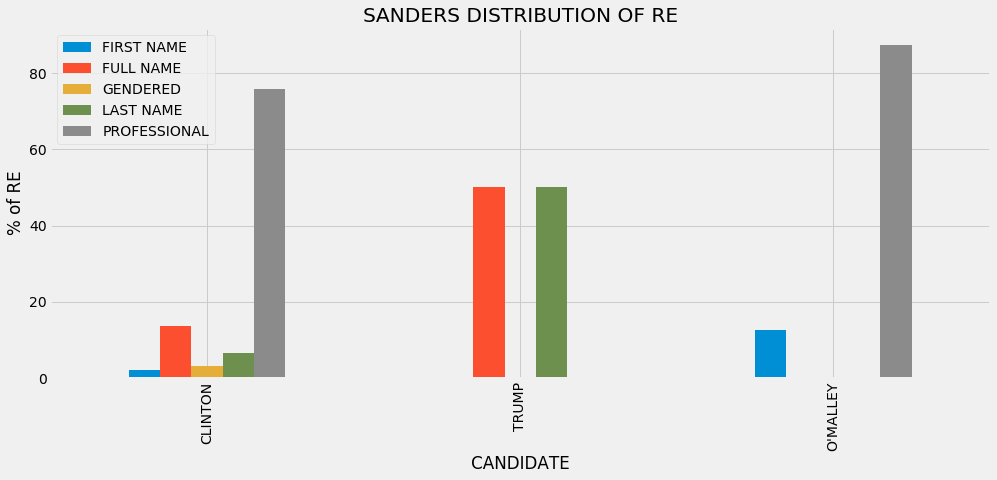


### Some Conclusions

**Like Hillary Clinton, Bernie Sanders did not refer to any of the Republican candidates besides Donald Trump. Out of the 26 times Sanders referred to Trump, there  was an even split between using his full name and his last name. Sanders never used a professional title for Trump. He referred to Clinton and Martin O'Malley most often by a professional title. He called Hillary Clinton a gendered term- Madam Secretary a handful of times, but as I mentioned before, this still maintains information about her profession. Sanders also used Cliton's full name a decent amount of the time, indicating that even though they were always participating in the same debates, Sanders talked *about* Clinton sometimes instead of to her. This is not true of how he referred to Martin O'Malley. He only ever referred to O'Malley by his first name or professional title. I think there is some interesting information regarding who is talking *about* who, and who is not being talked *about*. We will discuss this more later.**

### Moderators

**Next, we'll look at how moderators who moderated multiple debates (preferably both a rebuplican and democratic debate) referred to the same candidates. Specifically, we will look at Dana Bash and David Muir, because they were the only two moderators to refer to all of the candidates mentioned above, except David Muir does not moderate a debate where Carly Fiorina is participating. Also, Dana Bash is a woman while David Muir is a man, so we can see if gender plays any role here as well.**


```python
bash = speaker_dfs[23]
get_entities(bash['Entities'])
```


    {'Jeb Bush', 'Barack Obama', 'Hillary Clinton', 'Rand Paul', 'Donald Trump', 'Carly Fiorina', 'Ben Carson', 'Bernie Sanders', 'Chris Christie', 'Lindsey Graham', 'Ted Cruz', 'Marco Rubio', 'TITLE', 'John Kasich'}


```python
muir = speaker_dfs[17]
get_entities(muir['Entities'])
```


    {'Jeb Bush', 'Barack Obama', 'Hillary Clinton', 'Ben Carson', 'Donald Trump', 'Bernie Sanders', 'Martha Raddatz', 'Chris Christie', 'Rick Santorum', 'Bashar al-Assad', 'George W. Bush', 'Ted Cruz', 'Marco Rubio', "Martin O'Malley", 'TITLE', 'John Kasich'}


### Dana Bash

##### Donald Trump


```python
bash_REtrump = get_RE_for_label(bash['Tree'], "Donald Trump")
set(bash_REtrump)
```


    {'Mr. Trump', 'Donald Trump'}


```python
bash_trump_freq = {re: bash_REtrump.count(re) for re in bash_REtrump}
bash_trump_freq
```


    {'Donald Trump': 5, 'Mr. Trump': 27}


```python
bash_trump_REtype_freq = get_re_type_freq(trump_re_maps, bash_trump_freq)
bash_trump_REtype_freq
```


    {'PROFESSIONAL': 27, 'FULL NAME': 5}


##### Hillary Clinton


```python
bash_REclinton = get_RE_for_label(bash['Tree'], "Hillary Clinton")
bash_REclinton.remove('Secretary Secretary Clinton')
bash_REclinton.append('Secretary Clinton')
set(bash_REclinton)
```


    {'Secretary', 'Hillary Clinton', 'Secretary Clinton', 'Madam Secretary'}


```python
bash_clinton_freq = {re: bash_REclinton.count(re) for re in bash_REclinton}
bash_clinton_freq
```


    {'Secretary Clinton': 20, 'Hillary Clinton': 1, 'Secretary': 2, 'Madam Secretary': 5}


```python
bash_clinton_REtype_freq = get_re_type_freq(clinton_re_maps, bash_clinton_freq)
bash_clinton_REtype_freq
```


    {'PROFESSIONAL': 20, 'FULL NAME': 1, 'GENDERED': 5}


##### Ted Cruz


```python
bash_REcruz = get_RE_for_label(bash['Tree'], "Ted Cruz")
set(bash_REcruz)
```


    {'Senator Cruz'}


```python
bash_cruz_freq = {re: bash_REcruz.count(re) for re in bash_REcruz}
bash_cruz_freq
```


    {'Senator Cruz': 30}


```python
bash_cruz_REtype_freq = get_re_type_freq(cruz_re_maps, bash_cruz_freq)
bash_cruz_REtype_freq
```


    {'PROFESSIONAL': 30}


##### Marco Rubio


```python
bash_RErubio = get_RE_for_label(bash['Tree'], "Marco Rubio")
bash_RErubio.remove('Senator Senator Rubio')
bash_RErubio.append('Senator Rubio')
set(bash_RErubio)
```


    {'Senator Rubio'}


```python
bash_rubio_freq = {re: bash_RErubio.count(re) for re in bash_RErubio}
bash_rubio_freq
```


    {'Senator Rubio': 23}


```python
bash_rubio_REtype_freq = get_re_type_freq(rubio_re_maps, bash_rubio_freq)
bash_rubio_REtype_freq
```


    {'PROFESSIONAL': 23}


##### Carly Fiorina


```python
bash_REfiorina = get_RE_for_label(bash['Tree'], "Carly Fiorina")
set(bash_REfiorina)
```


    {'Fiorina', 'Carly Fiorina'}


```python
bash_fiorina_freq = {re: bash_REfiorina.count(re) for re in bash_REfiorina}
bash_fiorina_freq
```


    {'Carly Fiorina': 2, 'Fiorina': 3}


```python
bash_fiorina_REtype_freq = get_re_type_freq(fiorina_re_maps, bash_fiorina_freq)
bash_fiorina_REtype_freq
```


    {'FULL NAME': 2, 'LAST NAME': 3}


##### Ben Carson


```python
bash_REcarson = get_RE_for_label(bash['Tree'], "Ben Carson")
set(bash_REcarson)
```


    {'Dr. Carson'}


```python
bash_carson_freq = {re: bash_REcarson.count(re) for re in bash_REcarson}
bash_carson_freq
```


    {'Dr. Carson': 3}


```python
bash_carson_REtype_freq = get_re_type_freq(carson_re_maps, bash_carson_freq)
bash_carson_REtype_freq
```


    {'PROFESSIONAL': 3}


##### Bernie Sanders


```python
bash_REsanders = get_RE_for_label(bash['Tree'], "Bernie Sanders")
set(bash_REsanders)
```


    {'Senator Sanders', 'President Sanders'}


```python
bash_sanders_freq = {re: bash_REsanders.count(re) for re in bash_REsanders}
bash_sanders_freq
```


    {'Senator Sanders': 20, 'President Sanders': 1}


```python
bash_sanders_REtype_freq = get_re_type_freq(sanders_re_maps, bash_sanders_freq)
bash_sanders_REtype_freq
```


    {'PROFESSIONAL': 21}


```python
distribution_bash = pd.DataFrame([bash_clinton_REtype_freq, bash_trump_REtype_freq, bash_cruz_REtype_freq, bash_sanders_REtype_freq, bash_carson_REtype_freq, bash_fiorina_REtype_freq], index = ["CLINTON", 'TRUMP', 'CRUZ', 'SANDERS', 'CARSON', "FIORINA"])
distribution_bash.fillna(0, inplace=True)

distribution_bash['TOTAL']=distribution_bash.sum(axis=1)

#Get the percentage of each type of RE for each candidate.
distribution_bash['FULL NAME'] = distribution_bash['FULL NAME']/distribution_bash['TOTAL']*100
distribution_bash['LAST NAME'] = distribution_bash['LAST NAME']/distribution_bash['TOTAL']*100
distribution_bash['GENDERED'] = distribution_bash['GENDERED']/distribution_bash['TOTAL']*100
distribution_bash['PROFESSIONAL'] = distribution_bash['PROFESSIONAL']/distribution_bash['TOTAL']*100

del distribution_bash['TOTAL']
distribution_bash.head(6)
```


<div>
<table border="1" class="dataframe">
  <thead>
    <tr style="text-align: right;">
      <th></th>
      <th>FULL NAME</th>
      <th>GENDERED</th>
      <th>LAST NAME</th>
      <th>PROFESSIONAL</th>
    </tr>
  </thead>
  <tbody>
    <tr>
      <th>CLINTON</th>
      <td>3.846154</td>
      <td>19.230769</td>
      <td>0.0</td>
      <td>76.923077</td>
    </tr>
    <tr>
      <th>TRUMP</th>
      <td>15.625000</td>
      <td>0.000000</td>
      <td>0.0</td>
      <td>84.375000</td>
    </tr>
    <tr>
      <th>CRUZ</th>
      <td>0.000000</td>
      <td>0.000000</td>
      <td>0.0</td>
      <td>100.000000</td>
    </tr>
    <tr>
      <th>SANDERS</th>
      <td>0.000000</td>
      <td>0.000000</td>
      <td>0.0</td>
      <td>100.000000</td>
    </tr>
    <tr>
      <th>CARSON</th>
      <td>0.000000</td>
      <td>0.000000</td>
      <td>0.0</td>
      <td>100.000000</td>
    </tr>
    <tr>
      <th>FIORINA</th>
      <td>40.000000</td>
      <td>0.000000</td>
      <td>60.0</td>
      <td>0.000000</td>
    </tr>
  </tbody>
</table>
</div>


```python
distribution_bash.plot(kind='bar', figsize=(15,6))
plt.xlabel('CANDIDATE')
plt.ylabel('% of RE')
plt.title('BASH DISTRIBUTION OF RE')
plt.show()
```


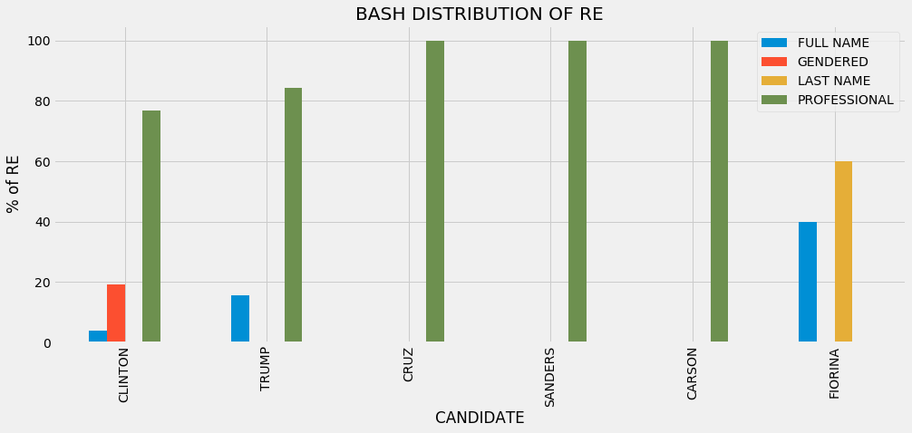


### Some Conclusions
**Unsurprisingly, Bash refers to all of the candidates by a professional title. She often refers to Hillary Clinton by Madam Secretary, which genders her title. For some reason, Carly Fiorina is only called by her full name and last name. Only Clinton, Trump and Fiorina are referred to by their full names, indicating the other candidates were probably asked questions about them or were asked to respond to Clinton or Trump's answers. Bash never uses a candidates first name only**

### David Muir

##### Donald Trump


```python
muir_REtrump = get_RE_for_label(muir['Tree'], "Donald Trump")
set(muir_REtrump)
```


    {'Mr. Trump', 'Donald Trump', 'Trump'}


```python
muir_trump_freq = {re: muir_REtrump.count(re) for re in muir_REtrump}
muir_trump_freq
```


    {'Donald Trump': 6, 'Mr. Trump': 21, 'Trump': 1}


```python
muir_trump_REtype_freq = get_re_type_freq(trump_re_maps, muir_trump_freq)
muir_trump_REtype_freq
```


    {'PROFESSIONAL': 21, 'FULL NAME': 6, 'LAST NAME': 1}


##### Hillary Clinton


```python
muir_REclinton = get_RE_for_label(muir['Tree'], "Hillary Clinton")
set(muir_REclinton)
```


    {'Clinton', 'Hillary Clinton', 'Secretary Clinton', 'Secretary'}


```python
muir_clinton_freq = {re: muir_REclinton.count(re) for re in muir_REclinton}
muir_clinton_freq
```


    {'Secretary Clinton': 30, 'Clinton': 2, 'Secretary': 7, 'Hillary Clinton': 1}


```python
muir_clinton_REtype_freq = get_re_type_freq(clinton_re_maps, muir_clinton_freq)
muir_clinton_REtype_freq
```


    {'PROFESSIONAL': 30, 'FULL NAME': 1, 'LAST NAME': 2}


##### Ted Cruz


```python
muir_REcruz = get_RE_for_label(muir['Tree'], "Ted Cruz")
set(muir_REcruz)
```


    {'Senator Cruz', 'Cruz', 'Senator Ted Cruz'}


```python
muir_cruz_freq = {re: muir_REcruz.count(re) for re in muir_REcruz}
muir_cruz_freq
```


    {'Senator Ted Cruz': 1, 'Senator Cruz': 17, 'Cruz': 1}


```python
muir_cruz_REtype_freq = get_re_type_freq(cruz_re_maps, muir_cruz_freq)
muir_cruz_REtype_freq
```


    {'PROFESSIONAL': 18, 'LAST NAME': 1}


##### Marco Rubio


```python
muir_RErubio = get_RE_for_label(muir['Tree'], "Marco Rubio")
set(muir_RErubio)
```


    {'Senator Marco Rubio', 'Senator Rubio'}


```python
muir_rubio_freq = {re: muir_RErubio.count(re) for re in muir_RErubio}
muir_rubio_freq
```


    {'Senator Marco Rubio': 1, 'Senator Rubio': 21}


```python
muir_rubio_REtype_freq = get_re_type_freq(rubio_re_maps, muir_rubio_freq)
muir_rubio_REtype_freq
```


    {'PROFESSIONAL': 22}


##### Bernie Sanders


```python
muir_REsanders = get_RE_for_label(muir['Tree'], "Bernie Sanders")
set(muir_REsanders)
```


    {'Senator Senator Sanders', 'Senator Sanders', 'President Sanders'}


```python
muir_sanders_freq = {re: muir_REsanders.count(re) for re in muir_REsanders}
muir_sanders_freq
```


    {'Senator Sanders': 22, 'Senator Senator Sanders': 1, 'President Sanders': 1}


```python
muir_sanders_REtype_freq = get_re_type_freq(sanders_re_maps, muir_sanders_freq)
muir_sanders_REtype_freq
```


    {'PROFESSIONAL': 23}


##### Ben Carson


```python
muir_REcarson = get_RE_for_label(muir['Tree'], "Ben Carson")
set(muir_REcarson)
```


    {'Dr. Ben Carson', 'Dr. Carson', 'Carson'}


```python
muir_carson_freq = {re: muir_REcarson.count(re) for re in muir_REcarson}
muir_carson_freq
```


    {'Dr. Ben Carson': 2, 'Dr. Carson': 8, 'Carson': 1}


```python
muir_carson_REtype_freq = get_re_type_freq(carson_re_maps, muir_carson_freq)
muir_carson_REtype_freq
```


    {'PROFESSIONAL': 10, 'LAST NAME': 1}


```python
distribution_muir = pd.DataFrame([muir_clinton_REtype_freq, muir_trump_REtype_freq, muir_cruz_REtype_freq, muir_sanders_REtype_freq, muir_carson_REtype_freq], index = ["CLINTON", 'TRUMP', 'CRUZ', 'SANDERS', 'CARSON'])
distribution_muir.fillna(0, inplace=True)

distribution_muir['TOTAL']=distribution_muir.sum(axis=1)

#Get the percentage of each type of RE for each candidate.
distribution_muir['FULL NAME'] = distribution_muir['FULL NAME']/distribution_muir['TOTAL']*100
distribution_muir['LAST NAME'] = distribution_muir['LAST NAME']/distribution_muir['TOTAL']*100
distribution_muir['PROFESSIONAL'] = distribution_muir['PROFESSIONAL']/distribution_muir['TOTAL']*100

del distribution_muir['TOTAL']
distribution_muir.head(6)
```


<div>
<table border="1" class="dataframe">
  <thead>
    <tr style="text-align: right;">
      <th></th>
      <th>FULL NAME</th>
      <th>LAST NAME</th>
      <th>PROFESSIONAL</th>
    </tr>
  </thead>
  <tbody>
    <tr>
      <th>CLINTON</th>
      <td>3.030303</td>
      <td>6.060606</td>
      <td>90.909091</td>
    </tr>
    <tr>
      <th>TRUMP</th>
      <td>21.428571</td>
      <td>3.571429</td>
      <td>75.000000</td>
    </tr>
    <tr>
      <th>CRUZ</th>
      <td>0.000000</td>
      <td>5.263158</td>
      <td>94.736842</td>
    </tr>
    <tr>
      <th>SANDERS</th>
      <td>0.000000</td>
      <td>0.000000</td>
      <td>100.000000</td>
    </tr>
    <tr>
      <th>CARSON</th>
      <td>0.000000</td>
      <td>9.090909</td>
      <td>90.909091</td>
    </tr>
  </tbody>
</table>
</div>


```python
distribution_muir.plot(kind='bar', figsize=(15,6))
plt.xlabel('CANDIDATE')
plt.ylabel('% of RE')
plt.title('MUIR DISTRIBUTION OF RE')
plt.show()
```


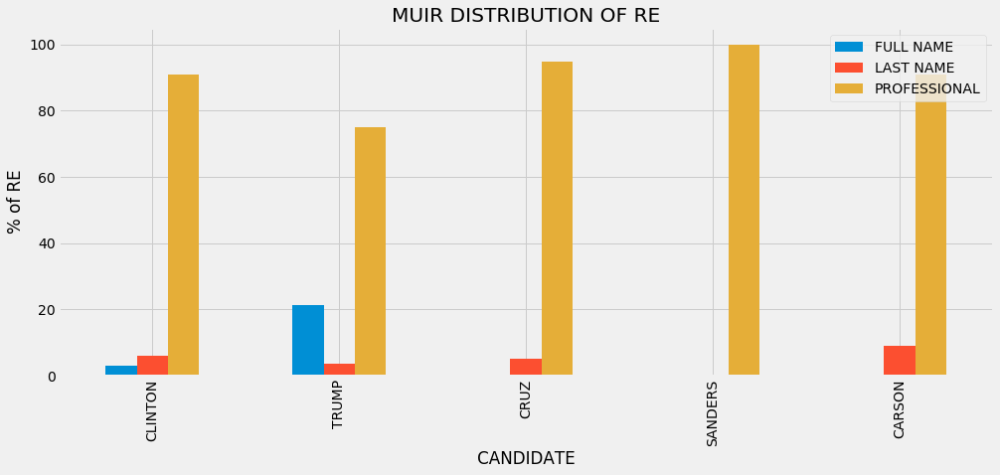


### Some Conclusions

**Like Bash, Muir refers to all of the candidates most often by their professional titles. Unlike Bash however, Muir does not refer to Carly Fiorina at all, and he never refers to Clinton by a gendered title. Both Bash and Muir refer to Donald Trump by his full name a larger percent of the time than they refer to Hillary Clinton by her full name. This could indicate that Trump is talked about more often then Clinton.**

### Differences Across Debates
**The last avenue we're going to explore is looking at changes over time. Let's see if there are any changes between the way Donald Trump and Hillary Clinton refer to each other from one general debate to the next.**

### Debate 1
##### Hillary Clinton


```python
clinton_1 = clinton.loc[clinton['Date'] == '9-26-16', :]
```


```python
clinton_trump_1 = get_RE_for_label(clinton_1['Tree'], 'Donald Trump')
set(clinton_trump_1)
```


    {'Donald', 'Donald Trump', 'Trump'}


```python
clinton_trump_freq1 = {re: clinton_trump_1.count(re) for re in clinton_trump_1}
clinton_trump_freq1
```


    {'Donald': 28, 'Donald Trump': 2, 'Trump': 1}


```python
clinton_trump_REtype1 = get_re_type_freq(trump_re_maps, clinton_trump_freq1)
clinton_trump_REtype1
```


    {'FULL NAME': 2, 'FIRST NAME': 28, 'LAST NAME': 1}


##### Donald Trump


```python
trump_1 = trump.loc[trump['Date'] == '9-26-16', :]
```


```python
trump_clinton_1 = get_RE_for_label(trump_1['Tree'], 'Hillary Clinton')
set(trump_clinton_1)
```


    {'Secretary', 'Secretary Clinton', 'Hillary'}


```python
trump_clinton_freq1 = {re: trump_clinton_1.count(re) for re in trump_clinton_1}
trump_clinton_freq1
```


    {'Hillary': 8, 'Secretary': 3, 'Secretary Clinton': 21}


```python
trump_clinton_REtype1 = get_re_type_freq(clinton_re_maps, trump_clinton_freq1)
trump_clinton_REtype1
```


    {'PROFESSIONAL': 21, 'FIRST NAME': 8}


### Debate 2
##### Hillary Clinton


```python
clinton_2 = clinton.loc[clinton['Date'] == '10-9-16', :]
```


```python
clinton_trump_2 = get_RE_for_label(clinton_2['Tree'], 'Donald Trump')
set(clinton_trump_2)
```


    {'Donald', 'Donald Trump', 'Trump'}


```python
clinton_trump_freq2 = {re: clinton_trump_2.count(re) for re in clinton_trump_2}
clinton_trump_freq2
```


    {'Donald Trump': 8, 'Donald': 25, 'Trump': 1}


```python
clinton_trump_REtype2 = get_re_type_freq(trump_re_maps, clinton_trump_freq2)
clinton_trump_REtype2
```


    {'FULL NAME': 8, 'FIRST NAME': 25, 'LAST NAME': 1}


##### Donald Trump


```python
trump_2 = trump.loc[trump['Date'] == '10-9-16', :]
```


```python
trump_clinton_2 = get_RE_for_label(trump_2['Tree'], 'Hillary Clinton')
set(trump_clinton_2)
```


    {'Hillary Clinton', 'Clinton', 'Hillary'}


```python
trump_clinton_freq2 = {re: trump_clinton_2.count(re) for re in trump_clinton_2}
trump_clinton_freq2
```


    {'Hillary': 16, 'Hillary Clinton': 10, 'Clinton': 1}


```python
trump_clinton_REtype2 = get_re_type_freq(clinton_re_maps, trump_clinton_freq2)
trump_clinton_REtype2
```


    {'FULL NAME': 10, 'FIRST NAME': 16, 'LAST NAME': 1}


### Debate 3
##### Hillary Clinton


```python
clinton_3 = clinton.loc[clinton['Date'] == '10-19-16', :]
```


```python
clinton_trump_3 = get_RE_for_label(clinton_3['Tree'], 'Donald Trump')
set(clinton_trump_3)
```


    {'Donald', 'Donald Trump'}


```python
clinton_trump_freq3 = {re: clinton_trump_3.count(re) for re in clinton_trump_3}
clinton_trump_freq3
```


    {'Donald': 28, 'Donald Trump': 2}


```python
clinton_trump_REtype3 = get_re_type_freq(trump_re_maps, clinton_trump_freq3)
clinton_trump_REtype3
```


    {'FULL NAME': 2, 'FIRST NAME': 28}


##### Donald Trump


```python
trump_3 = trump.loc[trump['Date'] == '10-19-16', :]
```


```python
trump_clinton_3 = get_RE_for_label(trump_3['Tree'], 'Hillary Clinton')
set(trump_clinton_3)
```


    {'Hillary Clinton', 'Hillary'}


```python
trump_clinton_freq3 = {re: trump_clinton_3.count(re) for re in trump_clinton_3}
trump_clinton_freq3
```


    {'Hillary': 13, 'Hillary Clinton': 6}


```python
trump_clinton_REtype3 = get_re_type_freq(clinton_re_maps, trump_clinton_freq3)
trump_clinton_REtype3
```


    {'FULL NAME': 6, 'FIRST NAME': 13}


```python
clinton_debates = pd.DataFrame([clinton_trump_REtype1, clinton_trump_REtype2, clinton_trump_REtype3], index = ["Debate 1", "Debate 2", "Debate 3"])
clinton_debates.fillna(0, inplace=True)

clinton_debates['TOTAL']=clinton_debates.sum(axis=1)

#Get the percentage of each type of RE for each candidate.
clinton_debates['FULL NAME'] = clinton_debates['FULL NAME']/clinton_debates['TOTAL']*100
clinton_debates['FIRST NAME'] = clinton_debates['FIRST NAME']/clinton_debates['TOTAL']*100
clinton_debates['LAST NAME'] = clinton_debates['LAST NAME']/clinton_debates['TOTAL']*100

del clinton_debates['TOTAL']
clinton_debates.head()
```


<div>
<table border="1" class="dataframe">
  <thead>
    <tr style="text-align: right;">
      <th></th>
      <th>FIRST NAME</th>
      <th>FULL NAME</th>
      <th>LAST NAME</th>
    </tr>
  </thead>
  <tbody>
    <tr>
      <th>Debate 1</th>
      <td>90.322581</td>
      <td>6.451613</td>
      <td>3.225806</td>
    </tr>
    <tr>
      <th>Debate 2</th>
      <td>73.529412</td>
      <td>23.529412</td>
      <td>2.941176</td>
    </tr>
    <tr>
      <th>Debate 3</th>
      <td>93.333333</td>
      <td>6.666667</td>
      <td>0.000000</td>
    </tr>
  </tbody>
</table>
</div>


```python
clinton_debates.plot(kind='bar', figsize=(15,6))
plt.xlabel('DEBATE')
plt.ylabel('% of RE')
plt.title('HOW CLINTON REFERS TO TRUMP ACROSS DEBATES')
plt.show()
```


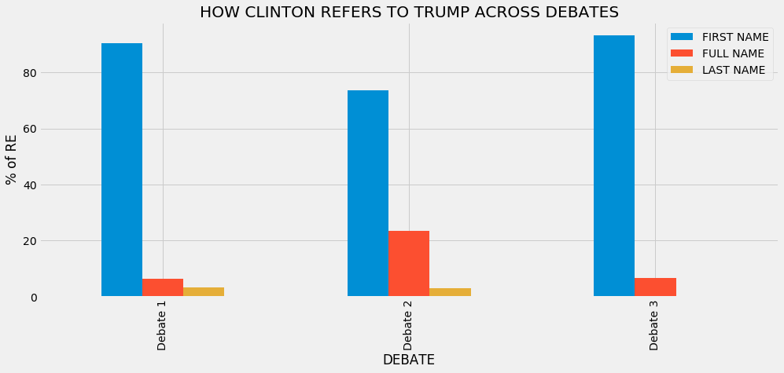


### Some Conclusions

**Clinton consistently referred to Trump by his first name most often. In the second debate, she uses his full name more often than she does in the other two debates. Since they are both participating in all three of these debates, the use of Trump's full name seems more confrontational, or as if Clinton were talking like Trump wasn't even there, than another form of address. **


```python
trump_debates = pd.DataFrame([trump_clinton_REtype1, trump_clinton_REtype2, trump_clinton_REtype3], index = ["Debate 1", "Debate 2", "Debate 3"])
trump_debates.fillna(0, inplace=True)

trump_debates['TOTAL']=trump_debates.sum(axis=1)

#Get the percentage of each type of RE for each candidate.
trump_debates['FULL NAME'] = trump_debates['FULL NAME']/trump_debates['TOTAL']*100
trump_debates['FIRST NAME'] = trump_debates['FIRST NAME']/trump_debates['TOTAL']*100
trump_debates['LAST NAME'] = trump_debates['LAST NAME']/trump_debates['TOTAL']*100
trump_debates['PROFESSIONAL'] = trump_debates['PROFESSIONAL']/trump_debates['TOTAL']*100

del trump_debates['TOTAL']
trump_debates.head()
```


<div>
<table border="1" class="dataframe">
  <thead>
    <tr style="text-align: right;">
      <th></th>
      <th>FIRST NAME</th>
      <th>FULL NAME</th>
      <th>LAST NAME</th>
      <th>PROFESSIONAL</th>
    </tr>
  </thead>
  <tbody>
    <tr>
      <th>Debate 1</th>
      <td>27.586207</td>
      <td>0.000000</td>
      <td>0.000000</td>
      <td>72.413793</td>
    </tr>
    <tr>
      <th>Debate 2</th>
      <td>59.259259</td>
      <td>37.037037</td>
      <td>3.703704</td>
      <td>0.000000</td>
    </tr>
    <tr>
      <th>Debate 3</th>
      <td>68.421053</td>
      <td>31.578947</td>
      <td>0.000000</td>
      <td>0.000000</td>
    </tr>
  </tbody>
</table>
</div>


```python
trump_debates.plot(kind='bar', figsize=(15,6))
plt.xlabel('DEBATE')
plt.ylabel('% of RE')
plt.title('HOW TRUMP REFERS TO CLINTON ACROSS DEBATES')
plt.show()
```


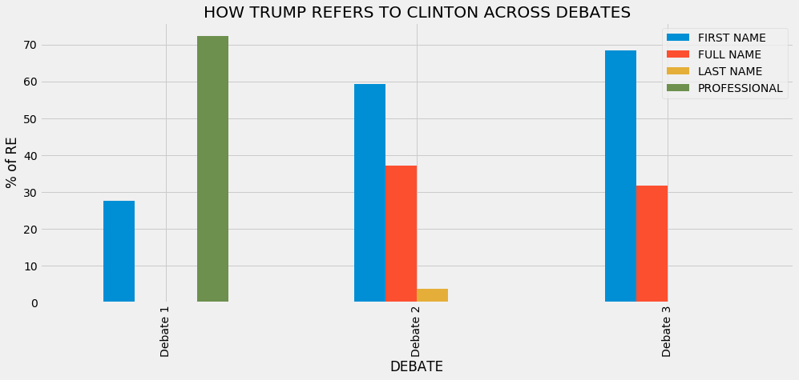


### Some Conclusions

**Trump makes a significant change in the way he refers to Clinton from the first to the second debate. He changes from calling her by a professional title most often to calling her by her first name most often. This is most likely a response to Clinton referring to him by his first name throughout the entire debate. By the second and third debate, Trump does not use a professional title for Clinton at all. In the second and third debate, Trump refers to Clinton by her first name more often than Clinton refers to Trump by his first name. Maintaining the same possible analysis from above, this could indicate a confrontational strategy or Trump could be talking as if Clinton isn't even there. Trump does not refer to Clinton by any gendered titles.**

### Final Analysis

**Please view [my final report](https://github.com/Data-Science-for-Linguists/2016-Election-Project/blob/master/final_report.md) for a summary of this entire project and some of my own interpretations of what the results and conclusions above could mean.**
