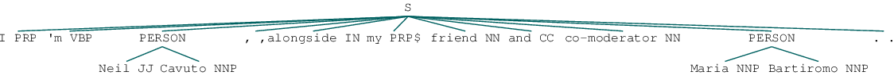
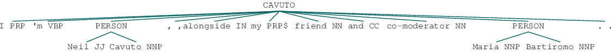
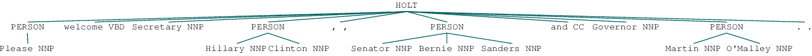
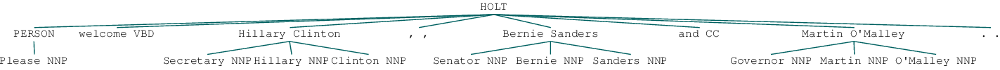
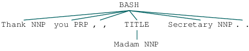
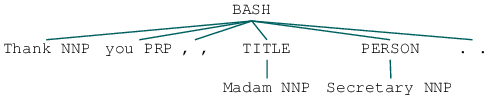
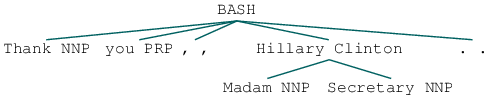

# What Did You Call Me?
### Referring Expressions, Titles, and Name-calling in the 2016 US Election

##### Final report
##### Paige Haring

## 0. Background

In the 2007 French Presidential Election, Ségolène Royal made history as the first female candidate to make it to the second round of a presidential election, and therefore the first female candidate to make it to the debate stage (Fracchiolla, 2011). Béatrice Fracchiola seized this opportunity to observe whether a female presence changed the dynamics of the debate by studying the way Royal and her competitor, Nicolas Sarkozy, addressed each other and looking for evidence of gender-bias. Gender stereotypes, like the idea that females are passive and less competent than males, have a significant impact on voting patterns and women's success in politics. Therefore, being able to distinguish the ways these stereotypes are reinforced through speech can help female candidates overcome them (Fracchiolla, 2011). Fracchiolla noticed that Sarkozy used politeness as a "courteous attack" and referred to Royal with gendered terms like Madame very often in order to remind the audience of Royal's gender and appeal to these gender stereotypes.

## 1. Introduction

Hillary Clinton became the first woman presidential nominee of a major political party in the United States during the 2016 Presidential Election. Her opponent in the general election, Donald Trump, was a business man with no political experience. I thought this election provided another opportunity to look for evidence of gender bias on the debate stage. Like Fracchiolla, I wanted to analyze the way the candidates referred to each other. While Fracchiolla focused largely on gendered terms of address and pronoun usage, I focused on the use of professional titles versus the use of candidates first or full names. I sought out to see if there were differences in the ways female and male candidates were addressed, and to see if there were differences in the ways candidates with and without political experience were referred to. If so, what could these differences mean?

## 2. Data Sourcing

The data for this project came from the [University of Santa Barbara's American Presidency Project](http://www.presidency.ucsb.edu/debates.php). I used the 12 transcripts from the republican debates, the 10 transcripts from the democratic debates, and the 3 transcripts from the general debates between Donald Trump and Hillary Clinton as my data. I was able to use this data under the terms of fair use, as I used it for scholarship purposes and modified it significantly. The data can be found [here]((https://github.com/Data-Science-for-Linguists/2016-Election-Project/tree/master/data).

## 3. Data Cleaning

There were several important steps involved in making this data usable for the task at hand. This process was documented in the [data processing file](https://github.com/Data-Science-for-Linguists/2016-Election-Project/blob/master/data_processing.md) in this repository. The original format of this data was 25 separate text files. My ultimate goal was to create DataFrames for each debate where each row contained information about an utterance in the order those utterances were spoken. This information included the speaker of the utterance, the date of the debate, and the kind of debate it was. First, I had to [split each debate transcript into chunks](data_processing.md#splitting-transcripts-by-speaker) where each chunk included all of the utterances one speaker said at a time, while maintaining the order of these chunks of utterances. Then, I had to [split each of these chunks](data_processing.md#tokenizing-each-speakers-sentences) into individual utterances. After this, my data was in a [more organized format](data_processing.md#reordering-and-naming-columns) and the next step was to do [Named Entity Recognition (NER) annotation](https://github.com/Data-Science-for-Linguists/2016-Election-Project/blob/master/NER_annotating.md) on each of these utterances. In order to know how a person was referred to, I first needed to find every instance where that person was mentioned. I did this NER annotation using NLTK's default NE chunker. This resulted in NER trees like this:

I wanted the speaker of the utterance to be evident by looking at the tree, so I [mapped the speaker column of the DateFrames](ner_annotating.md#mapping-speaker-to-tree) I created to the head label of each tree. After that, they looked like this:

The next step was to link the entities that were tagged in these trees to who they were referring to. I did this by manually creating a large list of relevant people, and [creating a dictionary](ner_annotating.md#creating-dictionary-for-ner-linking) that mapped each way of referring to a person to that person.

### Setbacks

The first issue I ran into using NLTK's chunker was that I specifically wanted to look at titles, and the chunker is designed to not tag titles. Sometimes it does not do this well, and titles are included as part of the entity, but most of the time they were excluded. Here is an example:

I had to write [a function](ner_annotating.md#pulling-in-titles) that would pull in the preceding titles.

The second issue was that the chunker simply did not tag a lot of entities that should have been tagged. I created a function that would tag these missed entities first by searching for [relevant last names](ner_annotating.md#tagging-missed-entities-last-names). Then again later by looking for [titles and first names]((#tagging-missed-entities-titles-and-first-names).

That changed my trees from this:

to this:

then this:

There were many other issues with the chunker that I couldn't fix. For example, in the first tree above, the word "Please" was tagged as a person. I didn't not untag any of the mistakenly tagged "entities". Also, since I created the linking dictionary manually and people were occasionally referred to by their first name, I made the decision to make sure I mapped each candidate's first name to them. This lead to some difficulties in distinguishing between people with the same first name. For example, since Chris Christie was a candidate, I mapped Chris to Chris Christie. This caused problems because Chris Wallace was a moderator. That caused each time Chris Wallace was referred to as Chris to be mistakenly tagged as Chris Christie. In the future, I might try a different NER tool.

## 4. Analysis

I analyzed the way Hillary Clinton, Donald Trump, 

## 5. Conclusion

We have found some interesting results. I don't believe with the data we have we can make any definite conclusions about gender bias evident in these transcripts, but there are some things that we can observe easily. It is no surprise that the moderators we looked at never refer to the candidates by their first name, and almost always refer to them by their professional titles. Interestingly, Dana Bash, a female moderator, used the expression Madam Secretary more often than David Muir did when describing Clinton. When using a professional title for Clinton, Muir did not add gender to the term.

We also found that out of all of the times Clinton is referred to, she is called by a professional title a smaller percentage of the time than the percentage of the each of the male candidates we looked at. Clinton refers to other candidates by their professional title most often, but refers to Donald Trump by his first name most often. This could have been strategic. Clinton could have been trying to take away some of the power Trump might have had by not referring to him with a title. Trump, who in the first debate called Clinton by a professional title most often, completely stopped doing that by the second in an attempt to match the way Clinton referred to him. It was interesting that Trump called Clinton by a title in the first debate, because in all of the primary debates preceding it, Trump referred to the other candidates involved by their first names most often. His use of a title for her was most likely a strategy to try and get respect from her by being more polite, or to make sure he did not look bad by not using a title. When Clinton made it clear she would only call him by his first name, Trump changed his strategy, because it doesn't help him to refer to her in a way that emphasizes her experience in politics in a respectful way while she refers to him in a less formal way. It makes him seem less powerful.

We should also consider what it could mean to call someone by their full name. In a debate where someone is called by their full name, and they are not participating, the speaker must be talking about that person because on the one hand, they are not there to address, and on the other hand, using a full name is a specific form of address, so everyone knows exactly who you are talking about. So what does it mean to be talked about a lot versus not at all? Talking about someone is obviously indicative of how relevant that person is in the campaign, and could be indicative of how much of a threat that person is considered to be. If a candidate talks about another candidate a lot, it could mean that they are relatively confident they will be directly compared to them in the future, meaning the speaker is confident both they and the person they are talking about will continue on into later rounds of the debates. This of course is not the only explanation of these phenomena, but certainly a possible explanation. To use a candidate's full name in a debate where you are both participating could be interpreted as confrontational. The speaker could also be talking about the candidate as if they were not there to address more personally. Please see my final report document in this repo to read more.
